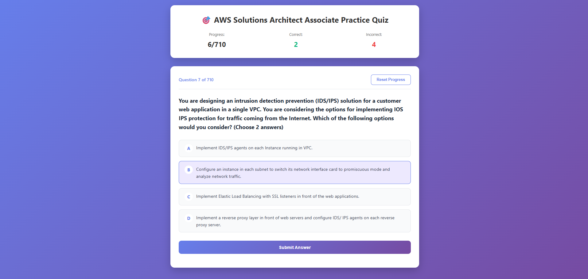

# 🎯 AWS SAA-C03 Interactive Quiz Application

An interactive web-based quiz application for practicing AWS Solutions Architect Associate (SAA-C03) exam questions.



## ✨ Features

- 📚 **Auto-parses 710+ questions** directly from README.md
- 💾 **Progress Tracking** - Your progress is saved in browser local storage
- 🔀 **Randomized Questions** - Questions are shuffled for varied practice
- ✅ **Instant Feedback** - See correct answers immediately after submission
- 📊 **Statistics Dashboard** - Track correct/incorrect answers and accuracy
- 🎨 **Modern UI** - Beautiful gradient design with smooth animations
- 📱 **Responsive Design** - Works perfectly on desktop, tablet, and mobile
- 🔄 **State Management** - Can refresh browser without losing progress
- ↩️ **Deselect Options** - Change your answer before submitting
- 🏆 **Completion Screen** - View your final statistics when done

## 🚀 Quick Start

### Prerequisites

- Python 3.x (for running local server)
- Modern web browser (Chrome, Firefox, Safari, Edge)

### Running the Quiz

1. **Clone or download this repository**
   ```bash
   git clone https://github.com/madhurajayashanka/AWS-Certified-Solutions-Architect-Associate-SAA-C03-Practice-Tests-Exams-Questions-Answers.git
   cd AWS-Certified-Solutions-Architect-Associate-SAA-C03-Practice-Tests-Exams-Questions-Answers
   ```

2. **Start a local web server**
   
   **Using Python (Recommended):**
   ```bash
   python -m http.server 8000
   ```
   
   **Using Node.js:**
   ```bash
   npx http-server
   ```
   
   **Using VS Code:**
   - Install the "Live Server" extension
   - Right-click on `index.html` → "Open with Live Server"

3. **Open your browser**
   
   Navigate to: `http://localhost:8000`

4. **Start practicing!** 🎉

## 📖 How to Use

### Taking the Quiz

1. **Read the question** carefully
2. **Select an answer** by clicking on one of the options
3. **Change your selection** if needed (click another option or click the same one to deselect)
4. **Submit your answer** by clicking the "Submit Answer" button
5. **Review the feedback**:
   - ✅ Green background = Correct answer
   - ❌ Red background = Incorrect answer (correct answer will be shown in green)
6. **Click "Next Question"** to continue

### Progress Tracking

- Your progress is automatically saved in your browser
- You can close the browser and return later - your progress will be preserved
- The dashboard shows:
  - Total questions answered
  - Number of correct answers
  - Number of incorrect answers

### Resetting Progress

- Click the **"Reset Progress"** button at any time to start over
- This will clear all statistics and shuffle questions again
- Confirmation prompt will appear before resetting

### Completion

- Once you've answered all questions, you'll see a completion screen with:
  - Total questions answered
  - Number of correct answers
  - Overall accuracy percentage
- Click **"Start Over"** to practice again with newly shuffled questions

## 🎨 User Interface

### Main Components

- **Header**: Displays progress statistics (Progress, Correct, Incorrect)
- **Question Card**: Shows the current question and answer options
- **Options**: Multiple choice answers with A, B, C, D labels
- **Control Buttons**: Submit Answer, Next Question, Reset Progress
- **Feedback Section**: Shows whether your answer was correct or incorrect

### Color Coding

- 🟣 **Purple/Gradient**: Primary theme color, selected options
- 🟢 **Green**: Correct answers, success messages
- 🔴 **Red**: Incorrect answers, error states
- ⚪ **White**: Question cards, main content areas
- 🔵 **Blue**: Links and interactive elements

## 🛠️ Technical Details

### File Structure

```
├── index.html          # Main HTML structure
├── style.css           # Styling and animations
├── script.js           # Quiz logic and functionality
├── README.md           # Source of quiz questions
└── QUIZ_APP_README.md  # This file
```

### Technologies Used

- **HTML5** - Structure
- **CSS3** - Styling with gradients, flexbox, animations
- **Vanilla JavaScript** - No frameworks, pure JS
- **Local Storage API** - Progress persistence
- **Fetch API** - Loading README.md content

### Browser Compatibility

- ✅ Chrome 90+
- ✅ Firefox 88+
- ✅ Safari 14+
- ✅ Edge 90+

## 🔧 Troubleshooting

### "Error loading questions" message

**Problem**: Browser can't load README.md due to CORS policy

**Solution**: You must run a local web server. Opening `index.html` directly (file://) won't work.

```bash
# Use one of these methods:
python -m http.server 8000
# or
npx http-server
# or
Use VS Code Live Server extension
```

### Questions not appearing (shows 0/0)

**Problem**: Questions aren't being parsed from README.md

**Solution**: 
1. Check browser console (F12) for errors
2. Ensure README.md is in the same folder
3. Verify you're accessing via `http://localhost` (not `file://`)

### Progress not saving

**Problem**: Local storage might be disabled or browser is in private mode

**Solution**:
1. Disable private/incognito mode
2. Check browser settings to allow local storage
3. Try a different browser

### Can't deselect an option

**Problem**: Already submitted the answer

**Solution**: Once you click "Submit Answer", the answer is locked. This is by design to prevent changing answers after seeing the result.

## 📊 Statistics

The quiz app provides comprehensive statistics:

- **Real-time Progress**: See how many questions you've completed
- **Accuracy Tracking**: Monitor your correct/incorrect ratio
- **Final Summary**: View overall performance when completing all questions
- **Persistent Storage**: Stats remain even after closing the browser

## 🎓 Study Tips

1. **Read Carefully**: AWS questions can be tricky - read each question thoroughly
2. **Eliminate Wrong Answers**: Use process of elimination for difficult questions
3. **Learn from Mistakes**: Review the correct answer when you get it wrong
4. **Regular Practice**: Use the shuffle feature to practice different question orders
5. **Track Progress**: Monitor your accuracy to identify weak areas
6. **Reset and Retry**: Practice multiple times for better retention

## 🤝 Contributing

Contributions are welcome! If you find bugs or have suggestions:

1. Open an issue on GitHub
2. Submit a pull request with improvements
3. Report any parsing errors with specific questions

## 📝 Notes

- The quiz automatically parses questions from `README.md`
- Questions must follow the format:
  ```markdown
  ### Question text here?

  - [ ] Option 1
  - [x] Option 2 (correct answer marked with x)
  - [ ] Option 3
  - [ ] Option 4

  **[⬆ Back to Top](#table-of-contents)**
  ```
- Local storage key used: `awsQuizStats`

## 🐛 Known Issues

- None currently reported

## 📜 License

This quiz application is provided as-is for educational purposes. The questions and content are sourced from the main README.md file.

## 🙏 Acknowledgments

- Question content from [Ditectrev's AWS SAA-C03 Practice Tests](https://github.com/Ditectrev/AWS-Certified-Solutions-Architect-Associate-SAA-C03-Practice-Tests-Exams-Questions-Answers)
- Built for the AWS certification community

---

**Happy Studying! Good luck with your AWS Solutions Architect Associate exam! 🚀**
