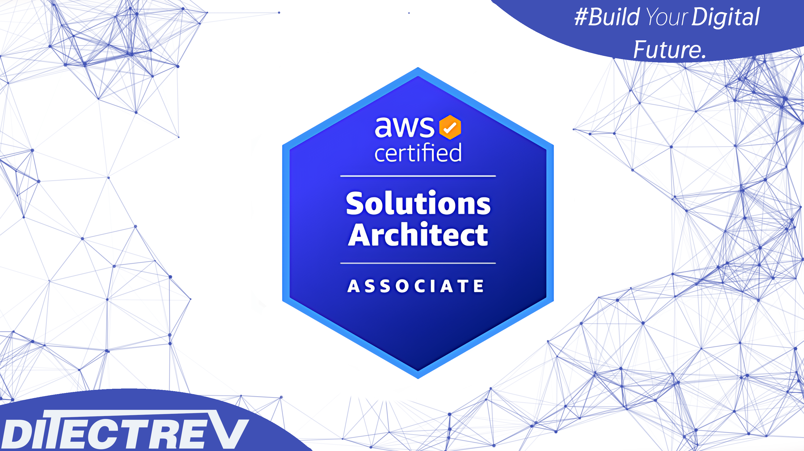

# ⬆️ Amazon Web Services Certified (AWS Certified) Solutions Architect Associate (SAA-C03) Practice Tests Exams Questions & Answers

## Table of Contents

| No. | Questions |
| --- | --------------------------- |
| 1   | [A user has launched an EC2 instance. The instance got terminated as soon as it was launched. Which of the below mentioned options is not a possible reason for this?](#pytanie1) |
| 2   | [Your website is serving on-demand training videos to your workforce. Videos are uploaded monthly in high resolution MP4 format. Your workforce is distributed globally often on the move and using company-provided tablets that require the HTTP Live Streaming (HLS) protocol to watch a video. Your company has no video transcoding expertise and it required you may need to pay for a consultant. How do you implement the most cost-efficient architecture without compromising high availability and quality of video delivery'?](#question2) |
| 3   | [You are designing an intrusion detection prevention (IDS/IPS) solution for a customer web application in a single VPC. You are considering the options for implementing lOS IPS protection for traffic coming from the Internet. Which of the following options would you consider? (Choose 2 answers)](#question3) |
| 4   | [Which of the following are valid statements about Amazon S3? (Choose 2 answers)](#question4) |
| 5   | [How can the domain's zone apex, for example, 'myzoneapexdomain.com', be pointed towards an Elastic Load Balancer?](#question5) |
| 6   | [When should I choose Provisioned IOPS over Standard RDS storage?](#question6) |
| 7   | [Your department creates regular analytics reports from your company's log files All log data is collected in Amazon S3 and processed by daily Amazon Elastic Map Reduce (EMR) jobs that generate daily PDF reports and aggregated tables in CSV format for an Amazon Redshift data warehouse. Your CFO requests that you optimize the cost structure for this system. Which of the following alternatives will lower costs without compromising average performance of the system or data integrity for the raw data?](#question7) |
| 8   | [Because of the extensibility limitations of striped storage attached to Windows Server, Amazon RDS does not currently support increasing storage on a [...] DB Instance.](#question8) |
| 9   | [In regards to IAM you can edit user properties later, but you cannot use the console to change the](#question9) |
| 10  | [In Amazon EC2 Container Service, are other container types supported?](#question10)   |
| 11  | [Content and Media Server is the latest requirement that you need to meet for a client. The client has been very specific about his requirements such as low latency, high availability, durability, and access control. Potentially there will be millions of views on this server and because of 'spiky' usage patterns, operations teams will need to provision static hardware, network, and management resources to support the maximum expected need. The Customer base will be initially low but is expected to grow and become more geographically distributed. Which of the following would be a good solution for content distribution?](#question11)   |
| 12  | [Name the disk storage supported by Amazon Elastic Compute Cloud (EC2).](#question12)   |
| 13  | [After an Amazon VPC instance is launched, can I change the VPC security groups it belongs to?](#question13)   |
| 14  | [After an Amazon VPC instance is launched, can I change the VPC security groups it belongs to?](#question14)   |
| 15  | [Amazon RDS supports SOAP only through [...].](#question15)   |
| 16  | [Which of the following services natively encrypts data at rest within an AWS region? (Choose 2 answers)](#question16)   |
| 17  | [Which one of the following can't be used as an origin server with Amazon CloudFront?](#question17)   |
| 18  | [Select the most correct The device name /dev/sdal (within Amazon EC2) is __](#question18)   |
| 19  | [How can I change the security group membership for interfaces owned by other AWS, such as Elastic Load Balancing?](#question19)   |
| 20  | [You have created a Route 53 latency record set from your domain to a machine in Northern Virginia and a similar record to a machine in Sydney. When a user located in US visits your domain he will be routed to:](#question20)   |
| 21  | [In the context of MySQL, version numbers are organized as MySQL version = X.Y.Z. What does X denote here?](#question21)   |
| 22  | [Which one of the below doesn't affect Amazon CloudFront billing?](#question22)   |
| 23  | [Just when you thought you knew every possible storage option on AWS you hear someone mention Reduced Redundancy Storage (RRS) within Amazon S3. What is the ideal scenario to use Reduced Redundancy Storage (RRS)?](#question23)   |
| 24  | [$ aws sqs receive-message –queue-url https://queue.amazonaws.com/546419318123/Test](#question24)   |
| 25  | [When running my DB Instance as a Multi-AZ deployment, can I use the standby for read or write operations?](#question25)   |
| 26  | [In the Launch Db Instance Wizard, where can I select the backup and maintenance options?](#question26)   |
| 27  | [What is the network performance offered by the c4.8xlarge instance in Amazon EC2?](#question27)   |
| 28  | [In Amazon EC2, if your EBS volume stays in the detaching state, you can force the detachment by clicking _____.](#question28)   |
| 29  | [What does Amazon DynamoDB provide?](#question29)   |
| 30  | [Security groups act like a firewall at the instance level, whereas [...] are an additional layer of security that act at the subnet level.](#question30)   |
| 31  | [You have been asked to tighten up the password policies in your organization after a serious security breach, so you need to consider every possible security measure. Which of the following is not an account password policy for IAM Users that can be set?](#question31)   |
| 32  | [Multi-AZ deployment [...] supported for Microsoft SQL Server DB Instances.](#question32)   |
| 33  | [What does Amazon Elastic Beanstalk provide?](#question33)   |
| 34  | [You need to quickly set up an email-sending service because a client needs to start using it in the next hour. Amazon Simple Email Service (Amazon SES) seems to be the logical choice but there are several options available to set it up. Which of the following options to set up SES would best meet the needs of the client?](#question34)   |
| 35  | [A user is observing the EC2 CPU utilization metric on CloudWatch. The user has observed some interesting patterns while filtering over the 1 week period for a particular hour. The user wants to zoom that data point to a more granular period. How can the user do that easily with CloudWatch?](#question35)   |
| 36  | [A company is running a batch analysis every hour on their main transactional DB. running on an RDS MySQL instance to populate their central Data Warehouse running on Redshift During the execution of the batch their transactional applications are very slow When the batch completes they need to update the top management dashboard with the new data The dashboard is produced by another system running on-premises that is currently started when a manually-sent email notifies that an update is required The on-premises system cannot be modified because is managed by anotherteam. How would you optimize this scenario to solve performance issues and automate the process as much as possible? How would you optimize this scenario to solve performance issues and automate the process as much as possible?](#question36)   |
| 37  | [You are configuring a new VPC for one of your clients for a cloud migration project, and only a public VPN will be in place. After you created your VPC, you created a new subnet, a new internet gateway, and attached your internet gateway to your VPC. When you launched your first instance into your VPC, you realized that you aren't able to connect to the instance, even if it is configured with an elastic IP. What should be done to access the instance?](#question37)   |
| 38  | [You have been asked to build a database warehouse using Amazon Redshift. You know a little about it, including that it is a SQL data warehouse solution, and uses industry standard ODBC and JDBCconnections and PostgreSQL drivers. However you are not sure about what sort of storage it uses for database tables. What sort of storage does Amazon Redshift use for database tables?](#question38)   |
| 39  | [A user has attached 1 EBS volume to a VPC instance. The user wants to achieve the best fault tolerance of data possible. Which of the below mentioned options can help achieve fault tolerance?](#question39)   |
| 40  | [Which features can be used to restrict access to data in 53? (Choose 2 answers)](#question40)   |
| 41  | [You are in the process of creating a Route 53 DNS failover to direct traffic to two EC2 zones. Obviously, if one fails, you would like Route 53 to direct traffic to the other region. Each region has an ELB with some instances being distributed. What is the best way for you to configure the Route 53 health check?](#question41)   |
| 42  | [For each DB Instance class, what is the maximum size of associated storage capacity?](#question42)   |
| 43  | [A user is planning a highly available application deployment with EC2. Which of the below mentioned options will not help to achieve HA?](#question43)   |
| 44  | [What does specifying the mapping /dev/sdc=none when launching an instance do?](#question44)   |
| 45  | [Which of the following statements is true of tagging an Amazon EC2 resource?](#question45)   |
| 46  | [You are deploying an application to collect votes for a very popular television show. Millions of users will submit votes using mobile devices. The votes must be collected into a durable, scalable, andhighly available data store for real-time public tabulation. Which service should you use?](#question46)   |
| 47  | [Are Reserved Instances available for Multi-AZ Deployments?](#question47)   |
| 48  | [A [...] for a VPC is a collection of subnets (typically private) that you may want to designate for your backend RDS DB Instances.](#question48)   |
| 49  | [An instance is launched into a VPC subnet with the network ACL configured to al low all inbound traffic and deny all outbound traffic. The instance's security group is configured to allow SSH from any IPaddress and deny all outbound traffic. What changes need to be made to allow SSH access to the instance?](#question49)   |
| 50  | [You can modify the backup retention period; valid values are 0 (for no backup retention) to a maximum of days.](#question50)   |
| 51  | [To serve Web traffic for a popular product your chief financial officer and IT director have purchased 10 ml large heavy utilization Reserved Instances (RIs) evenly spread across two availability zones: Route 53 is used to deliver the traffic to an Elastic Load Balancer (ELB). After several months, the product grows even more popular and you need additional capacity As a result, your company purchases two C3.2xlarge medium utilization RIs You register the two c3 2xlarge instances with your ELB and quickly find that the ml large instances are at 100% of capacity and the c3 2xlarge instances have significant capacity that's unused Which option is the most cost effective and uses EC2 capacity most effectively?](#question51)   |
| 52  | [An existing application stores sensitive information on a non-boot Amazon EBS data volume attached to an Amazon Elastic Compute Cloud instance. Which of the following approaches would protect the sensitive data on an Amazon EBS volume?](#question52)   |
| 53  | [A user has launched one EC2 instance in the US West region. The user wants to access the RDS instance launched in the US East region from that EC2 instance. How can the user configure the access for that EC2 instance?](#question53)   |
| 54  | [You have been asked to build AWS infrastructure for disaster recovery for your local applications and within that you should use an AWS Storage Gateway as part of the solution. Which of the following best describes the function of an AWS Storage Gateway?](#question54)   |
| 55  | [While creating an Amazon RDS DB, your first task is to set up a DB [...] that controls which IP address or EC2 instance can access your DB Instance.](#question55)   |
| 56  | [You need to import several hundred megabytes of data from a local Oracle database to an Amazon RDS DB instance. What does AWS recommend you use to accomplish this?](#question56)   |
| 57  | [In the context of AWS support, why must an EC2 instance be unreachable for 20 minutes rather than allowing customers to open tickets immediately?](#question57)   |
| 58  | [HTTP Query-based requests are HTTP requests that use the HTTP verb GET or POST and a Query parameter named _____](#question58)   |
| 59  | [A friend tells you he is being charged $100 a month to host his WordPress website, and you tell him you can move it to AWS for him and he will only pay a fraction of that, which makes him very happy. He then tells you he is being charged $50 a month for the domain, which is registered with the same people that set it up, and he asks if it's possible to move that to AWS as well. You tell him you aren't sure, but will look into it. Which of the following statements is true in regards to transferring domain names to AWS?](#question59)   |
| 60  | [While creating the snapshots using the command line tools, which command should I be using?](#question60)   |
| 61  | [All Amazon EC2 instances are assigned two IP addresses at launch, out of which one can only be reached from within the Amazon EC2 network?](#question61)   |
| 62  | [When an EC2 instance that is backed by an 53-based AMI is terminated, what happens to the data on the root volume?](#question62)   |
| 63  | [You've created your first load balancer and have registered your EC2 instances with the load balancer. Elastic Load Balancing routinely performs health checks on all the registered EC2 instances and automatically distributes all incoming requests to the DNS name of your load balancer across your registered, healthy EC2 instances. By default, the load balancer uses the [...] protocol for checking the health of your instances.](#question63)   |
| 64  | [Amazon Elastic Load Balancing is used to manage traffic on a fleet of Amazon EC2 instances, distributing traffic to instances across all availability zones within a region. Elastic Load Balancing has all the advantages of an on-premises load balancer, plus several security benefits. Which of the following is not an advantage of ELB over an on-premise load balancer?](#question64)   |
| 65  | [A web company is looking to implement an external payment service into their highly available application deployed in a VPC Their application EC2 instances are behind a public lacing ELB Auto scaling is used to add additional instances as traffic increases under normal load the application runs 2 instances in the Auto Scaling group but at peak it can scale 3x in size. The application instances need to communicate with the payment service over the Internet which requires whitelisting of all public IP addresses used to communicate with it. A maximum of 4 whitelisting IP addresses are allowed at a time and can be added through an API. How should they architect their solution?](#question65)   |
| 66  | [You are using Amazon SES as an email solution but are unsure of what its limitations are. Which statement below is correct in regards to that?](#question66)   |
| 67  | [Your company is getting ready to do a major public announcement of a social media site on AWS. The website is running on EC2 instances deployed across multiple Availability Zones with a Multi-AZ RDS MySQL Extra Large DB Instance. The site performs a high number of small reads and writes per second and relies on an eventual consistency model. After comprehensive tests you discover that there is read contention on RDS MySQL. Which are the best approaches to meet these requirements? (Choose 2 answers)](#question67)   |
| 68  | [What does a 'Domain' refer to in Amazon SWF?](#question68)   |
| 69  | [The SQL Server __ feature is an efficient means of copying data from a source database to your DB Instance. It writes the data that you specify to a data file, such as an ASCII file.](#question69)   |
| 70  | [Any person or application that interacts with AWS requires security credentials. AWS uses these credentials to identify who is making the call and whether to allow the requested access. You have just set up a VPC network for a client and you are now thinking about the best way to secure this network. You set up a security group called vpcsecuritygroup. Which following statement is true in respect to the initial settings that will be applied to this security group if you choose to use the default settings for this group?](#question70)   |
| 71  | [Which one of the below is not an AWS Storage Service?](#question71)   |
| 72  | [You are trying to launch an EC2 instance, however the instance seems to go into a terminated status immediately. What would probably not be a reason that this is happening?](#question72)   |
| 73  | [A company is building software on AWS that requires access to various AWS services. Which configuration should be used to ensure mat AWS credentials (i.e ., Access Key ID/Secret Access Key combination) are not compromised?](#question73)   |
| 74  | [Can we attach an EBS volume to more than one EC2 instance at the same time?](#question74)   |
| 75  | [You need to measure the performance of your EBS volumes as they seem to be under performing. You have come up with a measurement of 1,024 KB I/O but your colleague tells you that EBS volume performance is measured in IOPS. How many IOPS is equal to 1,024 KB I/O?](#question75)   |
| 76  | [Your company produces customer commissioned one-of-a-kind skiing helmets combining nigh fashion with custom technical enhancements Customers can show off their Individuality on the ski slopes and have access to head-up-displays. GPS rear-view cams and any other technical innovation they wish to embed in the helmet. The current manufacturing process is data rich and complex including assessments to ensure that the custom electronics and materials used to assemble the helmets are to the highest standards Assessments are a mixture of human and automated assessments you need to add a new set of assessment to model the failure modes of the custom electronics using GPUs with CUDA, across a cluster of servers with low latency networking. What architecture would allow you to automate the existing process using a hybrid approach and ensure that the architecture can support the evolution of processes over time?](#question76)   |
| 77  | [You are designing Internet connectivity for your VPC. The Web servers must be available on the Internet. The application must have a highly available architecture. Which alternatives should you consider? (Choose 2 answers)](#question77)   |
| 78  | [You need to configure an Amazon S3 bucket to serve static assets for your public-facing web application. Which methods ensure that all objects uploaded to the bucket are set to public read? Choose 2 answers](#question78)   |
| 79  | [A major customer has asked you to set up his AWS infrastructure so that it will be easy to recover in the case of a disaster of some sort. Which of the following is important when thinking about being able to quickly launch resources in AWS to ensure business continuity in case of a disaster?](#question79)   |
| 80  | [You are developing a new mobile application and are considering storing user preferences in AWS.2w This would provide a more uniform cross-device experience to users using multiple mobile devices to access the application. The preference data for each user is estimated to be SOKB in size Additionally 5 million customers are expected to use the application on a regular basis. The solution needs to be cost-effective, highly available, scalable and secure, how would you design a solution to meet the above requirements?](#question80)   |
| 81  | [In the Amazon RDS which uses the SQL Server engine, what is the maximum size for a Microsoft SQL Server DB Instance with SQL Server Express edition?](#question81)   |
| 82  | [You have deployed a web application targeting a global audience across multiple AWS Regions under the domain name.example.com. You decide to use Route53 Latency-Based Routing to serve web requests to users from the region closest to the user. To provide business continuity in the event of server downtime you configure weighted record sets associated with two web servers in separate Availability Zones per region. Dunning a DR test you notice that when you disable all web servers in one of the regions Route53 does not automatically direct all users to the other region. What could be happening? (Choose 2 answers)](#question82)   |
| 83  | [Amazon EBS provides the ability to create backups of any Amazon EC2 volume into what is known as _____.](#question83)   |
| 84  | [You've been hired to enhance the overall security posture for a very large e-commerce site They have a well architected multi-tier application running in a VPC that uses ELBs in front of both the web and the app tier with static assets served directly from 53 They are using a combination of RDS and DynamoOB for their dynamic data and then archiving nightly into 53 for further processing with EMR They are concerned because they found questionable log entries and suspect someone is attempting to gain unauthorized access. Which approach provides a cost effective scalable mitigation to this kind of attack?](#question84)   |
| 85  | [You are designing the network infrastructure for an application server in Amazon VPC Users will access all the application instances from the Internet as well as from an on-premises network The on-premises network is connected to your VPC over an AWS Direct Connect link. How would you design routing to meet the above requirements?](#question85)   |
| 86  | [You have multiple VPN connections and want to provide secure communication between sites using the AWS VPN CloudHub. Which statement is the most accurate in describing what you must do to set this up correctly?](#question86)   |
| 87  | [A user is aware that a huge download is occurring on his instance. He has already set the Auto Scaling policy to increase the instance count when the network I/O increases beyond a certain limit. How can the user ensure that this temporary event does not result in scaling?](#question87)   |
| 88  | [The Amazon EC2 web service can be accessed using the [...] web services messaging protocol. This interface is described by a Web Services Description Language (WSDL) document.](#question88)   |
| 89  | [Which of the following are true regarding encrypted Amazon Elastic Block Store (EBS) volumes? Choose 2 answers](#question89)   |
| 90  | [Is Federated Storage Engine currently supported by Amazon RDS for MySQL?](#question90)   |
| 91  | [While creating the snapshots using the API, which Action should I be using?](#question91)   |
| 92  | [A customer needs to capture all client connection information from their load balancer every five minutes. The company wants to use this data for analyzing traffic patterns and troubleshooting their applications. Which of the following options meets the customer requirements?](#question92)   |
| 93  | [Will my standby RDS instance be in the same Region as my primary?](#question93)   |
| 94  | [If I want my instance to run on a single-tenant hardware, which value do I have to set the instance's tenancy attribute to?](#question94)   |
| 95  | [Amazon RDS automated backups and DB Snapshots are currently supported for only the ___ storage engine](#question95)   |
| 96  | [Can the string value of 'Key' be prefixed with :aws:'?](#question96)   |
| 97  | [A user wants to increase the durability and availability of the EBS volume. Which of the below mentioned actions should he perform?](#question97)   |
| 98  | [What does Amazon RDS stand for?](#question98)   |
| 99  | [You have been asked to set up monitoring of your network and you have decided that Cloudwatch would be the best service to use. Amazon CloudWatch monitors your Amazon Web Services (AWS) resources and the applications you run on AWS in real-time. You can use CloudWatch to collect and track metrics, which are the variables you want to measure for your resources and applications. Which of the following items listed can AWS Cloudwatch monitor?](#question99)   |
| 100 | [What is the maximum write throughput I can provision for a single Dynamic DB table?](#question100) |
| 101 | [Question101](#question101) |
| 102 | [Question102](#question102) |
| 103 | [Question103](#question103) |
| 104 | [Question104](#question104) |
| 105 | [Question105](#question105) |
| 106 | [Question106](#question106) |
| 107 | [Question107](#question107) |
| 108 | [Question108](#question108) |
| 109 | [Question109](#question109) |
| 110 | [Question110](#question110) |
| 111 | [Question111](#question111) |
| 112 | [Question112](#question112) |
| 113 | [Question113](#question113) |
| 114 | [Question114](#question114) |
| 115 | [Question115](#question115) |
| 116 | [Question116](#question116) |
| 117 | [Question117](#question117) |
| 118 | [Question118](#question118) |
| 119 | [Question119](#question119) |
| 120 | [Question120](#question120) |
| 121 | [Question121](#question121) |
| 122 | [Question122](#question122) |
| 123 | [Question123](#question123) |
| 124 | [Question124](#question124) |
| 125 | [Question125](#question125) |
| 126 | [Question126](#question126) |
| 127 | [Question127](#question127) |
| 128 | [Question128](#question128) |
| 129 | [Question129](#question129) |
| 130 | [Question130](#question130) |
| 131 | [Question131](#question131) |
| 132 | [Question132](#question132) |
| 133 | [Question133](#question133) |
| 134 | [Question134](#question134) |
| 135 | [Question135](#question135) |
| 136 | [Question136](#question136) |
| 137 | [Question137](#question137) |
| 138 | [Question138](#question138) |
| 139 | [Question139](#question139) |
| 140 | [Question140](#question140) |
| 141 | [Question141](#question141) |
| 142 | [Question142](#question142) |
| 143 | [Question143](#question143) |
| 144 | [Question144](#question144) |
| 145 | [Question145](#question145) |
| 146 | [Question146](#question146) |
| 147 | [Question147](#question147) |
| 148 | [Question148](#question148) |
| 149 | [Question149](#question149) |
| 150 | [Question150](#question150) |
| 151 | [Question151](#question151) |
| 152 | [Question152](#question152) |
| 153 | [Question153](#question153) |
| 154 | [Question154](#question154) |
| 155 | [Question155](#question155) |
| 156 | [Question156](#question156) |
| 157 | [Question157](#question157) |
| 158 | [Question158](#question158) |
| 159 | [Question159](#question159) |
| 160 | [Question160](#question160) |
| 161 | [Question161](#question161) |
| 162 | [Question162](#question162) |
| 163 | [Question163](#question163) |
| 164 | [Question164](#question164) |
| 165 | [Question165](#question165) |
| 166 | [Question166](#question166) |
| 167 | [Question167](#question167) |
| 168 | [Question168](#question168) |
| 169 | [Question169](#question169) |
| 170 | [Question170](#question170) |
| 171 | [Question171](#question171) |
| 172 | [Question172](#question172) |
| 173 | [Question173](#question173) |
| 174 | [Question174](#question174) |
| 175 | [Question175](#question175) |
| 176 | [Question176](#question176) |
| 177 | [Question177](#question177) |
| 178 | [Question178](#question178) |
| 179 | [Question179](#question179) |
| 180 | [Question180](#question180) |
| 181 | [Question181](#question181) |
| 182 | [Question182](#question182) |
| 183 | [Question183](#question183) |
| 184 | [Question184](#question184) |
| 185 | [Question185](#question185) |
| 186 | [Question186](#question186) |
| 187 | [Question187](#question187) |
| 188 | [Question188](#question188) |
| 189 | [Question189](#question189) |
| 190 | [Question190](#question190) |
| 191 | [Question191](#question191) |
| 192 | [Question192](#question192) |
| 193 | [Question193](#question193) |
| 194 | [Question194](#question194) |
| 195 | [Question195](#question195) |
| 196 | [Question196](#question196) |
| 197 | [Question197](#question197) |
| 198 | [Question198](#question198) |
| 199 | [Question199](#question199) |
| 200 | [Question200](#question200) |
| 201 | [Question201](#question201) |
| 202 | [Question202](#question202) |
| 203 | [Question203](#question203) |
| 204 | [Question204](#question204) |
| 205 | [Question205](#question205) |
| 206 | [Question206](#question206) |
| 207 | [Question207](#question207) |
| 208 | [Question208](#question208) |
| 209 | [Question209](#question209) |
| 210 | [Question210](#question210) |
| 211 | [Question211](#question211) |
| 212 | [Question212](#question212) |
| 213 | [Question213](#question213) |
| 214 | [Question214](#question214) |
| 215 | [Question215](#question215) |
| 216 | [Question216](#question216) |
| 217 | [Question217](#question217) |
| 218 | [Question218](#question218) |
| 219 | [Question219](#question219) |
| 220 | [Question220](#question220) |
| 221 | [Question221](#question221) |
| 222 | [Question222](#question222) |
| 223 | [Question223](#question223) |
| 224 | [Question224](#question224) |
| 225 | [Question225](#question225) |
| 226 | [Question226](#question226) |
| 227 | [Question227](#question227) |
| 228 | [Question228](#question228) |
| 229 | [Question229](#question229) |
| 230 | [Question230](#question230) |
| 231 | [Question231](#question231) |
| 232 | [Question232](#question232) |
| 233 | [Question233](#question233) |
| 234 | [Question234](#question234) |
| 235 | [Question235](#question235) |
| 236 | [Question236](#question236) |
| 237 | [Question237](#question237) |
| 238 | [Question238](#question238) |
| 239 | [Question239](#question239) |
| 240 | [Question240](#question240) |
| 241 | [Question241](#question241) |
| 242 | [Question242](#question242) |
| 243 | [Question243](#question243) |
| 244 | [Question244](#question244) |
| 245 | [Question245](#question245) |
| 246 | [Question246](#question246) |
| 247 | [Question247](#question247) |
| 248 | [Question248](#question248) |
| 249 | [Question249](#question249) |
| 250 | [Question250](#question250) |
| 251 | [Question251](#question251) |
| 252 | [Question252](#question252) |
| 253 | [Question253](#question253) |
| 254 | [Question254](#question254) |
| 255 | [Question255](#question255) |
| 256 | [Question256](#question256) |
| 257 | [Question257](#question257) |
| 258 | [Question258](#question258) |
| 259 | [Question259](#question259) |
| 260 | [Question260](#question260) |
| 261 | [Question261](#question261) |
| 262 | [Question262](#question262) |
| 263 | [Question263](#question263) |
| 264 | [Question264](#question264) |
| 265 | [Question265](#question265) |
| 266 | [Question266](#question266) |
| 267 | [Question267](#question267) |
| 268 | [Question268](#question268) |
| 269 | [Question269](#question269) |
| 270 | [Question270](#question270) |
| 271 | [Question271](#question271) |
| 272 | [Question272](#question272) |
| 273 | [Question273](#question273) |
| 274 | [Question274](#question274) |
| 275 | [Question275](#question275) |
| 276 | [Question276](#question276) |
| 277 | [Question277](#question277) |
| 278 | [Question278](#question278) |
| 279 | [Question279](#question279) |
| 280 | [Question280](#question280) |
| 281 | [Question281](#question281) |
| 282 | [Question282](#question282) |
| 283 | [Question283](#question283) |
| 284 | [Question284](#question284) |
| 285 | [Question285](#question285) |
| 286 | [Question286](#question286) |
| 287 | [Question287](#question287) |
| 288 | [Question288](#question288) |
| 289 | [Question289](#question289) |
| 290 | [Question290](#question290) |
| 291 | [Question291](#question291) |
| 292 | [Question292](#question292) |
| 293 | [Question293](#question293) |

### A user has launched an EC2 instance. The instance got terminated as soon as it was launched. Which of the below mentioned options is not a possible reason for this?

- [ ] The user account has reached the maximum volume limit.
- [ ] The AMI is missing. It is the required part.
- [ ] The snapshot is corrupt.
- [x] The user account has reached the maximum EC2 instance limit.

### Your website is serving on-demand training videos to your workforce. Videos are uploaded monthly in high resolution MP4 format. Your workforce is distributed globally often on the move and using company-provided tablets that require the HTTP Live Streaming (HLS) protocol to watch a video. Your company has no video transcoding expertise and it required you may need to pay for a consultant. How do you implement the most cost-efficient architecture without compromising high availability and quality of video delivery'?

- [ ] A video transcoding pipeline running on EC2 using SQS to distribute tasks and Auto Scaling to adjust the number of nodes depending on the length of the queue. EBS volumes to host videos and EBS snapshots to incrementally backup original files after a few days. CloudFront to serve HLS transcoded videos from EC2.
- [ ] Elastic Transcoder to transcode original high-resolution MP4 videos to HL.
- [x] EBS volumes to host videos and EBS snapshots to incrementally backup original files after a few days. CloudFront to serve HLS transcoded videos from EC2.
- [ ] Elastic Transcoder to transcode original high-resolution MP4 videos to HL.
- [ ] Amazon S3 to host videos with Lifecycle Management to archive original files to Glacier after a few days. CloudFront to serve HLStranscoded videos from 53.
- [ ] A video transcoding pipeline running on EC2 using SQS to distribute tasks and Auto Scaling to adjust the number of nodes depending on the length of the queue. 53 to host videos with Lifecycle Management to archive all files to Glacier after a few days. CloudFront to serve HLS transcoded videos from Glacier.

### You are designing an intrusion detection prevention (IDS/IPS) solution for a customer web application in a single VPC. You are considering the options for implementing lOS IPS protection for traffic coming from the Internet. Which of the following options would you consider? (Choose 2 answers)

- [ ] Implement IDS/IPS agents on each Instance running in VPC.
- [x] Configure an instance in each subnet to switch its network interface card to promiscuous mode and analyze network traffic.
- [ ] Implement Elastic Load Balancing with SSL listeners in front of the web applications.
- [x] Implement a reverse proxy layer in front of web servers and configure IDS/ IPS agents on each reverse proxy server.

### Which of the following are valid statements about Amazon S3? (Choose 2 answers)

- [ ] Amazon S3 provides read-after-write consistency for any type of PUT or DELETE.
- [ ] Consistency is not guaranteed for any type of PUT or DELETE.
- [x] A successful response to a PUT request only occurs when a complete object is saved.
- [ ] Partially saved objects are immediately readable with a GET after an overwrite PU.
- [ ] S3 provides eventual consistency for overwrite PUTS and DELETE.

### How can the domain's zone apex, for example, 'myzoneapexdomain.com', be pointed towards an Elastic Load Balancer?

- [x] By using an Amazon Route 53 Alias record.
- [ ] By using an AAAA record.
- [ ] By using an Amazon Route 53 CNAME record.
- [ ] By using an A record.

### When should I choose Provisioned IOPS over Standard RDS storage?

- [x] If you have batch-oriented workloads.
- [ ] If you use production online transaction processing (OLTP) workloads.
- [ ] If you have workloads that are not sensitive to consistent performance.

### Your department creates regular analytics reports from your company's log files All log data is collected in Amazon S3 and processed by daily Amazon Elastic Map Reduce (EMR) jobs that generate daily PDF reports and aggregated tables in CSV format for an Amazon Redshift data warehouse. Which of the following alternatives will lower costs without compromising average performance of the system or data integrity for the raw data?

- [ ] Use reduced redundancy storage (RRS) for all data in 53. Use a combination of Spot Instances and Reserved Instances for Amazon EMR jobs. Use Reserved Instances for Amazon Redshift.
- [ ] Use reduced redundancy storage (RRS) for PDF and .csv data in 53. Add Spot Instances to EMR jobs. Use Spot Instances for Amazon Redshift.
- [x] Use reduced redundancy storage (RRS) for PDF and .csv data in Amazon S3. Add Spot Instances to Amazon EMR jobs. Use Reserved Instances for Amazon Redshift.
- [ ] Use reduced redundancy storage (RRS) for all data in Amazon S3. Add Spot Instances to Amazon EMR jobs. Use Reserved Instances for Amazon Redshift.

### Because of the extensibility limitations of striped storage attached to Windows Server, Amazon RDS does not currently support increasing storage on a [...] DB Instance,

- [x] SQL Server.
- [ ] MySQL.
- [ ] Oracle.

### in regards to IAM you can edit user properties later, but you cannot use the console to change the [...].

- [x] user name.
- [ ] password.
- [ ] default group.

### in Amazon EC2 Container Service, are other container types supported?

- [ ] Yes, EC2 Container Service supports any container service you need.
- [ ] Yes, EC2 Container Service also supports Microsoft container service.
- [x] No, Docker is the only container platform supported by EC2 Container Service presently.
- [ ] Yes, EC2 Container Service supports Microsoft container service and Openstack.

### Content and Media Server is the latest requirement that you need to meet for a client. The client has been very specific about his requirements such as low latency, high availability, durability, and access control. Potentially there will be millions of views on this server and because of 'spiky' usage patterns, operations teams will need to provision static hardware, network, and management resources to support the maximum expected need. The Customer base will be initially low but is expected to grow and become more geographically distributed. Which of the following would be a good solution for content distribution?

- [ ] Amazon S3 as both the origin server and for caching.
- [ ] AWS Storage Gateway as the origin server and Amazon EC2 for caching.
- [ ] AWS CloudFront as both the origin server and for caching.
- [x] Amazon S3 as the origin server and Amazon CloudFront for caching.

### Name the disk storage supported by Amazon Elastic Compute Cloud (EC2)

- [ ] None of these.
- [ ] Amazon AppStream store.
- [ ] Amazon SNS store.
- [x] Amazon Instance Store.

### After an Amazon VPC instance is launched, can I change the VPC security groups it belongs to?

- [ ] Only if the tag 'VPC_Change_Group' is true.
- [x] Yes. You can.
- [ ] No. You cannot.
- [ ] Only if the tag 'VPC Change Group' is true.

### If I want an instance to have a public IP address, which IP address should I use?

- [x] Elastic IP Address.
- [ ] Class B IP Address.
- [ ] Class A IP Address.
- [ ] Dynamic IP Address.

### Amazon RDS supports SOAP only through [...].

- [ ] HTTP or HTTPS.
- [ ] TCP/IP.
- [ ] HTTP.
- [x] HTTPS.

### Which of the following services natively encrypts data at rest within an AWS region? (Choose 2 answers)

- [x] AWS Storage Gateway.
- [ ] Amazon DynamoDB.
- [ ] Amazon CloudFront.
- [x] Amazon Glacier.
- [ ] Amazon Simple Queue Service.

### Which one of the following can't be used as an origin server with Amazon CloudFront?

- [ ] A web server running in your infrastructure.
- [ ] Amazon S3.
- [x] Amazon Glacier.
- [ ] A web server running on Amazon EC2 instances.

### Select the most correct The device name /dev/sdal (within Amazon EC2) is [...].

- [ ] possible for EBS volumes.
- [x] reserved for the root device.
- [ ] recommended for EBS volumes.
- [ ] recommended for instance store volumes.

### How can I change the security group membership for interfaces owned by other AWS, such as Elastic Load Balancing?

- [x] By using the service specific console or APICLI commands.
- [ ] None of these.
- [ ] Using Amazon EC2 API/CLI.
- [ ] using all these methods.

### You have created a Route 53 latency record set from your domain to a machine in Northern Virginia and a similar record to a machine in Sydney. When a user located in US visits your domain he will be routed to

- [x] Northern Virginia.
- [ ] Sydney.
- [ ] Both, Northern Virginia and Sydney.
- [ ] Depends on the Weighted Resource Record Sets.

### in the context of MySQL, version numbers are organized as MySQL version = X.Y.Z. What does X denote here?

- [ ] Release level.
- [ ] Minor version.
- [ ] Version number.
- [x] Major version.

### Which one of the below doesn't affect Amazon CloudFront billing?

- [x] Distribution Type.
- [ ] Data Transfer Out.
- [ ] Dedicated IP SSL Certificates.
- [ ] Requests.

### Just when you thought you knew every possible storage option on AWS you hear someone mention Reduced Redundancy Storage (RRS) within Amazon S3. What is the ideal scenario to use Reduced Redundancy Storage (RRS)?

- [ ] Huge volumes of data.
- [ ] Sensitve data.
- [x] Non-critical or reproducible data.
- [ ] Critical data.

###  $ aws sqs receive-message –queue-url <https://queue.amazonaws.com/546419318123/Test>

- [x] 3.
- [ ] 4.
- [ ] 2.
- [ ] 1.

### When running my DB Instance as a Multi-AZ deployment, can I use the standby for read or write operations?

- [ ] Yes.
- [ ] Only with MSSQL based RDS.
- [ ] Only for Oracle RDS instances.
- [x] No.

### in the Launch Db Instance Wizard, where can I select the backup and maintenance options?

- [ ] Under DB INSTANCE DETAILS.
- [ ] Under REVI EW.
- [x] Under MANAGEMENT OPTIONS.
- [ ] Under ENGINE SELECTION.

### What is the network performance offered by the c4.8xlarge instance in Amazon EC2?

- [ ] 20 Gigabit.
- [x] 10 Gigabit.
- [ ] Very High but variable.
- [ ] 5 Gigabit.

### in Amazon EC2, if your EBS volume stays in the detaching state, you can force the detachment by clicking [...].

- [x] Force Detach.
- [ ] Detach Instance.
- [ ] AttachVolume.
- [ ] AttachInstance.

### What does Amazon DynamoDB provide?

- [ ] A predictable and scalable MySQL database.
- [ ] A fast and reliable PL/SQL database cluster.
- [ ] A standalone Cassandra database, managed by Amazon Web Services.
- [x] A fast, highly scalable managed NoSQL database service.

### Security groups act like a firewall at the instance level, whereas [...] are an additional layer of security that act at the subnet level.

- [ ] DB Security Groups.
- [ ] VPC Security Groups.
- [x] network ACLs.

### You have been asked to tighten up the password policies in your organization after a serious security breach, so you need to consider every possible security measure. Which of the following is not an account password policy for IAM Users that can be set?

- [ ] Force IAM users to contact an account administrator when the user has allowed his or her password to expire.
- [ ] A minimum password length.
- [x] Force IAM users to contact an account administrator when the user has entered his password incorrectly.
- [ ] Prevent IAM users from reusing previous passwords.

### Multi-AZ deployment [...] supported for Microsoft SQL Server DB Instances.

- [x] is not currently.
- [ ] is as of 2013.
- [ ] is planned to be in 2014.
- [ ] will never be.

### What does Amazon Elastic Beanstalk provide?

- [ ] A scalable storage appliance on top of Amazon Web Services.
- [x] An application container on top of Amazon Web Services.
- [ ] A service by this name doesn't exist.
- [ ] A scalable cluster of EC2 instances.

### You need to quickly set up an email-sending service because a client needs to start using it in the next hour. Amazon Simple Email Service (Amazon SES) seems to be the logical choice but there are several options available to set it up. Which of the following options to set up SES would best meet the needs of the client?

- [x] Amazon SES console.
- [ ] AWS CloudFormation.
- [ ] SMTP Interface.
- [ ] AWS Elastic Beanstalk.

### A user is observing the EC2 CPU utilization metric on CloudWatch. The user has observed some interesting patterns while filtering over the 1 week period for a particular hour. The user wants to zoom that data point to a more granular period. How can the user do that easily with CloudWatch?

- [x] The user can zoom a particular period by selecting that period with the mouse and then releasing the mouse.
- [ ] The user can zoom a particular period by specifying the aggregation data for that period.
- [ ] The user can zoom a particular period by double clicking on that period with the mouse.
- [ ] The user can zoom a particular period by specifying the period in the Time Range.

### A company is running a batch analysis every hour on their main transactional DB. running on an RDS MySQL instance to populate their central Data Warehouse running on Redshift During the execution of the batch their transactional applications are very slow When the batch completes they need to update the top management dashboard with the new data The dashboard is produced by another system running on-premises that is currently started when a manually-sent email notifies that an update is required The on-premises system cannot be modified because is managed by anotherteam. How would you optimize this scenario to solve performance issues and automate the process as much as possible? How would you optimize this scenario to solve performance issues and automate the process as much as possible?

- [x] Replace RDS with Redshift for the batch analysis and SNS to notify the on-premises system to update the dashboard.
- [ ] Replace ROS with Redshift for the oaten analysis and SQS to send a message to the on-premises system to update the dashboard.
- [ ] Create an RDS Read Replica for the batch analysis and SNS to notify me on-premises system to update the dashboard.
- [ ] Create an RDS Read Replica for the batch analysis and SQS to send a message to the on-premises system to update the dashboard.

### You are configuring a new VPC for one of your clients for a cloud migration project, and only a public VPN will be in place. After you created your VPC, you created a new subnet, a new internet gateway, and attached your internet gateway to your VPC. When you launched your first instance into your VPC, you realized that you aren't able to connect to the instance, even if it is configured with an elastic IP. What should be done to access the instance?

- [x] A route should be created as 0.0.0.0/0 and your internet gateway as target.
- [ ] Attach another ENI to the instance and connect via new EN.
- [ ] A NAT instance should be created and all traffic should be forwarded to NAT instance.
- [ ] A NACL should be created that allows all outbound traffic.

### You have been asked to build a database warehouse using Amazon Redshift. You know a little about it, including that it is a SQL data warehouse solution, and uses industry standard ODBC and JDBCconnections and PostgreSQL drivers. However you are not sure about what sort of storage it uses for database tables. What sort of storage does Amazon Redshift use for database tables?

- [ ] InnoDB Tables.
- [ ] NDB data storage.
- [x] Columnar data storage.
- [ ] NDB CLUSTER Storage.

### A user has attached 1 EBS volume to a VPC instance. The user wants to achieve the best fault tolerance of data possible. Which of the below mentioned options can help achieve fault tolerance?

- [x] Attach one more volume with RAID 1 configuration.
- [ ] Attach one more volume with RAID 0 configuration.
- [ ] Connect multiple volumes and stripe them with RAI.
- [ ] Use the EBS volume as a root device.

### Which features can be used to restrict access to data in 53? (Choose 2 answers)

- [ ] Set an 53 ACL on the bucket or the object.
- [ ] Create a Cloud Front distribution for the bucket.
- [x] Set an 53 bucket policy.
- [x] Enable IAM Identity Federation.
- [ ] Use 53 Virtua l Hosting.

### You are in the process of creating a Route 53 DNS failover to direct traffic to two EC2 zones. Obviously, if one fails, you would like Route 53 to direct traffic to the other region. Each region has an ELB with some instances being distributed. What is the best way for you to configure the Route 53 health check?

- [ ] Route 53 doesn't support ELB with an internal health check.You need to create your own Route 53 health check of the ELB.
- [ ] Route 53 natively supports ELB with an internal health check. Turn 'Evaluate target health' off and 'Associate with Health Check' on and R53 will use the ELB's internal health check.
- [ ] Route 53 doesn't support ELB with an internal health check. You need to associate your resource record set for the ELB with your own health check.
- [x] Route 53 natively supports ELB with an internal health check. Turn 'Evaluate target health' on and 'Associate with Health Check' off and R53 will use the ELB's internal health check.

### For each DB Instance class, what is the maximum size of associated storage capacity?

- [ ] 5GB.
- [x] 1TB.
- [ ] 2TB.
- [ ] 500GB.

### A user is planning a highly available application deployment with EC2. Which of the below mentioned options will not help to achieve HA?

- [ ] Elastic IP address.
- [x] PIOPS.
- [ ] AMI.
- [ ] Availability Zones.

### What does specifying the mapping /dev/sdc=none when launching an instance do?

- [ ] Prevents /dev/sdc from creating the instance.
- [ ] Prevents /dev/sdc from deleting the instance.
- [ ] Set the value of /dev/sdc to 'zero'.
- [x] Prevents /dev/sdc from attaching to the instance.

### Which of the following statements is true of tagging an Amazon EC2 resource?

- [ ] You don't need to specify the resource identifier while terminating a resource.
- [ ] You can terminate, stop, or delete a resource based solely on its tags.
- [x] You can't terminate, stop, or delete a resource based solely on its tags.
- [ ] You don't need to specify the resource identifier while stopping a resource.

### You are deploying an application to collect votes for a very popular television show. Millions of users will submit votes using mobile devices. The votes must be collected into a durable, scalable, andhighly available data store for real-time public tabulation. Which service should you use?

- [ ] Amazon DynamoDB.
- [ ] Amazon Redshift.
- [x] Amazon Kinesis.
- [ ] Amazon Simple Queue Service.

### Are Reserved Instances available for Multi-AZ Deployments?

- [ ] Only for Cluster Compute instances.
- [x] Yes for all instance types.
- [ ] Only for M3 instance types.
- [ ] No.

### A [...] for a VPC is a collection of subnets (typically private) that you may want to designate for your backend RDS DB Instances.

- [ ] DB Subnet Set.
- [ ] RDS Subnet Group.
- [x] DB Subnet Group.
- [ ] DB Subnet Collection.

### An instance is launched into a VPC subnet with the network ACL configured to al low all inbound traffic and deny all outbound traffic. The instance's security group is configured to allow SSH from any IPaddress and deny all outbound traffic. What changes need to be made to allow SSH access to the instance?

- [ ] The out bound security group needs to be modified to allow out bound traffic.
- [x] The outbound network ACL needs to be modified to allow outbound traffic.
- [ ] Nothing, it can be accessed from any IP address using SS.
- [ ] Both the outbound security group and outbound network ACL need to be modified to allow outbound traffic.

### You can modify the backup retention period; valid values are 0 (for no backup retention) to a maximum of [...] days.

- [ ] 45.
- [x] 35.
- [ ] 15.
- [ ] 5.

### To serve Web traffic for a popular product your chief financial officer and IT director have purchased 10 ml large heavy utilization Reserved Instances (RIs) evenly spread across two availability zones: Route 53 is used to deliver the traffic to an Elastic Load Balancer (ELB). After several months, the product grows even more popular and you need additional capacity As a result, your company purchases two C3.2xlarge medium utilization RIs You register the two c3 2xlarge instances with your ELB and quickly find that the ml large instances are at 100% of capacity and the c3 2xlarge instances have significant capacity that's unused Which option is the most cost effective and uses EC2 capacity most effectively?

- [ ] Use a separate ELB for each instance type and distribute load to ELBs with Route 53 weighted round robin.
- [ ] Configure Autoscaning group and Launch Configuration with ELB to add up to 10 more on-demand ml large instances when triggered by Cloudwatch shut off c3 2xlarge instances.
- [ ] Route traffic to EC2 ml large and c3 2xlarge instances directly using Route 53 latency based routing and health checks shut off ELB.
- [x] Configure ELB with two c3 2xiarge Instances and use on-demand Autoscaling group for up to two additional c3.2xlarge instances Shut on mi .large instances.

### An existing application stores sensitive information on a non-boot Amazon EBS data volume attached to an Amazon Elastic Compute Cloud instance. Which of the following approaches would protect the sensitive data on an Amazon EBS volume?

- [ ] Upload your customer keys to AWS CloudHS.
- [ ] Associate the Amazon EBS volume with AWS CloudHS.
- [ ] Re-mount the Amazon EBS volume.
- [x] Create and mount a new, encrypted Amazon EBS volume. Move the data to the new volume. Delete the old Amazon EBS volume.
- [ ] Unmount the EBS volume. Toggle the encryption attribute to True. Re-mount the Amazon EBS volume.
- [ ] Snapshot the current Amazon EBS volume. Restore the snapshot to a new, encrypted Amazon EBS volume. Mount the Amazon EBS volume.

### A user has launched one EC2 instance in the US West region. The user wants to access the RDS instance launched in the US East region from that EC2 instance. How can the user configure the access for that EC2 instance?

- [x] Configure the IP range of the US West region instance as the ingress security rule of RDS.
- [ ] It is not possible to access RDS of the US East region from the US West region.
- [ ] Open the security group of the US West region in the RDS security group's ingress rule.
- [ ] Create an IAM role which has access to RDS and launch an instance in the US West region with it.

### You have been asked to build AWS infrastructure for disaster recovery for your local applications and within that you should use an AWS Storage Gateway as part of the solution. Which of the following best describes the function of an AWS Storage Gateway?

- [ ] Accelerates transferring large amounts of data between the AWS cloud and portable storage devices .
- [ ] A web service that speeds up distribution of your static and dynamic web content.
- [x] Connects an on-premises software appliance with cloud-based storage to provide seamless and secure integration between your on-premises IT environment and AWS's storage infrastructure.
- [ ] Is a storage service optimized for infrequently used data, or 'cold data'.

### While creating an Amazon RDS DB, your first task is to set up a DB [...] that controls which IP address or EC2 instance can access your DB Instance.

- [ ] security token pool.
- [ ] security token.
- [ ] security pool.
- [x] security group.

### You need to import several hundred megabytes of data from a local Oracle database to an Amazon RDS DB instance. What does AWS recommend you use to accomplish this?

- [ ] Oracle export/import utilities.
- [ ] Oracle SQL Developer.
- [x] Oracle Data Pump.
- [ ] DBMS_FILE_TRANSFER.

### in the context of AWS support, why must an EC2 instance be unreachable for 20 minutes rather than allowing customers to open tickets immediately?

- [x] Because most reachability issues are resolved by automated processes in less than 20 minutes.
- [ ] Because all EC2 instances are unreachable for 20 minutes every day when AWS does routine maintenance.
- [ ] Because all EC2 instances are unreachable for 20 minutes when first launched.
- [ ] Because of all the reasons listed here.

### HTTP Query-based requests are HTTP requests that use the HTTP verb GET or POST and a Query parameter named [...].

- [x] Action.
- [ ] Value.
- [ ] Reset.
- [ ] Retrieve.

### A friend tells you he is being charged $100 a month to host his WordPress website, and you tell him you can move it to AWS for him and he will only pay a fraction of that, which makes him very happy. He then tells you he is being charged $50 a month for the domain, which is registered with the same people that set it up, and he asks if it's possible to move that to AWS as well. You tell him you aren't sure, but will look into it. Which of the following statements is true in regards to transferring domain names to AWS?

- [ ] You can't transfer existing domains to AW.
- [x] You can transfer existing domains into Amazon Route 53's management.
- [ ] You can transfer existing domains via AWS Direct Connect.
- [ ] You can transfer existing domains via AWS Import/Export.

### While creating the snapshots using the command line tools, which command should I be using?

- [ ] ec2-deploy-snapshot.
- [ ] ec2-fresh-snapshot.
- [x] ec2-create-snapshot.
- [ ] ec2-new-snapshot.

### All Amazon EC2 instances are assigned two IP addresses at launch, out of which one can only be reached from within the Amazon EC2 network?

- [ ] Multiple IP address.
- [ ] Public IP address.
- [x] Private IP address.
- [ ] Elastic IP Address.

### When an EC2 instance that is backed by an 53-based AMI is terminated, what happens to the data on the root volume?

- [ ] Data is automatically saved as an EBS snapshot.
- [ ] Data is automatically saved as an EBS volume.
- [ ] Data is unavailable until the instance is restarted.
- [x] Data is automatically deleted.

### You've created your first load balancer and have registered your EC2 instances with the load balancer. Elastic Load Balancing routinely performs health checks on all the registered EC2 instances and automatically distributes all incoming requests to the DNS name of your load balancer across your registered, healthy EC2 instances. By default, the load balancer uses the [...] protocol for checking the health of your instances.

- [ ] HTTPS.
- [x] HTTP.
- [ ] ICMP.
- [ ] IPv6.

### Amazon Elastic Load Balancing is used to manage traffic on a fleet of Amazon EC2 instances, distributing traffic to instances across all availability zones within a region. Elastic Load Balancing has all the advantages of an on-premises load balancer, plus several security benefits. Which of the following is not an advantage of ELB over an on-premise load balancer?

- [x] ELB uses a four-tier, key-based architecture for encryption.
- [ ] ELB offers clients a single point of contact, and can also serve as the first line of defense against attacks on your network.
- [ ] ELB takes over the encryption and decryption work from the Amazon EC2 instances and manages it centrally on the load balancer.
- [ ] ELB supports end-to-end traffic encryption using TLS (previously SSL) on those networks that use secure HTTP (HTTPS) connections.

### A web company is looking to implement an external payment service into their highly available application deployed in a VPC Their application EC2 instances are behind a public lacing ELB Auto scaling is used to add additional instances as traffic increases under normal load the application runs 2 instances in the Auto Scaling group but at peak it can scale 3x in size. The application instances need to communicate with the payment service over the Internet which requires whitelisting of all public IP addresses used to communicate with it. A maximum of 4 whitelisting IP addresses are allowed at a time and can be added through an API. How should they architect their solution?

- [ ] Route payment requests through two NAT instances setup for High Availability and whitelist the Elastic IP addresses attached to the MAT instances.
- [ ] Whitelist the VPC Internet Gateway Public IP and route payment requests through the Internet Gateway.
- [ ] Whitelist the ELB IP addresses and route payment requests from the Application servers through the EL.
- [x] Automatically assign public IP addresses to the application instances in the Auto Scaling group and run a script on boot that adds each instances public IP address to the payment validation whitelist AP.

### You are using Amazon SES as an email solution but are unsure of what its limitations are. Which statement below is correct in regards to that?

- [ ] New Amazon SES users who have received production access can send up to 1,000 emails per 24-hour period, at a maximum rate of 10 emails per second.
- [ ] Every Amazon SES sender has a the same set of sending limits.
- [ ] Sending limits are based on messages rather than on recipients.
- [x] Every Amazon SES sender has a unique set of sending limits.

### Your company is getting ready to do a major public announcement of a social media site on AWS. The website is running on EC2 instances deployed across multiple Availability Zones with a Multi-AZ RDS MySQL Extra Large DB Instance. The site performs a high number of small reads and writes per second and relies on an eventual consistency model. After comprehensive tests you discover that there is read contention on RDS MySQL. Which are the best approaches to meet these requirements? (Choose 2 answers)

- [x] Deploy ElasticCache in-memory cache running in each availability zone.
- [ ] Implement sharding to distribute load to multiple RDS MySQL instances.
- [x] Increase the RDS MySQL Instance size and Implement provisioned IOPS.
- [ ] Add an RDS MySQL read replica in each availability zone.

### What does a 'Domain' refer to in Amazon SWF?

- [ ] A security group in which only tasks inside can communicate with each other.
- [ ] A special type of worker.
- [x] A collection of related Workflows.
- [ ] The DNS record for the Amazon SWF service.

### The SQL Server [...] feature is an efficient means of copying data from a source database to your DB Instance. It writes the data that you specify to a data file, such as an ASCII file.

- [x] bulk copy.
- [ ] group copy.
- [ ] dual copy.
- [ ] mass copy.

### Any person or application that interacts with AWS requires security credentials. AWS uses these credentials to identify who is making the call and whether to allow the requested access. You have just set up a VPC network for a client and you are now thinking about the best way to secure this network. You set up a security group called vpcsecuritygroup. Which following statement is true in respect to the initial settings that will be applied to this security group if you choose to use the default settings for this group?

- [ ] Allow all inbound traffic and allow no outbound traffic.
- [x] Allow no inbound traffic and allow all outbound traffic.
- [ ] Allow inbound traffic on port 80 only and allow all outbound traffic.
- [ ] Allow all inbound traffic and allow all outbound traffic.

### Which one of the below is not an AWS Storage Service?

- [ ] Amazon S3.
- [ ] Amazon Glacier.
- [x] Amazon CloudFront.
- [ ] Amazon EBS.

### You are trying to launch an EC2 instance, however the instance seems to go into a terminated status immediately. What would probably not be a reason that this is happening?

- [ ] The AMI is missing a required part.
- [ ] The snapshot is corrupt.
- [x] You need to create storage in EBS first.
- [ ] You've reached your volume limit.

### A company is building software on AWS that requires access to various AWS services. Which configuration should be used to ensure mat AWS credentials (i.e., Access Key ID/Secret Access Key combination) are not compromised?

- [x] Enable Multi-Factor Authentication for your AWS root account.
- [ ] Assign an IAM role to the Amazon EC2 instance.
- [ ] Store the AWS Access Key ID/Secret Access Key combination in software comments.
- [ ] Assign an IAM user to the Amazon EC2 Instance.

### Can we attach an EBS volume to more than one EC2 instance at the same time?

- [ ] Yes.
- [x] No.
- [ ] Only EC2-optimized EBS volumes.
- [ ] Only in read mode.

### You need to measure the performance of your EBS volumes as they seem to be under performing. You have come up with a measurement of 1,024 KB I/O but your colleague tells you that EBS volume performance is measured in IOPS. How many IOPS is equal to 1,024 KB I/O?

- [ ] 16.
- [ ] 256.
- [ ] 8.
- [x] 4.

### Your company produces customer commissioned one-of-a-kind skiing helmets combining nigh fashion with custom technical enhancements Customers can show off their Individuality on the ski slopes and have access to head-up-displays. GPS rear-view cams and any other technical innovation they wish to embed in the helmet. The current manufacturing process is data rich and complex including assessments to ensure that the custom electronics and materials used to assemble the helmets are to the highest standards Assessments are a mixture of human and automated assessments you need to add a new set of assessment to model the failure modes of the custom electronics using GPUs with CUDA, across a cluster of servers with low latency networking. What architecture would allow you to automate the existing process using a hybrid approach and ensure that the architecture can support the evolution of processes over time?

- [ ] Use AWS Data Pipeline to manage movement of data & meta-data and assessments Use an autoscaling group of G2 instances in a placement group.
- [x] Use Amazon Simple Workflow (SWF) to manages assessments, movement of data & meta-data Use an auto-scaling group of G2 instances in a placement group.
- [ ] Use Amazon Simple Workflow (SWF) to manages assessments movement of data & meta-data Use an auto-scaling group of C3 instances with SR-IOV (Single Root 1/0 Virtualization).
- [ ] Use AWS data Pipeline to manage movement of data & meta-data and assessments use autoscaling group of C3 with SR-IOV (Single Root 1/0 virtualization).

### You are designing Internet connectivity for your VPC. The Web servers must be available on the Internet. The application must have a highly available architecture. Which alternatives should you consider? (Choose 2 answers)

- [ ] Configure a NAT instance in your VPC Create a default route via the NAT instance and associate it with all subnets Configure a DNS A record that points to the NAT instance public IP address.
- [ ] Configure a CloudFront distribution and configure the origin to point to the private IP addresses of your Web servers Configure a Route53 CNAME record to your Cloud Front distribution.
- [x] Place all your web servers behind EL8 Configure a Route53 CNMIE to point to the ELB DNS name.
- [x] Assign EIPs to all web servers. Configure a Route53 record set with all EIPs. With health checks and DNS failover.
- [ ] Configure ELB with an EIP Place all your Web servers behind ELB Configure a Route53 A record that points to the EI.

### You need to configure an Amazon S3 bucket to serve static assets for your public-facing web application. Which methods ensure that all objects uploaded to the bucket are set to public read? (Choose 2 answers)

- [x] Set permissions on the object to public read during upload.
- [ ] Configure the bucket ACL to set all objects to public read.
- [x] Configure the bucket policy to set all objects to public read.
- [ ] Use AWS Identity and Access Management roles to set the bucket to public read.
- [ ] Amazon S3 objects default to public read, so no action is needed.

### A major customer has asked you to set up his AWS infrastructure so that it will be easy to recover in the case of a disaster of some sort. Which of the following is important when thinking about being able to quickly launch resources in AWS to ensure business continuity in case of a disaster?

- [ ] Create and maintain AMIs of key servers where fast recovery is required.
- [ ] Regularly run your servers, test them, and apply any software updates and configuration changes.
- [x] All items listed here are important when thinking about disaster recovery.
- [ ] Ensure that you have all supporting custom software packages available in AW.

### You are developing a new mobile application and are considering storing user preferences in AWS.2w This would provide a more uniform cross-device experience to users using multiple mobile devices to access the application. The preference data for each user is estimated to be SOKB in size Additionally 5 million customers are expected to use the application on a regular basis. The solution needs to be cost-effective, highly available, scalable and secure, how would you design a solution to meet the above requirements?

- [ ] Setup an RDS MySQL instance in 2 availability zones to store the user preference data. Deploy a public facing application on a server in front of the database to manage security and accesscredentials.
- [x] Setup a DynamoDB table with an item for each user having the necessary attributes to hold the user preferences. The mobile application will query the user preferences directly from the DynamoDB table. Utilize ST.
- [ ] Web Identity Federation, and DynamoDB Fine Grained Access Control to authenticate and authorize access.
- [ ] Setup an RDS MySQL instance with multiple read replicas in 2 availability zones to store the user preference data. The mobile application will query the user preferences from the read replicas. Leverage the MySQL user management and access privilege system to manage security and access credentials.
- [ ] Store the user preference data in 53 Setup a DynamoDB table with an item for each user and an item attribute pointing to the user' 53 object. The mobile application will retrieve the 53 URL from DynamoDB and then access the 53 object directly utilize STS, Web identity Federation, and 53 ACLs to authenticate and authorize access.

### in the Amazon RDS which uses the SQL Server engine, what is the maximum size for a Microsoft SQL Server DB Instance with SQL Server Express edition?

- [x] 10GB per DB.
- [ ] 100GB per DB.
- [ ] 2TB per DB.
- [ ] 1TB per DB.

### You have deployed a web application targeting a global audience across multiple AWS Regions under the domain name.example.com. You decide to use Route53 Latency-Based Routing to serve web requests to users from the region closest to the user. To provide business continuity in the event of server downtime you configure weighted record sets associated with two web servers in separate Availability Zones per region. Dunning a DR test you notice that when you disable all web servers in one of the regions Route53 does not automatically direct all users to the other region. What could be happening? (Choose 2 answers)

- [ ] Latency resource record sets cannot be used in combination with weighted resource record sets.
- [x] You did not setup an HTTP health check tor one or more of the weighted resource record sets associated with me disabled web servers.
- [ ] The value of the weight associated with the latency alias resource record set in the region with the disabled servers is higher than the weight for the other region.
- [ ] One of the two working web servers in the other region did not pass its HTTP health check.
- [ ] You did not set 'Evaluate Target Health' to 'Yes' on the latency alias resource record set associated with example com in the region where you disabled the servers.

### Amazon EBS provides the ability to create backups of any Amazon EC2 volume into what is known as [...].

- [x] snapshots.
- [ ] images.
- [ ] instance backups.
- [ ] mirrors.

### You've been hired to enhance the overall security posture for a very large e-commerce site They have a well architected multi-tier application running in a VPC that uses ELBs in front of both the web and the app tier with static assets served directly from 53 They are using a combination of RDS and DynamoOB for their dynamic data and then archiving nightly into 53 for further processing with EMR They are concerned because they found questionable log entries and suspect someone is attempting to gain unauthorized access. Which approach provides a cost effective scalable mitigation to this kind of attack?

- [ ] Recommend that they lease space at a DirectConnect partner location and establish a lG DirectConnect connection to their vPC they would then establish Internet connectivity into their space, filter the traffic in hardware Web Application Firewall (WAF). And then pass the traffic through the DirectConnect connection into their application running in their VPC,
- [ ] Add previously identified hostile source IPs as an explicit INBOUND DENY NACL to the web tier sub net.
- [x] Add a WAF tier by creating a new ELB and an AutoScaling group of EC2 Instances running a host based WAF They would redirect Route 53 to resolve to the new WAF tier ELB The WAF tier wouldthier pass the traffic to the current web tier The web tier Security Groups would be updated to only allow traffic from the WAF tier Security Group
- [ ] Remove all but TLS 1 2 from the web tier ELB and enable Advanced Protocol Filtering This will enable the ELB itself to perform WAF functionality.

### You are designing the network infrastructure for an application server in Amazon VPC Users will access all the application instances from the Internet as well as from an on-premises network The on-premises network is connected to your VPC over an AWS Direct Connect link. How would you design routing to meet the above requirements?

- [x] Configure a single routing Table with a default route via the Internet gateway Propagate a default route via BGP on the AWS Direct Connect customer router. Associate the routing table with all VPCsubnets.
- [ ] Configure a single routing table with a default route via the internet gateway Propagate specific routes for the on-premises networks via BGP on the AWS Direct Connect customer router Associatethe routing table with all VPC subnets.
- [ ] Configure a single routing table with two default routes: one to the internet via an Internet gateway the other to the on-premises network via the VPN gateway use this routing table across all subnets in your VPC.
- [ ] Configure two routing tables one that has a default route via the Internet gateway and another that has a default route via the VPN gateway Associate both routing tables with each VPC subnet.

### You have multiple VPN connections and want to provide secure communication between sites using the AWS VPN CloudHub. Which statement is the most accurate in describing what you must do to set this up correctly?

- [x] Create a virtual private gateway with multiple customer gateways, each with unique Border Gateway Protocol (BGP) Autonomous System Numbers (ASNs).
- [ ] Create a virtual private gateway with multiple customer gateways, each with a unique set of keys.
- [ ] Create a virtual public gateway with multiple customer gateways, each with a unique Private subnet.
- [ ] Create a virtual private gateway with multiple customer gateways, each with unique subnet id.

### A user is aware that a huge download is occurring on his instance. He has already set the Auto Scaling policy to increase the instance count when the network I/O increases beyond a certain limit. How can the user ensure that this temporary event does not result in scaling?

- [ ] The network I/O are not affected during data download.
- [ ] The policy cannot be set on the network I/O.
- [ ] There is no way the user can stop scaling as it is already configured.
- [x] Suspend scaling.

### The Amazon EC2 web service can be accessed using the [...] web services messaging protocol. This interface is described by a Web Services Description Language (WSDL) document.

- [x] SOAP.
- [ ] DCOM.
- [ ] CORBA.
- [ ] XML-RPC.

### Which of the following are true regarding encrypted Amazon Elastic Block Store (EBS) volumes? (Choose 2 answers)

- [x] Supported on all Amazon EBS volume types.
- [x] Snapshots are automatically encrypted.
- [ ] Available to all instance types.
- [ ] Existing volumes can be encrypted.
- [ ] shared volumes can be encrypted.

### Is Federated Storage Engine currently supported by Amazon RDS for MySQL?

- [ ] Only for Oracle RDS instances.
- [ ] Yes.
- [x] No.
- [ ] Only in VPC.

### While creating the snapshots using the API, which Action should I be using?

- [ ] MakeSnapShot.
- [ ] FreshSnapshot.
- [ ] DeploySnapshot.
- [x] CreateSnapshot.

### A customer needs to capture all client connection information from their load balancer every five minutes. The company wants to use this data for analyzing traffic patterns and troubleshooting their applications. Which of the following options meets the customer requirements?

- [x] Enable AWS CloudTrail for the load balancer.
- [ ] Enable access logs on the load balancer.
- [ ] Install the Amazon CloudWatch Logs agent on the load balancer.
- [ ] Enable Amazon CloudWatch metrics on the load balancer.

### Will my standby RDS instance be in the same Region as my primary?

- [ ] Only for Oracle RDS types.
- [x] Yes.
- [ ] Only if configured at launch.
- [ ] No.

### If I want my instance to run on a single-tenant hardware, which value do I have to set the instance's tenancy attribute to?

- [x] dedicated.
- [ ] isolated.
- [ ] one.
- [ ] reserved.

### Amazon RDS automated backups and DB Snapshots are currently supported for only the [...] storage engine.

- [ ] MyISAM.
- [x] lnnoDB.

### Can the string value of 'Key' be prefixed with :aws:'?

- [ ] Only in GovCloud.
- [ ] Only for 53 not EC2.
- [ ] Yes.
- [x] No.

### A user wants to increase the durability and availability of the EBS volume. Which of the below mentioned actions should he perform?

- [x] Take regular snapshots.
- [ ] Create an AM.
- [ ] Create EBS with higher capacity.
- [ ] Access EBS regularly.

### What does Amazon RDS stand for?

- [ ] Regional Data Server.
- [x] Relational Database Service.
- [ ] Nothing.
- [ ] Regional Database Service.

### You have been asked to set up monitoring of your network and you have decided that Cloudwatch would be the best service to use. Amazon CloudWatch monitors your Amazon Web Services (AWS) resources and the applications you run on AWS in real-time. You can use CloudWatch to collect and track metrics, which are the variables you want to measure for your resources and applications. Which of the following items listed can AWS Cloudwatch monitor?

- [ ] Log files your applications generate.
- [x] All of the items listed on this page.
- [ ] System-wide visibility into resource utilization, application performance, and operational health.
- [ ] Custom metrics generated by your applications and services.

### What is the maximum write throughput I can provision for a single Dynamic DB table?

- [ ] 1,000 write capacity units.
- [ ] 100,000 write capacity units.
- [x] Dynamic DB is designed to scale without limits, but if you go beyond 10,000 you have to contact AWS first.
- [ ] 10,000 write capacity units.

### Do Amazon EBS volumes persist independently from the running life of an Amazon EC2 instance?

- [ ] Yes, they do but only if they are detached from the instance.
- [ ] No, you cannot attach EBS volumes to an instance.
- [ ] No, they are dependent.
- [x] Yes, they do.

### What is a Security Group?

- [ ] None of these.
- [ ] A list of users that can access Amazon EC2 instances.
- [ ] An Access Control List (ACL) for AWS resources.
- [x] A firewall for inbound traffic, built-in around every Amazon EC2 instance.

### You need to set up a high level of security for an Amazon Relational Database Service (RDS) you have just built in order to protect the confidential information stored in it. What are all the possible security groups that RDS uses?

- [x] DB security groups, VPC security groups, and EC2 security groups.
- [ ] DB security groups only.
- [ ] EC2 security groups only.
- [ ] VPC security groups, and EC2 security groups.

### in the 'Detailed' monitoring data available for your Amazon EBS volumes, Provisioned IOPS volumes automatically send [...] minute metrics to Amazon CloudWatch.

- [ ] 3.
- [x] 1.
- [ ] 5.
- [ ] 2.

### You are looking at ways to improve some existing infrastructure as it seems a lot of engineering resources are being taken up with basic management and monitoring tasks and the costs seem to be excessive. You are thinking of deploying Amazon ElasticCache to help. Which of the following statements is true in regards to ElasticCache?

- [ ] You can improve load and response times to user actions and queries however the cost associated with scaling web applications will be more.
- [ ] You can't improve load and response times to user actions and queries but you can reduce the cost associated with scaling web applications.
- [ ] You can improve load and response times to user actions and queries however the cost associated with scaling web applications will remain the same.
- [x] You can improve load and response times to user actions and queries and also reduce the cost associated with scaling web applications.

### A customer needs corporate IT governance and cost oversight of all AWS resources consumed by its divisions. The divisions want to maintain administrative control of the discrete AWS resources theyconsume and keep those resources separate from the resources of other divisions. Which of the following options, when used together will support the autonomy/control of divisions while enabling corporate IT to maintain governance and cost oversight? (Choose 2 answers)

- [ ] Use AWS Consolidated Billing and disable AWS root account access for the child accounts.
- [ ] Enable IAM cross-account access for all corporate IT administrators in each child account.
- [ ] Create separate VPCs for each division within the corporate IT AWS account.
- [x] Use AWS Consolidated Billing to link the divisions' accounts to a parent corporate account.
- [ ] Write all child AWS CloudTrail and Amazon CloudWatch logs to each child account's Amazon S3 'Log' bucket.

### After creating a new IAM user which of the following must be done before they can successfully make API calls?

- [ ] Add a password to the user.
- [ ] Enable Multi-Factor Authentication for the user.
- [ ] Assign a Password Policy to the user.
- [x] Create a set of Access Keys for the user.

### A friend wants you to set up a small BitTorrent storage area for him on Amazon S3. You tell him it is highly unlikely that AWS would allow such a thing in their infrastructure. However you decide to investigate. Which of the following statements best describes using BitTorrent with Amazon S3?

- [ ] Amazon S3 does not support the BitTorrent protocol because it is used for pirated software.
- [ ] You can use the BitTorrent protocol but only for objects that are less than 100 GB in size.
- [ ] You can use the BitTorrent protocol but you need to ask AWS for specific permissions first.
- [x] You can use the BitTorrent protocol but only for objects that are less than 5 GB in size.

### IAM's Policy Evaluation Logic always starts with a default [...] for every request, except for those that use the AWS account's root security credentials?

- [ ] Permit.
- [x] Deny.
- [ ] Cancel.

### You have been given a scope to deploy some AWS infrastructure for a large organization. The requirements are that you will have a lot of EC2 instances but may need to add more when the average utilization of your Amazon EC2 fleet is high and conversely remove them when CPU utilization is low. Which AWS services would be best to use to accomplish this?

- [ ] Auto Scaling, Amazon CloudWatch and AWS Elastic Beanstalk.
- [x] Auto Scaling, Amazon CloudWatch and Elastic Load Balancing.
- [ ] Amazon CloudFront, Amazon CloudWatch and Elastic Load Balancing.
- [ ] AWS Elastic Beanstalk, Amazon CloudWatch and Elastic Load Balancing.

### When does the billing of an Amazon EC2 system begin?

- [ ] It starts when the Status column for your distribution changes from Creating to Deployed.
- [ ] It starts as soon as you click the create instance option on the main EC2 console.
- [ ] It starts when your instance reaches 720 instance hours.
- [x] It starts when Amazon EC2 initiates the boot sequence of an AMI instance.

### A user is storing a large number of objects on AWS S3. The user wants to implement the search functionality among the objects. How can the user achieve this?

- [ ] Use the indexing feature of S3.
- [ ] Tag the objects with the metadata to search on that.
- [ ] Use the query functionality of S3.
- [x] Make your own DB system which stores the S3 metadata for the search functionality.

### Which two approaches can satisfy these objectives? (Choose[???] 2 answers)

- [ ] Develop an identity broker that authenticates against IAM security Token service to assume a Lam role in order to get temporary AWS security credentials The application calls the identity broker toget AWS temporary security credentials with access to the appropriate 53 bucket.
- [x] The application authenticates against LDAP and retrieves the name of an IAM role associated with the user. The application then ca lls the IAM Security Token Service to assume that IAM role The application can use the temporary credentials to access the appropriate 53 bucket.
- [ ] Develop an identity broker that authenticates against LDAP and then calls IAM Security To ken Service to get IAM federated user credentials The application calls the identity broker to get IAMfederated user credentials with access to the appropriate 53 bucket.
- [ ] The application authenticates against LDAP the application then calls the AWS identity and Access Management (IAM) Security service to log in to IAM using the LDAP credentials the application can use the IAM temporary credentials to access the appropriate 53 bucket.
- [ ] The application authenticates against IAM Security Token Service using the LDAP credentials the application uses those temporary AWS security credentials to access the appropriate 53 bucket.

### A group can contain many users. Can a user belong to multiple groups?

- [x] Yes always.
- [ ] No.
- [ ] Yes but only if they are using two factor authentication.
- [ ] Yes but only in VPC.

### Does Dynamic DB support in-place atomic updates?

- [ ] It is not defined.

- [x] Yes.
- [ ] It does support in-place non-atomic updates.

### Can you move a Reserved Instance from one Availability Zone to another?

- [x] Yes, but each Reserved Instance is associated with a specific Region that cannot be changed.
- [ ] Yes, only in US-West-2.
- [ ] Yes, only in US-East-1.
- [ ] No.

### You want to establish a dedicated network connection from your premises to AWS in order to save money by transferring data directly to AWS rather than through your internet service provider. You are sure there must be some other benefits beyond cost savings. Which of the following statements would be the best choice to put your client's mind at rest?

- [ ] Different instances running on the same physical machine are isolated from each other via a 256-bit Advanced Encryption Standard (AES-256).
- [ ] Different instances running on the same physical machine are isolated from each other via the Xen hypervisor and via a 256-bit Advanced Encryption Standard (AES-256).
- [x] Different instances running on the same physical machine are isolated from each other via the Xen hypervisor.
- [ ] Different instances running on the same physical machine are isolated from each other via IAM permissions.

### Can I detach the primary (ethO) network interface when the instance is running or stopped?

- [ ] Yes, You can.
- [x] No. You cannot.

### You have launched an Amazon Elastic Compute Cloud (EC2) instance into a public subnet with a primary private I P address assigned, an internet gateway is attached to the VPC, and the public route table is configured to send all Internet-based traffic to the Internet gateway. The instance security group is set to allow all outbound traffic but cannot access the internet. Why is the Internet unreachable from this instance?

- [x] The instance does not have a public IP address.
- [ ] The internet gateway security group must allow all outbound traffic.
- [ ] The instance security group must allow all inbound traffic.
- [ ] The instance 'Source/Destination check' property must be enabled.

### Which of the following statements best describes the differences between Elastic Beanstalk and CloudFormation?

- [ ] Elastic Beanstalk uses Elastic load balancing and CloudFormation doesn't.
- [ ] CloudFormation is faster in deploying applications than Elastic Beanstalk.
- [ ] Elastic Beanstalk is faster in deploying applications than CloudFormation.
- [x] CloudFormation is much more powerful than Elastic Beanstalk, because you can actually design and script custom resources.

### It is advised that you watch the Amazon CloudWatch [...] metric (available via the AWS Management Console or Amazon Cloud Watch APIs) carefully and recreate the Read Replica should it fall behind due to replication errors.

- [ ] Write Lag.
- [ ] Read Replica.
- [x] Replica Lag.
- [ ] Single Replica.

### Your application provides data transformation services. Files containing data to be transformed are first uploaded to Amazon S3 and then transformed by a fleet of spot EC2 instances. Fi les submitted by your premium customers must be transformed with the highest priority. How should you implement such a system?

- [ ] Use a DynamoDB table with an attribute defining the priority level. Transformation instances will scan the table for tasks, sorting the results by priority level.
- [ ] Use Route 53 latency based-routing to send high priority tasks to the closest transformation instances.
- [x] Use two SQS queues, one for high priority messages, the other for default priority. Transformation instances first poll the high priority queue; if there is no message, they poll the default priority queue.
- [ ] Use a single SQS queue. Each message contains the priority level. Transformation instances poll high-priority messages first.

### When you view the block device mapping for your instance, you can see only the EBS volumes, not the instance store volumes.

- [ ] Depends on the instance type.
- [ ] False.
- [ ] Depends on whether you use API call.
- [x] True.

### Does AWS CloudFormation support Amazon EC2 tagging?

- [x] Yes, AWS CloudFormation supports Amazon EC2 tagging.
- [ ] No, CloudFormation doesn't support any tagging.
- [ ] No, it doesn't support Amazon EC2 tagging.
- [ ] It depends if the Amazon EC2 tagging has been defined in the template.

### If I modify a DB Instance or the DB parameter group associated with the instance, should I reboot the instance for the changes to take effect?

- [x] Yes.- [ ] No.

### If you are using Amazon RDS Provisioned IOPS storage with MySQL and Oracle database engines, you can scale the throughput of your database Instance by specifying the IOPS rate from [...].

- [ ] 1,000 to 100,000.
- [ ] 100 to 1,000.
- [ ] 10,000 to 100,000.
- [x] 1,000 to 10,000.

### To specify a resource in a policy statement, in Amazon EC2, can you use its Amazon Resource Name (ARN)?

- [x]  Yes, you can.
- [ ]  No, you can't because EC2 is not related to AR
- [ ]  No, you can't because you can't specify a particular Amazon EC2 resource in an IAM policy.
- [ ]  Yes, you can but only for the resources that are not affected by the action.

### An enterprise wants to use a third-party SaaS application. The SaaS application needs to have access to issue several API commands to discover Amazon EC2 resources running within the enterprise's account The enterprise has internal security policies that require any outside access to their environment must conform to the principles of least privilege and there must be controls in place to ensure that the credentials used by the 5aa5 vendor cannot be used by any other third party. Which of the following would meet all of these conditions?

- [ ] From the AW5 Management Console, navigate to the Security Credentials page and retrieve the access and secret key for your account.
- [ ] Create an IAM user within the enterprise account assign a user policy to the IAM user that allows only the actions required by the SaaS application create a new access and secret key for the user and provide these credentials to the 5aa5 provider.
- [x] Create an IAM role for cross-account access allows the SaaS provider's account to assume the role and assign it a policy that allows only the actions required by the SaaS application.
- [ ] Create an IAM role for EC2 instances, assign it a policy that allows only the actions required tor the Saas application to work, provide the role ARM to the SaaS provider to use when launching their application instances.

### By default what are ENIs that are automatically created and attached to instances using the EC2 console set to do when the attached instance terminates?

- [ ] Remain as is.
- [x] Terminate.
- [ ] Hibernate.
- [ ] Pause.

### in EC2, what happens to the data in an instance store if an instance reboots (either intentionally or unintentionally)?

- [ ] Data is deleted from the instance store for security reasons.
- [x] Data persists in the instance store.
- [ ] Data is partially present in the instance store.
- [ ] Data in the instance store will be lost.

### You are designing a social media site and are considering how to mitigate distributed denial-of service (DDoS) attacks. Which of the below are viable mitigation techniques? (Choose 3 answers)

- [ ] Add multiple elastic network interfaces (ENis) to each EC2 instance to increase the network bandwidth.
- [ ] Use dedicated instances to ensure that each instance has the maximum performance possible.
- [x] Use an Amazon CloudFront distribution for both static and dynamic content.
- [x] Use an Elastic Load Balancer with auto scaling groups at the web. App and Amazon Relational Database Service (RDS) tiers.
- [x] Add alert Amazon CloudWatch to look for high Network in and CPU utilization.
- [ ] Create processes and capabilities to quickly add and remove rules to the instance OS firewall.

### in Amazon CloudFront, if you use Amazon EC2 instances and other custom origins with CloudFront, it is recommended to [...].

- [ ] not use Elastic Load Balancing.
- [ ] restrict Internet communication to private instances while allowing outgoing traffic.
- [ ] enable access key rotation for CloudWatch metrics.
- [x] specify the URL of the load balancer for the domain name of your origin server.

### Which of the following statements is true regarding attaching network interfaces to your instances in your VPC?

- [ ] You can attach 5 ENIs per instance type.
- [ ] You can attach as many ENIs as you want.
- [x] The number of ENIs you can attach varies by instance type.
- [ ] You can attach 100 ENIs total regardless of instance type.

### What is the reason for this?

- [ ] For security reasons.
- [ ] Hardware restrictions.
- [x] Public (IPV4) internet addresses are a scarce resource.
- [ ] There are only 5 network interfaces per instance.

### Can a 'user' be associated with multiple AWS accounts?

- [ ] Yes.
- [x] No.

### You have an application running on an Amazon Elastic Compute Cloud instance, that uploads 5 GB video objects to Amazon Simple Storage Service (53). Video uploads are taking longer than expected, resulting in poor application performance. Which method will help improve performance of your application?

- [ ] Enable enhanced networking.
- [x] Use Amazon S3 multipart upload.
- [ ] Leveraging Amazon CloudFront, use the HTTP POST method to reduce latency.
- [ ] Use Amazon Elastic Block Store Provisioned IOPs and use an Amazon EBS-optimized instance.

### You have been given a scope to set up an AWS Media Sharing Framework for a new start up photo sharing company similar to flickr. The first thing that comes to mind about this is that it will obviously need a huge amount of persistent data storage for this framework. Which of the following storage options would be appropriate for persistent storage?

- [ ] Amazon Glacier or Amazon S3.
- [ ] Amazon Glacier or AWS Import/Export.
- [ ] AWS Import/Export or Amazon CloudFront.
- [x] Amazon EBS volumes or Amazon S3.

### You need a persistent and durable storage to trace call activity of an IVR (Interactive Voice Response) system. Call duration is mostly in the 2-3 minutes timeframe. Each traced call can be either active or terminated. An external application needs to know each minute the list of currently active calls, which are usually a few calls/second. Put once per month there is a periodic peak up to 1000 calls/second for a few hours. The system is open 24/7 and any downtime should be avoided. Historical data is periodically archived to files. Cost saving is a priority for this project. What database implementation would better fit this scenario, keeping costs as low as possible?

- [x] Use RDS Multi-AZ with two tables, one for 'Active calls' and one for 'Terminated calls'. in this way the 'Active calls' table is always small and effective to access.
- [ ] Use DynamoDB with a 'Calls' table and a Global Secondary Index on a 'lsActive' attribute that is present for active calls only in this way the Global Secondary index is sparse and more effective.
- [ ] Use DynamoDB with a 'Calls' table and a Global secondary index on a 'State' attribute that can equal to 'active' or 'terminated' in this way the Global Secondary index can be used for all Items in the table.
- [ ] Use RDS Multi-AZ with a 'CALLS' table and an Indexed 'STATE* field that can be equal to 'ACTIVE' or 'TERMINATED' in this way the SOL query Is optimized by the use of the Index.

### If you have chosen Multi-AZ deployment, in the event of a planned or unplanned outage of your primary DB Instance, Amazon RDS automatically switches to the standby replica. The automatic failover mechanism simply changes the record of the main DB Instance to point to the standby DB Instance.

- [ ] DNAME.
- [x] CNAME.
- [ ] TXT.
- [ ] MX.

### All Amazon EC2 instances are assigned two IP addresses at launch. Which are those?

- [ ] 2 Elastic IP addresses.
- [ ] A private IP address and an Elastic IP address.
- [ ] A public IP address and an Elastic IP address.
- [x] A private IP address and a public IP address.

### You need to pass a custom script to new Amazon Linux instances created in your Auto Scaling group. Which feature allows you to accomplish this?

- [ ] User data.
- [x] EC2Config service.
- [ ] IAM roles.
- [ ] AWS Config.

### A customer wants to track access to their Amazon Simple Storage Service (53) buckets and also use this information for their internal security and access audits. Which of the following will meet the Customer requirement?

- [x] Enable AW5 CloudTrail to audit all Amazon S3 bucket access.
- [ ] Enable server access logging for all required Amazon S3 buckets.
- [ ] Enable the Requester Pays option to track access via AWS Billing.
- [ ] Enable Amazon S3 event notifications for Put and Post.

### Which DNS name can only be resolved within Amazon EC2?

- [ ] Public DNS name.
- [x] Internal DNS name.
- [ ] External DNS name.
- [ ] Global DNS name.

### An AWS customer is deploying an application mat is composed of an AutoScaling group of EC2 Instances. The customers security policy requires that every outbound connection from these instances to any other service within the customers Virtual Private Cloud must be authenticated using a unique x 509 certificate that contains the specific instance-id. In addition an x 509 certificates must Designed by the customer's Key management service in order to be trusted for authentication. Which of the following configurations will support these requirements?

- [x] Configure an IAM Role that grants access to an Amazon S3 object containing a signed certificate and configure me Auto Scaling group to launch instances with this role Have the instances bootstrap get the certificate from Amazon S3 upon first boot.
- [ ] Embed a certificate into the Amazon Machine Image that is used by the Auto Scaling group Have the launched instances generate a certificate signature request with the instance's assigned instance- id to the Key management service for signature.
- [ ] Configure the Auto Scaling group to send an SNS notification of the launch of a new instance to the trusted key management service. Have the Key management service generate a signed certificate and send it directly to the newly launched instance.
- [ ] Configure the launched instances to generate a new certificate upon first boot Have the Key management service poll the AutoScaling group for associated instances and send new instances acertificate signature (hat contains the specific instance-id.

### Which of the following methods can achieve this? (Choose 3 answers)

- [x] Use Amazon S3 server-side encryption with AWS Key Management Service managed keys.
- [ ] Use Amazon S3 server-side encryption with customer-provided keys.
- [ ] Use Amazon S3 server-side encryption with EC2 key pair.
- [ ] Use Amazon S3 bucket policies to restrict access to the data at rest.
- [ ] Encrypt the data on the client-side before ingesting to Amazon S3 using their own master key.
- [ ] Use SSL to encrypt the data while in transit to Amazon S3.

### in Amazon EC2, you are billed instance-hours when [...].

- [x] your EC2 instance is in a running state.
- [ ] the instance exits from Amazon S3 console.
- [ ] your instance still exits the EC2 console.
- [ ] EC2 instances stop.

### Which of the below mentioned options is a possible solution to avoid any security threat?

- [ ] Use the IAM based single sign between the AWS resources and the organization application.
- [x] Use the IAM role and assign it to the instance.
- [ ] Since the application is hosted on EC2, it does not need credentials to access S3.
- [ ] Use the 509 certificates instead of the access and the secret access keys.

### in Amazon EC2 Container Service components, what is the name of a logical grouping of container instances on which you can place tasks?

- [x] A cluster.
- [ ] A container instance.
- [ ] A container.
- [ ] A task definition.

### You are looking to migrate your Development (Dev) and Test environments to AWS. You have decided to use separate AWS accounts to host each environment. You plan to link each accounts bill to a Master AWS account using Consolidated Billing. To make sure you Keep within budget you would like to implement a way for administrators in the Master account to have access to stop, delete and/or terminate resources in both the Dev and Test accounts. Identify which option will allow you to achieve this goal.

- [ ] Create IAM users in the Master account with full Admin permissions. Create cross-account roles in the Dev and Test accounts that grant the Master account access to the resources in the account by inheriting permissions from the Master account.
- [ ] Create IAM users and a cross-account role in the Master account that grants full Admin permissions to the Dev and Test accounts.
- [x] Create IAM users in the Master account Create cross-account roles in the Dev and Test accounts that have full Admin permissions and grant the Master.
- [ ] Link the accounts using Consolidated Billing. This will give IAM users in the Master account access to resources in the Dev and Test accounts.

### What will be the status of the snapshot until the snapshot is complete?

- [ ] running.
- [ ] working.
- [ ] progressing.
- [x] pending.

### A customer is running a multi-tier web application farm in a virtual private cloud (VPC) that is not connected to their corporate network. They are connecting to the VPC over the Internet to manage all of their Amazon EC2 instances running in both the public and private subnets. They have only authorized the bastion-security-group with Microsoft Remote Desktop Protocol (RDP) access to the application instance security groups, but the company wants to further limit administrative access to all of the instances in the VPC. Which of the following Bastion deployment scenarios will meet this requirement?

- [ ] Deploy a Windows Bastion host on the corporate network that has RDP access to all instances in the VP.
- [ ] Deploy a Windows Bastion host with an Elastic IP address in the public subnet and allow SSH access to the bastion from anywhere.
- [x] Deploy a Windows Bastion host with an Elastic IP address in the private subnet, and restrict RDP access to the bastion from only the corporate public IP addresses.
- [ ] Deploy a Windows Bastion host with an auto-assigned Public IP address in the public subnet, and allow RDP access to the bastion from only the corporate public IP addresses.

### True or False: Common points of failures like generators and cooling equipment are shared across Availability Zones.

- [ ] True.
- [x] False.

### A company is building a voting system for a popular TV show, viewers win watch the performances then visit the show's website to vote for their favorite performer. It is expected that in a short period of time after the show has finished the site will receive millions of visitors. The visitors will first login to the site using their Amazon.com credentials and then submit their vote. After the voting is completed the page will display the vote totals. The company needs to build the site such that can handle the rapid influx of traffic while maintaining good performance but also wants to keep costs to a minimum. Which of the design patterns below should they use?

- [ ] Use Cloud Front and an Elastic Load balancer in front of an auto-scaled set of web servers, the web servers will first can the Login With Amazon service to authenticate the user then process the users vote and store the result into a multi-AZ Relational Database Service instance.
- [ ] Use CloudFront and the static website hosting feature of 53 with the Javascript SDK to call the Login With Amazon service to authenticate the user, use IAM Roles to gain permissions to a DynamoDB table to store the users vote.
- [ ] Use Cloud Front and an Elastic Load Balancer in front of an auto-scaled set of web servers, the web servers will first call the Login with Amazon service to authenticate the user, the web servers will process the users vote and store the result into a DynamoDB table using IAM Roles for EC2 instances to gain permissions to the DynamoDB table.
- [x] Use Cloud Front and an Elastic Load Balancer in front of an auto-scaled set of web servers, the web servers will first call the Login. With Amazon service to authenticate the user, the web servers win process the users vote and store the result into an SQS queue using IAM Roles for EC2 Instances to gain permissions to the SQS queue. A set of application servers will then retrieve the items from the queue and store the result into a DynamoDB table.

### You are designing a photo sharing mobile app the application will store all pictures in a single Amazon S3 bucket. Users will upload pictures from their mobile device directly to Amazon S3 and will be able to view and download their own pictures directly from Amazon S3. You want to configure security to handle potentially millions of users in the most secure manner possible. What should your server-side application do when a new user registers on the photo sharing mobile application?

- [ ] Create a set of long-term credentials using AWS Security Token Service with appropriate permissions Store these credentials in the mobile app and use them to access Amazon S3.
- [x] Record the user's Information in Amazon RDS and create a role in IAM with appropriate permissions. When the user uses their mobile app create temporary credentials using the AWS Security Token Service 'Assume Role' function Store these credentials in the mobile app's memory and use them to access Amazon S3 Generate new credentials the next time the user runs the mobile app.
- [ ] Record the user's Information in Amazon DynamoDB.
- [ ] When the user uses their mobile app create temporary credentials using AWS Security Token Service with appropriate permissions Store these credentials in the mobile app's memory and use them to access Amazon S3 Generate new credentials the next time the user runs the mobile app.
- [ ] Create IAM user. Assign appropriate permissions to the IAM user Generate an access key and secret key for the IAM user, store them in the mobile app and use these credentials to access Amazon S3.
- [ ] Create an IAM user. Update the bucket policy with appropriate permissions for the IAM user Generate an access Key and secret Key for the IAM user, store them in the mobile app and use these credentials to access Amazon S3.

### Is there a limit to how many groups a user can be in?

- [x] Yes for all users.
- [ ] Yes for all users except root.
- [ ] No.
- [ ] Yes unless special permission granted.

### Which is the default region in AWS?

- [ ] eu-west-1.
- [x] us-east-1.
- [ ] us-east-2.
- [ ] ap-southeast-1.

### Your company hosts a social media site supporting users in multiple countries. You have been asked to provide a highly available design tor the application that leverages multiple regions tor the most recently accessed content and latency sensitive portions of the wet) site The most latency sensitive component of the application involves reading user preferences to support web site personalization and ad selection. In addition to running your application in multiple regions, which option will support this application's requirements?

- [x] Serve user content from 53. CloudFront and use Route53 latency-based routing between ELBs in each region Retrieve user preferences from a local DynamoDB table in each region and leverage SQS to capture changes to user preferences with 505 workers for propagating updates to each table.
- [ ] Use the 53 Copy API to copy recently accessed content to multiple regions and serve user content from 53. CloudFront with dynamic content and an ELB in each region Retrieve user preferences from an ElasticCache cluster in each region and leverage SNS notifications to propagate user preference changes to a worker node in each region.
- [ ] Use the 53 Copy API to copy recently accessed content to multiple regions and serve user content from 53 CloudFront and Route53 latency-based routing Between ELBs in each region Retrieve user preferences from a DynamoDB table and leverage SQS to capture changes to user preferences with 505 workers for propagating DynamoDB updates.
- [ ] Serve user content from 53. CloudFront with dynamic content, and an ELB in each region Retrieve user preferences from an ElastiCache cluster in each region and leverage Simple Workflow (SWF) to manage the propagation of user preferences from a centralized OB to each ElastiCache cluster.

### A [...] is a document that provides a formal statement of one or more permissions.

- [x] policy.
- [ ] permission.
- [ ] Role.
- [ ] resource.

### A company wants to implement their website in a virtual private cloud (VPC). The web tier will use an Auto Scaling group across multiple Availability Zones (AZs). The database will use Multi-AZ RDSMySQL and should not be publicly accessible. What is the minimum number of subnets that need to be configured in the VPC?

- [ ] 1.
- [x] 2.
- [ ] 3.
- [ ] 4.

### Is there a limit to the number of groups you can have?

- [ ] Yes for all users except root.
- [ ] No.
- [ ] Yes unless special permission granted.
- [x] Yes for all users.

### True or False: Automated backups are enabled by default for a new DB Instance

- [x] True.
- [ ] False.

### What is one key difference between an Amazon EBS-backed and an instance-store backed instance?

- [x] Amazon EBS-backed instances can be stopped and restarted.
- [ ] Instance-store backed instances can be stopped and restarted.
- [ ] Auto scaling requires using Amazon EBS-backed instances.
- [ ] Virtual Private Cloud requires EBS backed instances.

### A major customer has asked you to set up his AWS infrastructure so that it will be easy to recover in the case of a disaster of some sort. Which of the following statements is true of Amazon EC2 security groups?

- [ ] Create and maintain AMIs of key servers where fast recovery is required.
- [ ] Regularly run your servers, test them, and apply any software updates and configuration changes.
- [ ] Ensure that you have all supporting custom software packages available in AW.
- [x] All items listed here are important when thinking about disaster recovery.

### Select a true statement about Amazon EC2 Security Groups (EC2-Classic).

- [x] After you launch an instance in EC2-Classic, you can't change its security groups.
- [ ] After you launch an instance in EC2-Classic, you can change its security groups only once.
- [ ] After you launch an instance in EC2-Classic, you can only add rules to a security group.
- [ ] After you launch an instance in EC2-Classic, you cannot add or remove rules from a security group.

### To view information about an Amazon EBS volume, open the Amazon EC2 console at <https://console.aws.amazon.com/ec2/>, click in the Navigation panel.

- [ ] EBS.
- [ ] Describe.
- [ ] Details.
- [x] Volumes.

### Provisioned IOPS Costs: you are charged for the IOPS and storage whether or not you use them in a given month.

- [x] True.
- [ ] False.

### You have an EC2 Security Group with several running EC2 instances. You change the Security Group rules to allow inbound traffic on a new port and protocol, and launch several new instances in the same Security Group. The new rules apply:

- [x] Immediately to all instances in the security group.
- [ ] Immediately to the new instances only.
- [ ] Immediately to the new instances, but old instances must be stopped and restarted before the new rules apply.
- [ ] To all instances, but it may take several minutes for old instances to see the changes.

### An edge location refers to which Amazon Web Service?

- [ ] An edge location is refered to the network configured within a Zone or Region.
- [ ] An edge location is an AWS Region.
- [x] An edge location is the location of the data center used for Amazon CloudFront.
- [ ] An edge location is a Zone within an AWS Region.

### If I want to run a database in an Amazon instance, which is the most recommended Amazon storage option?

- [ ] Amazon Instance Storage.
- [x] Amazon EBS.
- [ ] You can't run a database inside an Amazon instance.
- [ ] Amazon S3.

### A customer is leveraging Amazon Simple Storage Service in eu-west-1 to store static content for a web-based property. The customer is storing objects using the Standard Storage class. Where are the customers objects replicated?

- [ ] A single facility in eu-west-1 and a single facility in eu-central-1.
- [ ] A single facility in eu-west-1 and a single facility in us-east-1.
- [x] Multiple facilities in eu-west-1.
- [ ] A single facility in eu-west-1.

### You have set up an S3 bucket with a number of images in it and you have decided that you want anybody to be able to access these images, even anonymous users. To accomplish this you create a bucket policy. You will need to use an Amazon S3 bucket policy that specifies a [...] in the principal element, which means anyone can access the bucket.

- [ ] hash tag (#).
- [ ] anonymous user.
- [x] wildcard (*).
- [ ] S3 user.

### You try to connect via SSH to a newly created Amazon EC2 instance and get one of the following error messages: 'Network error: Connection timed out' or 'Error connecting to [instance], reason: -> Connection timed out: connect,' You have confirmed that the network and security group rules are configured correctly and the instance is passing status checks. What steps should you take to identify the source of the behavior? (Choose 2 answers)

- [x] Verify that the private key file corresponds to the Amazon EC2 key pair assigned at launch.
- [ ] Verify that your IAM user policy has permission to launch Amazon EC2 instances.
- [ ] Verify that you are connecting with the appropriate user name for your AM
- [ ] Verify that the Amazon EC2 Instance was launched with the proper IAM role.
- [ ] Verify that your federation trust to AWS has been established.

### An Auto-Scaling group spans 3 AZs and currently has 4 running EC2 instances. When Auto Scaling needs to terminate an EC2 instance by default, AutoScaling will: (Choose 2 answers)

- [ ] Allow at least five minutes for Windows/Linux shutdown scripts to complete, before terminating the instance.
- [ ] Terminate the instance with the least active network connections. If multiple instances meet this criterion, one will be randomly selected.
- [x] Send an SNS notification, if configured to do so.
- [ ] Terminate an instance in the AZ which currently has 2 running EC2 instances.
- [ ] Randomly select one of the 3 AZs, and then terminate an instance in that A.

### A photo-sharing service stores pictures in Amazon Simple Storage Service (53) and allows application sign-in using an OpenID Connect-compatible identity provider. Which AWS Security Token Service approach to temporary access should you use for the Amazon S3 operations?

- [ ] SAML-based Identity Federation.
- [ ] Cross-Account Access.
- [ ] AWS Identity and Access Management roles.
- [x] Web Identity Federation.

### What is the maximum key length of a tag?

- [ ] 512 Unicode characters.
- [ ] 64 Unicode characters.
- [ ] 256 Unicode characters.
- [x] 128 Unicode characters.

### Does Amazon RDS allow direct host access via Telnet, Secure Shell (SSH), or Windows Remote Desktop Connection?

- [ ] Yes.
- [x] No.

### A user wants to achieve High Availability with PostgreSQL DB. Which of the below mentioned functionalities helps achieve HA?

- [x] Multi-AZ.
- [ ] Read Replica.
- [ ] Multi region.
- [ ] PostgreSQL does not support HA.

### Are penetration tests allowed as long as they are limited to the customer's instances?

- [ ] Yes, they are allowed but only for selected regions.
- [ ] No, they are never allowed.
- [ ] Yes, they are allowed without any permission.
- [x] Yes, they are allowed but only with approval.

### You are building a system to distribute confidential documents to employees. Using CloudFront, what method could be used to serve content that is stored in S3, but not publically accessible from S3 directly?

- [ ] Add the CloudFront account security group 'amazon-cf/amazon-cf-sg' to the appropriate S3 bucket policy.
- [ ] Create a S3 bucket policy that lists the CloudFront distribution ID as the Principal and the target bucket as the Amazon Resource Name (ARN).
- [ ] Create an Identity and Access Management (IAM) User for CloudFront and grant access to the objects in your S3 bucket to that IAM User.
- [x] Create an Origin Access Identity (OAI) for CloudFront and grant access to the objects in your S3 bucket to that OA.

### You require the ability to analyze a large amount of data, which is stored on Amazon S3 using Amazon Elastic Map Reduce. You are using the cc2 8x large Instance type, whose CPUs are mostly idle during processing. Which of the below would be the most cost efficient way to reduce the runtime of the job?

- [ ] Create more smaller flies on Amazon S3.
- [ ] Add additional cc2 8x large instances by introducing a task group.
- [x] Use smaller instances that have higher aggregate 1/0 performance.
- [ ] Create fewer, larger fi les on Amazon S3.

### What is the name of licensing model in which I can use your existing Oracle Database licenses to run Oracle deployments on Amazon RDS?

- [x] Bring Your Own License.
- [ ] Role Bases License.
- [ ] Enterprise License.
- [ ] License Included.

### Which of the following statements are true about Amazon Route 53 resource records?

- [x] An Alias record can map one DNS name to another Amazon Route 53 DNS name.
- [ ] A CNAME record can be created for your zone apex.
- [x] An Amazon Route 53 CNAME record can point to any DNS record hosted anywhere.
- [ ] TIL can be set for an Alias record in Amazon Route 53.
- [ ] An Amazon Route 53 Alias record can point to any DNS record hosted anywhere.

### Amazon Route 53 resource records? (Choose 2 answers)

- [x] An Alias record can map one DNS name to another Amazon Route 53 DNS name.
- [ ] A CNAME record can be created for your zone apex.
- [x] An Amazon Route 53 CNAME record can point to any DNS record hosted anywhere.
- [ ] TIL can be set for an Alias record in Amazon Route 53.
- [ ] An Amazon Route 53 Alias record can point to any DNS record hosted anywhere.

### Do you need to shutdown your EC2 instance when you create a snapshot of EBS volumes that serve as root devices?

- [ ] No, you only need to shutdown an instance before deleting it.
- [x] Yes.
- [ ] No, the snapshot would turn off your instance automatically.
- [ ] No.

### Can I initiate a 'forced failover' for my Oracle Multi-AZ DB Instance deployment?

- [x] Yes.
- [ ] Only in certain regions.
- [ ] Only in VPC.
- [ ] No.

### Amazon RDS provides high availability and failover support for DB instances using [...].

- [ ] customized deployments.
- [ ] Appstream customizations.
- [ ] log events.
- [x] Multi-AZ deployments.

### Amazon EC2 has no Amazon Resource Names (ARNs) because you can't specify a particular Amazon EC2 resource in an IAM policy.

- [x] True. [???]
- [ ] False.

### A major client who has been spending a lot of money on his internet service provider asks you to set up an AWS Direct Connection to try and save him some money. You know he needs high-speed connectivity. Which connection port speeds are available on AWS Direct Connect?

- [ ] 500Mbps and 1Gbps.
- [x] 1Gbps and 10Gbps.
- [ ] 100Mbps and 1Gbps.
- [ ] 1Gbps.

### What will be the state of the alarm at the end of 90 minutes, if the CPU utilization is constant at 80%?

- [ ] ALERT.
- [x] ALARM.
- [ ] OK.
- [ ] INSUFFICIENT_DATA.

### A 3-tier e-commerce web application is current deployed on-premises and will be migrated to AWS for greater scalability and elasticity The web server currently shares read-only data using a network distributed file system The app server tier uses a clustering mechanism for discovery and shared session state that depends on I P multicast The database tier uses shared-storage clustering to provide database fail over capability, and uses several read slaves for scaling Data on all servers and the distributed file system directory is backed up weekly to off-site tapes. Which AWS storage and database architecture meets the requirements of the application?

- [ ] Web servers: store read-only data in 53, and copy from 53 to root volume at boot time. App servers: share state using a combination of DynamoDB and IP unicast. Database: use RDS with multi-AZdeployment and one or more read replicas. Backup: web servers, app servers, and database backed up weekly to Glacier using snapshots.
- [ ] Web servers: store read-only data in an EC2 NFS server, mount to each web server at boot time. App servers: share state using a combination of DynamoDB and IP multicast. Database: use RDS with multi-AZ deployment and one or more Read Replicas. Backup: web and app servers backed up weekly via AM Is, database backed up via DB snapshots.
- [x] Web servers: store read-only data in 53, and copy from 53 to root volume at boot time. App servers: share state using a combination of DynamoDB and IP unicast. Database: use RDS with multi-AZ deployment and one or more Read Replicas. Backup: web and app servers backed up weekly via AM Is, database backed up via DB snapshots.
- [ ] Web servers: store read-only data in 53, and copy from 53 to root volume at boot time. App servers: share state using a combination of DynamoDB and IP unicast. Database: use RDS with multi-AZdeployment. Backup: web and app servers backed up weekly via AM Is, database backed up via DB snapshots.

### What are the four levels of AWS Premium Support?

- [x] Basic, Developer, Business, Enterprise.
- [ ] Basic, Startup, Business, Enterprise.
- [ ] Free, Bronze, Silver, Gold.
- [ ] All support is free.

### What is the default maximum number of Access Keys per user?

- [ ] 10.
- [ ] 15.
- [x] 2.
- [ ] 20.

### in the most recent company meeting, your CEO focused on the fact that everyone in the organization needs to make sure that all of the infrastructure that is built is truly scalable. Which of the following statements is incorrect in reference to scalable architecture?

- [ ] A scalable service is capable of handling heterogeneity.
- [ ] A scalable service is resilient.
- [x] A scalable architecture won't be cost effective as it grows.
- [ ] Increasing resources results in a proportional increase in performance.

### What does Amazon S3 stand for?

- [ ] Simple Storage Solution.
- [ ] Storage Storage Storage (triple redundancy Storage).
- [ ] Storage Server Solution.
- [x] Simple Storage Service.

### A company needs to monitor the read and write IOPs metrics for their AWS MySQL RDS instance and send real-time alerts to their operations team. Which AWS services can accomplish this? (Choose 2 answers)

- [ ] Amazon Simple Email Service.
- [x] Amazon CloudWatch.
- [ ] Amazon Simple Queue Service.
- [ ] Amazon Route 53.
- [x] Amazon Simple Notification Service.

### A user has configured ELB with two EBS backed EC2 instances. The user is trying to understand the DNS access and IP support for ELB. Which of the below mentioned statements may not help the user understand the IP mechanism supported by ELB?

- [ ] The client can connect over IPV4 or IPV6 using Dualstack.
- [ ] Communication between the load balancer and back-end instances is always through IPV4.
- [ ] ELB DNS supports both IPV4 and IPV6.
- [x] The ELB supports either IPV4 or IPV6 but not both.

### What is Oracle SQL Developer?

- [ ] An AWS developer who is an expert in Amazon RDS using both the Oracle and SQL Server DB engines.
- [x] A graphical Java tool distributed without cost by Oracle.
- [ ] It is a variant of the SQL Server Management Studio designed by Microsoft to support Oracle DBMS functionalities.
- [ ] A different DBMS released by Microsoft free of cost.

### You can use [...] and [...] to help secure the instances in your VPC.

- [ ] security groups and multi-factor authentication.
- [ ] security groups and 2-Factor authentication.
- [ ] security groups and biometric authentication.
- [x] security groups and network ACLs.

### What is the type of monitoring data (for Amazon EBS volumes) which is available automatically in 5- minute periods at no charge called?

- [x] Basic.
- [ ] Primary.
- [ ] Detailed.
- [ ] Local.

### A user comes to you and wants access to Amazon CloudWatch but only wants to monitor a specific LoadBalancer. Is it possible to give him access to a specific set of instances or a specific LoadBalancer?

- [x] No because you can't use IAM to control access to CloudWatch data for specific resources.
- [ ] Yes. You can use IAM to control access to CloudWatch data for specific resources.
- [ ] No because you need to be Sysadmin to access CloudWatch data.
- [ ] Yes. Any user can see all CloudWatch data and needs no access rights.

### Which Amazon Elastic Compute Cloud feature can you query from within the instance to access instance properties?

- [ ] Instance user data.
- [ ] Resource tags.
- [x] Instance metadata.
- [ ] Amazon Machine Image.

### Making your snapshot public shares all snapshot data with everyone. Can the snapshots with AWS Market place product codes be made public?

- [x] Yes.- [ ] No.

### Which service enables AWS customers to manage users and permissions in AWS?

- [ ] AWS Access Control Service (ACS).
- [x] AWS Identity and Access Management (IAM).

### You have launched an EC2 instance with four (4) 500 GB EBS Provisioned IOPS volumes attached. The EC2 instance is EBS-Optimized and supports 500 Mbps throughput between EC2 and EBS. The four EBS volumes are configured as a single RAID 0 device, and each Provisioned IOPS volume is provisioned with 4,000IOPS (4,000 16KB reads or writes), for a total of 16,000 random IOPS on the instance. The EC2 instance initially delivers the expected 16,000 IOPS random read and write performance. Sometime later, in order to increase the total random I/O performance of the instance, you add an additional two 500 GB EBS Provisioned IOPS volumes to the RAID. Each volume is provisioned to 4,000 IOPs like the original four, for a total of 24,000 IOPS on the EC2 instance. Monitoring shows that the EC2 instance CPU utilization increased from 50% to 70%, but the total random IOPS measured at the instance level does not increase at all. What is the problem and a valid solution?

- [ ] Larger storage volumes support higher Provisioned IOPS rates; increase the provisioned volume storage of each of the 6 EBS volumes to 1TB.
- [x] The EBS-Optimized throughput limits the total IOPS that can be utilized; use an EBS Optimized instance that provides larger throughput. Mo
- [ ] Small block sizes cause performance degradation, limiting the I/O throughput; configure the instance device driver and filesystem to use 64KB blocks to increase throughput.
- [ ] The standard EBS Instance root volume limits the total IOPS rate; change the instance root volume to also be a 500GB 4,000 Provisioned IOPS volume.
- [ ] RAID 0 only scales linearly to about 4 devices; use RAID 0 with 4 EBS Provisioned IOPS volumes, but increase each Provisioned IOPS EBS volume to 6,000 IOPS.

### A user has configured a website and launched it using the Apache web server on port 80. The user is using ELB with the EC2 instances for Load Balancing. What should the user do to ensure that the EC2 instances accept requests only from ELB?

- [x] Configure the security group of EC2, which allows access to the ELB source security group.
- [ ] Configure the EC2 instance so that it only listens on the ELB port.
- [ ] Open the port for an ELB static IP in the EC2 security group.
- [ ] Configure the security group of EC2, which allows access only to the ELB listener.

### You're trying to delete an SSL certificate from the IAM certificate store, and you're getting the message 'Certificate: <certificate< span=''>-id> is being used by CloudFront.' Which of the following statements is probably the reason why you are getting this error?

- [x] Before you can delete an SSL certificate, you need to either rotate SSL certificates or revert from using a custom SSL certificate to using the default CloudFront certificate.
- [ ] You can't delete SSL certificates. You need to request it from AW.
- [ ] Before you can delete an SSL certificate, you need to set up the appropriate access level in IAM. Before you can delete an SSL certificate you need to set up https on your server.
- [ ] Before you can delete an SSL certificate you need to set up https on your server.

### Which of the following is correct in regards to those security groups?

- [x] A security group that has port 22 (for SSH) or port 3389 (for RDP) open to your network.
- [ ] A security group that has no ports open to your network.
- [ ] A security group that has only port 3389 (for RDP) open to your network.
- [ ] A security group that has only port 22 (for SSH) open to your network.

### How should they architect their solution to achieve these goals?

- [ ] Configure an instance with monitoring software and the elastic network interface (ENI) set to promiscuous mode packet sniffing to see an traffic across the VPC. Configure servers running in the VPC using the host-based 'route' commands to send all traffic through the platform to a scalable virtualized IDS/IP.
- [ ] Create a second VPC and route all traffic from the primary application VPC through the second VPC where the scalable virtualized IDS/IPS platform resides.
- [x] Configure servers running in the VPC using the host-based 'route' commands to send all traffic through the platform to a scalable virtualized IDS/IP.
- [ ] Configure each host with an agent that collects all network traffic and sends that traffic to the IDS/IPS platform for inspection.

### What is an effective method to mitigate this?

- [x] Remove public read access and use signed URLs with expiry dates.
- [ ] Use Cloud Front distributions for static content.
- [ ] Block the IPs of the offending websites in Security Groups.
- [ ] Store photos on an EBS volume of the web server.

### Which of the following is not a true statement relating to the performance of your EBS volumes?

- [x] Frequent snapshots provide a higher level of data durability and they will not degrade the performance of your application while the snapshot is in progress.
- [ ] General Purpose (SSD) and Provisioned IOPS (SSD) volumes have a throughput limit of 128 MB/s per volume.
- [ ] There is a relationship between the maximum performance of your EBS volumes, the amount of I/O you are driving to them, and the amount of time it takes for each transaction to complete.
- [ ] There is a 5 to 50 percent reduction in IOPS when you first access each block of data on a newly created or restored EBS volume.

### Changes to the backup window take effect [...].

- [ ] from the next billing cycle.
- [ ] after 30 minutes.
- [x] immediately.
- [ ] after 24 hours.

### Location of Instances are [...].

- [ ] Regional.
- [x] based on Availability Zone.
- [ ] Global.

### You log in to IAM on your AWS console and notice the following message. 'Delete your root access keys.' Why do you think IAM is requesting this?

- [ ] Because the root access keys will expire as soon as you log out.
- [ ] Because the root access keys expire after 1 week.
- [ ] Because the root access keys are the same for all users.
- [x] Because they provide unrestricted access to your AWS resources.

### What is the minimum charge for the data transferred between Amazon RDS and Amazon EC2 Instances in the same Availability Zone?

- [ ] USD 0.10 per GB.
- [x] No charge. It is free.
- [ ] USD 0.02 per GB
- [ ] USD 0.01 per GB.

### in DynamoDB, could you use IAM to grant access to Amazon DynamoDB resources and API actions?

- [ ] in DynamoDB there is no need to grant access.
- [ ] Depended to the type of access.
- [x] Yes.
- [ ] No.

### The common use cases for DynamoDB Fine-Grained Access Control (FGAC) are cases in which the end user wants [...].

- [ ] to change the hash keys of the table directly.
- [ ] to check if an IAM policy requires the hash keys of the tables directly.
- [ ] to read or modify any code commit key of the table directly, without a middle-tier service.
- [x] to read or modify the table directly, without a middle-tier service.

### What are the initial settings of an user created security group?

- [ ] Allow all inbound traffic and Allow no outbound traffic.
- [ ] Al low no inbound traffic and Al low no outbound traffic.
- [x] Al low no inbound traffic and Al low all outbound traffic.
- [ ] Allow all inbound traffic and Allow all outbound traffic.

### Which one of the following answers is not a possible state of Amazon CloudWatch Alarm?

- [ ] INSUFFICIENT_DATA.
- [ ] ALARM.
- [ ] OK.
- [x] STATUS_CHECK_FAILED.

### [...] let you categorize your EC2 resources in different ways, for example, by purpose, owner, or environment.

- [ ] wildcards.
- [ ] pointers.
- [x] Tags.
- [ ] special filters.

### Which of the below mentioned options is not available when an instance is launched by Auto Scaling with EC2 Classic?

- [ ] Public IP.
- [x] Elastic IP.
- [ ] Private DNS.
- [ ] Private IP.

### You have a lot of data stored in the AWS Storage Gateway and your manager has come to you asking about how the billing is calculated, specifically the Virtual Tape Shelf usage. What would be a correct response to this?

- [ ] You are billed for the virtual tape data you store in Amazon Glacier and are billed for the size of the virtual tape.
- [x] You are billed for the virtual tape data you store in Amazon Glacier and billed for the portion of virtual tape capacity that you use, not for the size of the virtual tape.
- [ ] You are billed for the virtual tape data you store in Amazon S3 and billed for the portion of virtual tape capacity that you use, not for the size of the virtual tape.
- [ ] You are billed for the virtual tape data you store in Amazon S3 and are billed for the size of the virtual tape.

### The new DB Instance that is created when you promote a Read Replica retains the backup window period

- [x] True.
- [ ] False.

### [...] is a fast, flexible, fully managed push messaging service.

- [x] Amazon SNS.
- [ ] Amazon SES.
- [ ] Amazon SQS.
- [ ] Amazon FPS.

### You are tasked with setting up a Linux bastion host for access to Amazon EC2 instances running in your VPC. Only clients connecting from the corporate external public IP address 72.34.51.100 should have SSH access to the host. Which option will meet the customer requirement?

- [x] Security Group Inbound Rule: Protocol – TC.
- [ ] Port Range- 22, Source 72.34.51. 100/32.
- [ ] Security Group Inbound Rule: Protocol – UDP, Port Range- 22, Source 72.34.51.100/32.
- [ ] Network ACL Inbound Rule: Protocol – UDP, Port Range- 22, Source 72.34.51.100/32.
- [ ] Network ACL Inbound Rule: Protocol – TCP, Port Range-22, Source 72.34.51.100/0.

### How can you secure data at rest on an EBS volume?

- [ ] Attach the volume to an instance using EC2's SSL interface.
- [ ] Write the data randomly instead of sequentially.
- [ ] Encrypt the volume using the 53 server-side encryption service.
- [ ] Create an IAM policy that restricts read and write access to the volume.
- [x] Use an encrypted file system on top of the EBS volume.

### Is there a method in the IAM system to al low or deny access to a specific instance?

- [ ] Only for VPC based instances.
- [ ] Yes.
- [x] No.

### Using Amazon IAM, can I give permission based on organizational groups?

- [ ] Yes but only in certain cases.
- [x] Yes.
- [ ] No.

### Which services allow the customer to retain full administrative privileges of the underlying EC2 instances? (Choose 2 answers)

- [ ] Amazon Relational Database Service.
- [x] Amazon Elastic Map Reduce.
- [ ] Amazon ElastiCache.
- [ ] Amazon DynamoDB.
- [ ] AWS Elastic Beanstalk.

### While launching an RDS DB instance, on which page I can select the Availability Zone?

- [ ] REVIEW.
- [ ] DB INSTANCE DETAILS.
- [ ] MANAGEMENT OPTIONS.
- [x] ADDITIONAL CONFIGURATION.

### You are responsible for a legacy web application whose server environment is approaching end of life. You would like to migrate this application to AWS as quickly as possible, since the application environment currently has the following limitations. The VM's single 10GB VMDK is almost full Me virtual network interface still uses the 10Mbps driver, which leaves your 100Mbps WAN connection completely underutilized. It is currently running on a highly customized. Windows VM within a VMware environment: You do not have me installation media. This is a mission critical application with an RTO (Recovery Time Objective) of 8 hours. RPO (Recovery Point Objective) of 1 hour. How could you best migrate this application to AWS while meeting your business continuity requirements?

- [x] Use the EC2 VM Import Connector for vCenter to import the VM into EC2.
- [ ] Use Import/Export to import the VM as an ESS snapshot and attach to EC2.
- [ ] Use 53 to create a backup of the VM and restore the data into EC2.
- [ ] Use me ec2-bundle-instance API to Import an Image of the VM into EC2.

### You are setting up some EBS volumes for a customer who has requested a setup which includes a RAID (redundant array of inexpensive disks). AWS has some recommendations for RAID setups. Which RAID setup is not recommended for Amazon EBS?

- [ ] RAID 5 only.
- [x] RAID 5 and RAID 6.
- [ ] RAID 1 only.
- [ ] RAID 1 and RAID 6.

### Much of your company's data does not need to be accessed often, and can take several hours for retrieval time, so it's stored on Amazon Glacier. However someone within your organization has expressed concerns that his data is more sensitive than the other data, and is wondering whether the high level of encryption that he knows is on S3 is also used on the much cheaper Glacier service. Which of the following statements would be most applicable in regards to this concern?

- [ ] There is no encryption on Amazon Glacier, that's why it is cheaper.
- [ ] Amazon Glacier automatically encrypts the data using AES-128 a lesser encryption method than Amazon S3 but you can change it to AES-256 if you are willing to pay more.
- [x] Amazon Glacier automatically encrypts the data using AES-256, the same as Amazon S3.
- [ ] Amazon Glacier automatically encrypts the data using AES-128 a lesser encryption method than Amazon S3.

### Can I use Provisioned IOPS with VPC?

- [ ] Only Oracle based RDS.
- [ ] No.
- [ ] Only with MSSQL based RDS.
- [x] Yes for all RDS instances.

### To ensure failover capabilities, consider using a [...] for incoming traffic on a network interface.

- [ ] primary public IP.
- [x] secondary private IP.
- [ ] secondary public IP.
- [ ] add on secondary IP.

### By default, EBS volumes that are created and attached to an instance at launch are deleted when that instance is terminated. You can modify this behavior by changing the value of the flag [...] to false when you launch the instance.

- [x] Delete On Termination.
- [ ] Remove On Deletion.
- [ ] Remove On Termination.
- [ ] Terminate On Deletion.

### Which AWS service helps this functionality?

- [x] AWS Simple Queue Service.
- [ ] AWS Simple Notification Service.
- [ ] AWS Simple Workflow Service.
- [ ] AWS Simple Email Service.

### Which of the below statements would be an incorrect response to your customers enquiry?

- [ ] Amazon EMR customers can choose to send data to Amazon S3 using the HTTPS protocol for secure transmission.
- [ ] Amazon S3 provides authentication mechanisms to ensure that stored data is secured against unauthorized access.
- [x] Every packet sent in the AWS network uses Internet Protocol Security (IPsec).
- [ ] Customers may encrypt the input data before they upload it to Amazon S3.

### The one-time payment for Reserved Instances is [...] refundable if the reservation is cancelled.

- [ ] always.
- [ ] in some circumstances.
- [x] never.

### Is it possible to get a history of all EC2 API calls made on your account for security analysis and operational troubleshooting purposes?

- [ ] Yes, by default, the history of your API calls is logged.
- [x] Yes, you should turn on the CloudTrail in the AWS console.
- [ ] No, you can only get a history of VPC API calls.
- [ ] No, you cannot store history of EC2 API calls on Amazon.

### The Trusted Advisor service provides insight regarding which four categories of an AWS account?

- [ ] Security, fault tolerance, high availability, and connectivity.
- [ ] Security, access control, high availability, and performance.
- [x] Performance, cost optimization, security, and fault tolerance.
- [ ] Performance, cost optimization, access control, and connectivity.

### An AWS customer runs a public blogging website. The site users upload two million blog entries a month. The average blog entry size is 200 KB. The access rate to blog entries drops to negligible 6months after publication and users rarely access a blog entry 1 year after publication. Additionally, blog entries have a high update rate during the first 3 months following publication, this drops to noupdates after 6 months. The customer wants to use CloudFront to improve his user's load times. Which of the following recommendations would you make to the customer?

- [ ] Duplicate entries into two different buckets and create two separate CloudFront distributions where 53 access is restricted only to Cloud Front identity.
- [ ] Create a CloudFront distribution with 'US' Europe price class for US/ Europe users and a different CloudFront distribution with Al l Edge Locations' for the remaining users.
- [x] Create a CloudFront distribution with 53 access restricted only to the CloudFront identity and partition the blog entry's location in 53 according to the month it was uploaded to be used withCloudFront behaviors.
- [ ] Create a CloudFronl distribution with Restrict Viewer Access Forward Query string set to true and minimum TTL of 0.

### Your supervisor has asked you to build a simple file synchronization service for your department. He doesn't want to spend too much money and he wants to be notified of any changes to files by email. What do you think would be the best Amazon service to use for the email solution?

- [x] Amazon SES.
- [ ] Amazon CloudSearch.
- [ ] Amazon SWF.
- [ ] Amazon AppStream.

### What are the Amazon EC2 API tools?

- [ ] They don't exist. The Amazon EC2 AMI tools, instead, are used to manage permissions.
- [x] Command-line tools to the Amazon EC2 web service.
- [ ] They are a set of graphical tools to manage EC2 instances.
- [ ] They don't exist. The Amazon API tools are a client interface to Amazon Web Services.

### Your customer wishes to deploy an enterprise application to AWS which will consist of several web servers, several application servers and a small (50GB) Oracle database information is stored, both in the database and the file systems of the various servers. The backup system must support database recovery whole server and whole disk restores, and individual file restores with a recovery time of no more than two hours. They have chosen to use RDS Oracle as the database. Which backup architecture will meet these requirements?

- [x] Backup RDS using automated daily DB backups Backup the EC2 instances using AMIs and supplement with file-level backup to 53 using traditional enterprise backup software to provide file level restore.
- [ ] Backup RDS using a Multi-AZ Deployment Backup the EC2 instances using Amis, and supplement by copying file system data to 53 to provide file-level restore.
- [ ] Backup RDS using automated daily DB backups Backup the EC2 instances using EBS snapshots and supplement with file-level backups to Amazon Glacier using traditional enterprise backup software to provide file-level restore.
- [ ] Backup RDS database to 53 using Oracle RMAN Backup the EC2 instances using Amis, and supplement with EBS snapshots for individual volume restore.

### You are architecting a highly-scalable and reliable web application which will have a huge amount of content. You have decided to use Cloudfront as you know it will speed up distribution of your static and dynamic web content and know that Amazon CloudFront integrates with Amazon CloudWatch metrics so that you can monitor your web application. Because you live in Sydney you have chosen the the Asia Pacific (Sydney) region in the AWS console. However you have set up this up but no CloudFront metrics seem to be appearing in the CloudWatch console. What is the most likely reason from the possible choices below for this?

- [ ] Metrics for CloudWatch are available only when you choose the same region as the application you are monitoring.
- [ ] You need to pay for CloudWatch for it to become active.
- [x] Metrics for CloudWatch are available only when you choose the US East (Virginia).
- [ ] Metrics for CloudWatch are not available for the Asia Pacific region as yet.

### Is the SQL Server Audit feature supported in the Amazon RDS SQL Server engine?

- [ ] Yes.
- [x] No.

### What is the command line instruction for running the remote desktop client in Windows?

- [ ] desk.cpl.
- [x] mstsc.

### Which of the following cannot be used in Amazon EC2 to control who has access to specific Amazon EC2 instances?

- [ ] Security Groups.
- [x] IAM System.
- [ ] SSH keys.
- [ ] Windows passwords.

### What is the charge for the data transfer incurred in replicating data between your primary and standby?

- [ ] Same as the standard data transfer charge.
- [ ] Double the standard data transfer charge.
- [x] No charge. It is free.
- [ ] Half of the standard data transfer charge.

### You have a load balancer configured for VPC, and all back-end Amazon EC2 instances are in service. However, your web browser times out when connecting to the load balancer's DNS name. Which options are probable causes of this behavior? (Choose 2 answers)

- [x] The load balancer was not configured to use a public subnet with an Internet gateway configured.
- [ ] The Amazon EC2 instances do not have a dynamically allocated private IP address.
- [ ] The security groups or network ACLs are not property configured for web traffic.
- [ ] The load balancer is not configured in a private subnet with a NAT instance.
- [ ] The VPC does not have a VGW configured.

### Resources that are created in AWS are identified by a unique identifier called an

- [ ] Amazon Resource Number.
- [ ] Amazon Resource Nametag.
- [x] Amazon Resource Name.
- [ ] Amazon Resource Namespace.

### What are the two types of licensing options available for using Amazon RDS for Oracle?

- [ ] BYOL and Enterprise License.
- [x] BYOL and License Included.
- [ ] Enterprise License and License Included.
- [ ] Role based License and License Included.

### in AWS, which security aspects are the customer's responsibility? Choose 4 answers

- [x] Security Group and ACL (Access Control List) settings.
- [ ] Decommissioning storage devices.
- [ ] Patch management on the EC2 instance's operating system.
- [ ] Life-cycle management of IAM credentials.
- [ ] Controlling physical access to compute resources.
- [ ] Encryption of EBS (Elastic Block Storage) volumes.

### You have a web application running on six Amazon EC2 instances, consuming about 45% of resources on each instance. You are using auto-scaling to make sure that six instances are running at all times. The number of requests this application processes is consistent and does not experience spikes. The application is critical to your business and you want high availability at all times. You want the load to be distributed evenly between all instances. You also want to use the same Amazon Machine Image (AMI) for all instances. Which of the following architectural choices should you make?

- [ ] Deploy 6 EC2 instances in one availability zone and use Amazon Elastic Load Balancer.
- [ ] Deploy 3 EC2 instances in one region and 3 in another region and use Amazon Elastic Load Balancer.
- [x] Deploy 3 EC2 instances in one availability zone and 3 in another availability zone and use Amazon Elastic Load Balancer.
- [ ] Deploy 2 EC2 instances in three regions and use Amazon Elastic Load Balancer.

### An ERP application is deployed across multiple AZs in a single region. in the event of failure, the Recovery Time Objective (RTO) must be less than 3 hours, and the Recovery Point Objective (RPO) must be 15 minutes the customer realizes that data corruption occurred roughly 1.5 hours ago. What DR strategy could be used to achieve this RTO and RPO in the event of this kind of failure?

- [x] Take hourly DB backups to 53, with transaction logs stored in 53 every 5 minutes.
- [ ] Use synchronous database master-slave replication between two availability zones.
- [ ] Take hourly DB backups to EC2 Instance store volumes with transaction logs stored in 53 every 5 minutes.
- [ ] Take 15 minute DB backups stored in Glacier with transaction logs stored in 53 every 5 minutes.

### You have been setting up an Amazon Virtual Private Cloud (Amazon VPC) for your company, including setting up subnets. Security is a concern, and you are not sure which is the best security practice for securing subnets in your VPC. Which statement below is correct in describing the protection of AWS resources in each subnet?

- [x]  You can use multiple layers of security, including security groups and network access control lists (ACL).
- [ ]  You can only use access control lists (ACL).
- [ ]  You don't need any security in subnets.
- [ ]  You can use multiple layers of security, including security groups, network access control lists (ACL) and CloudHS.

### Amazon EC2 provides a repository of public data sets that can be seamlessly integrated into AWS cloud-based applications. What is the monthly charge for using the public data sets?

- [ ] A 1 time charge of 10$ for all the datasets.
- [ ] 1$ per dataset per month.
- [ ] 10$ per month for all the datasets.
- [x] There is no charge for using the public data sets.

### [...] embodies the 'share-nothing' architecture and essentially involves breaking a large database into several smaller databases. Common ways to split a database include: 1. Splitting tables that are not joined in the same query onto different hosts or 2. Duplicating a table across multiple hosts and then using a hashing algorithm to determine which host receives a given update.

- [x] $harding.
- [ ] Fai lure recovery.
- [ ] Federation.
- [ ] DOL operations.

### After deploying a new website for a client on AWS, he asks if you can set it up so that if it fails it can be automatically redirected to a backup website that he has stored on a dedicated server elsewhere. You are wondering whether Amazon Route 53 can do this. Which statement below is correct in regards to Amazon Route 53?

- [ ] Amazon Route 53 can't help detect an outage. You need to use another service.
- [x] Amazon Route 53 can help detect an outage of your website and redirect your end users to alternate locations.
- [ ] Amazon Route 53 can help detect an outage of your website but can't redirect your end users to alternate locations.
- [ ] Amazon Route 53 can't help detect an outage of your website, but can redirect your end users to alternate locations.

### Your company plans to host a large donation website on Amazon Web Services (AWS). You anticipate a large and undetermined amount of traffic that will create many database writes. To be certain that you do not drop any writes to a database hosted on AWS. Which service should you use?

- [ ] Amazon RDS with provisioned IOPS up to the anticipated peak write throughput.
- [x] Amazon Simple Queue Service (SOS) for capturing the writes and draining the queue to write to the database.
- [ ] Amazon ElastiCache to store the writes until the writes are committed to the database.
- [ ] Amazon DynamoDB with provisioned write throughput up to the anticipated peak write throughput.

### You have set up an Auto Scaling group. The cool down period for the Auto Scaling group is 7 minutes. The first instance is launched after 3 minutes, while the second instance is launched after 4 minutes. How many minutes after the first instance is launched will Auto Scaling accept another scaling activity request?

- [x] 11 minutes.
- [ ] 7 minutes.
- [ ] 10 minutes.
- [ ] 14 minutes.

### You are migrating a legacy client-server application to AWS. The application responds to a specific DNS domain (e.g. <www.example.com>) and has a 2-tier architecture, with multiple application servers and a database server. Remote clients use TCP to connect to the application servers. The application servers need to know the IP address of the clients in order to function properly and are currently taking that information from the TCP socket. A Multi-AZ RDS MySQL instance will be used for the database. During the migration you can change the application code, but you have to file a change request. How would you implement the architecture on AWS in order to maximize scalability and high availability?

- [ ] File a change request to implement Alias Resource support in the application. Use Route 53 Alias Resource Record to distribute load on two application servers in different AZs.
- [ ] File a change request to implement Latency Based Routing support in the application. Use Route 53 with Latency Based Routing enabled to distribute load on two application servers in different AZs.
- [ ] File a change request to implement Cross-Zone support in the application. Use an ELB with a TCP Listener and Cross-Zone Load Balancing enabled, two application servers in different AZs.
- [x] File a change request to implement Proxy Protocol support in the application. Use an ELB with a TCP Listener and Proxy Protocol enabled to distribute load on two application servers in different AZs.

### Can I test my DB Instance against a new version before upgrading?

- [x] Yes.
- [ ] No.
- [ ] Only in VPC.

### Your system recently experienced down time during the troubleshooting process. You found that a new administrator mistakenly terminated several production EC2 instances. Which of the following strategies will help prevent a similar situation in the future? The administrator still must be able to: Launch, start stop, and terminate development resources. Launch and start production instances.

- [ ] Create an IAM user, which is not allowed to terminate instances by leveraging production EC2 termination protection.
- [x] Leverage resource based tagging along with an IAM user, which can prevent specific users from terminating production EC2 resources.
- [ ] Leverage EC2 termination protection and multi-factor authentication, which together require users to authenticate before terminating EC2 instances.
- [ ] Create an IAM user and apply an IAM role which prevents users from terminating production EC2 instances.

### You have just set up a large site for a client which involved a huge database which you set up with Amazon RDS to run as a Multi-AZ deployment. You now start to worry about what will happen if the database instance fails. Which statement best describes how this database will function if there is a database failure?

- [x] Updates to your DB Instance are synchronously replicated across Availability Zones to the standby in order to keep both in sync and protect your latest database updates against DB Instance failure.
- [ ] Your database will not resume operation without manual administrative intervention.
- [ ] Updates to your DB Instance are asynchronously replicated across Availability Zones to the standby in order to keep both in sync and protect your latest database updates against DB Instance failure.
- [ ] Updates to your DB Instance are synchronously replicated across S3 to the standby in order to keep both in sync and protect your latest database updates against DB Instance failure.

### Your company has an on-premises multi-tier PHP web application, which recently experienced downtime due to a large burst in web traffic due to a company announcement Over the coming days, you are expecting similar announcements to drive similar unpredictable bursts, and are looking to find ways to quickly improve your infrastructures ability to handle unexpected increases in traffic. The application currently consists of 2 tiers a web tier which consists of a load balancer and several Linux Apache web servers as well as a database tier which hosts a Linux server hosting a MySQLdatabase. Which scenario below will provide full site functionality, while helping to improve the ability of your application in the short timeframe required?

- [ ] Failover environment: Create an 53 bucket and configure it for website hosting. Migrate your DNS to Route53 using zone file import, and leverage Route53 DNS failover to failover to the 53 hostedwebsite.
- [ ] Hybrid environment: Create an AMI, which can be used to launch web servers in EC2. Create an Auto Scaling group, which uses the AMI to scale the web tier based on incoming traffic. LeverageElastic Load Balancing to balance traffic between on-premises web servers and those hosted in AWS.
- [x] Offload traffic from on-premises environment: Setup a CloudFront distribution, and configure CloudFront to cache objects from a custom origin. Choose to customize your object cache behavior, andselect a TIL that objects should exist in cache.
- [ ] Migrate to AWS: Use VM Import/Export to quickly convert an on-premises web server to an AMI.
- [ ] Create an Auto Scaling group, which uses the imported AMI to scale the web tier based on incoming traffic. Create an RDS read replica and setup replication between the RDS instance and on-premises MySQL server to migrate the database.

### When using consolidated billing there are two account types. What are they?

- [x] Paying account and Linked account.
- [ ] Parent account and Child account.
- [ ] Main account and Sub account.
- [ ] Main account and Secondary account.

### You have a periodic Image analysis application that gets some files in Input analyzes them and tor each file writes some data in output to a ten file the number of files in input per day is high and concentrated in a few hours of the day. Currently you have a server on EC2 with a large EBS volume that hosts the input data and the results it takes almost 20 hours per day to complete the process What services could be used to reduce the elaboration time and improve the availability of the solution?

- [ ] Amazon S3 to store 1/0 files. SQS to distribute elaboration commands to a group of hosts working in parallel. Auto scaling to dynamically size the group of hosts depending on the length of the SQS queue.
- [ ] EBS with Provisioned IOPS (PIOPS) to store 1/0 files. SNS to distribute elaboration commands to a group of hosts working in parallel Auto Scaling to dynamically size the group of hosts depending on the number of SNS notifications.
- [ ] Amazon S3 to store 1/0 files, SNS to distribute evaporation commands to a group of hosts working in parallel. Auto scaling to dynamically size the group of hosts depending on the number of SNS notifications.
- [x] EBS with Provisioned IOPS (PIOPS) to store 1/0 files SOS to distribute elaboration commands to a group of hosts working in parallel Auto Scaling to dynamically size the group ot hosts depending on the length of the SQS queue.

### While controlling access to Amazon EC2 resources, which of the following acts as a firewall that controls the traffic allowed to reach one or more instances?

- [x] A security group.
- [ ] An instance type.
- [ ] A storage cluster.
- [ ] An object.

### The base URI for all requests for instance metadata is [...].

- [ ] <http://254.169.169.254/latest/>.
- [ ] <http://169.169.254.254/latest/>.
- [ ] <http://127.0.0.1/latest/>.
- [x] <http://169.254.169.254/latest/>

### While using the EC2 GET requests as URLs, the [...] is the URL that serves as the entry point for the web service.

- [ ] token.
- [x] endpoint.
- [ ] action.
- [ ] None of these.

### A user is planning to launch a scalable web application. Which of the below mentioned options will not affect the latency of the application?

- [ ] Region.
- [ ] Provisioned IOPS.
- [ ] Availability Zone.
- [ ] Instance size.

### Your firm has uploaded a large amount of aerial image data to 53 in the past, in your on-premises environment, you used a dedicated group of servers to oaten process this data and used Rabbit MQAnopen source messaging system to get job information to the servers. Once processed the data would go to tape and be shipped offsite. Your manager told you to stay with the current design, and leverage AWS archival storage and messaging services to minimize cost. Which is correct?

- [ ] Use SQS for passing job messages use Cloud Watch alarms to terminate EC2 worker instances when they become idle. Once data is processed, change the storage class of the 53 objects to Reduced Redundancy Storage.
- [ ] Setup Auto-Scaled workers triggered by queue depth that use spot instances to process messages in SOS Once data is processed,
- [ ] Change the storage class of the 53 objects to Reduced Redundancy Storage. Setup Auto-Scaled workers triggered by queue depth that use spot instances to process messages in SQS Once data is processed, change the storage class of the 53 objects to Glacier.
- [x] Use SNS to pass job messages use Cloud Watch alarms to terminate spot worker instances when they become idle. Once data is processed, change the storage class of the 53 object to Glacier.

### A user has launched 10 EC2 instances inside a placement group. Which of the below mentioned statements is true with respect to the placement group?

- [x] All instances must be in the same AZ.
- [ ] All instances can be across multiple regions.
- [ ] The placement group cannot have more than 5 instances.
- [ ] All instances must be in the same region.

### A user has created a CloudFormation stack. The stack creates AWS services, such as EC2 instances, ELB, AutoScaling, and RDS. While creating the stack it created EC2, ELB and AutoScaling but failed to create RDS. What will CloudFormation do in this scenario?

- [x] Rollback all the changes and terminate all the created services.
- [ ] It will wait for the user's input about the error and correct the mistake after the input.
- [ ] CloudFormation can never throw an error after launching a few services since it verifies all the steps before launching.
- [ ] It will warn the user about the error and ask the user to manually create RDS.

### You have been asked to design the storage layer for an application. The application requires disk performance of at least 100,000 IOPS. In addition, the storage layer must be able to survive the loss of an individual disk, EC2 instance, or Availability Zone without any data loss. The volume you provide must have a capacity of at least 3 TB. Which of the following designs will meet these objectives?

- [ ] Instantiate a c3.8xlarge instance in us-east-1. Provision 4x1TB EBS volumes, attach them to the instance, and configure them as a single RAID 5 volume. Ensure that EBS snapshots are performed every 15 minutes.
- [ ] Instantiate a c3.8xlarge instance in us-east-1. Provision 3xlTB EBS volumes, attach them to the Instance, and configure them as a single RAID 0 volume. Ensure that EBS snapshots are performed every 15 minutes.
- [ ] Instantiate an i2.8xlarge instance in us-east-1a. Create a RAID 0 volume using the four 800GB SSD ephemeral disks provided with the instance. Provision 3x1TB EBS volumes, attach them to the instance, and configure them as a second RAID 0 volume. Configure synchronous, block-level replication from the ephemeral-backed volume to the EBS-backed volume.
- [ ] Instantiate a c3.8xlarge instance in us-east-1. Provision an AWS Storage Gateway and configure it for 3 TB of storage and 100,000 IOPS. Attach the volume to the instance.
- [x] Instantiate an i2.8xlarge instance in us-east-1a. Create a RAID 0 volume using the four 800GB SSD ephemeral disks provided with the instance. Configure synchronous, block-level replication to an identically configured instance in us-east-1b.

### A company is preparing to give AWS Management Console access to developers Company policy mandates identity federation and role-based access control. Roles are currently assigned using groups in the corporate Active Directory. What combination of the following will give developers access to the AWS console? (Choose 2 answers)

- [x] AWS Directory Service AD Connector.
- [ ] AWS Directory Service Simple AD.
- [ ] AWS Identity and Access Management groups.
- [ ] AWS identity and Access Management roles.
- [ ] AWS identity and Access Management users.

### Your startup wants to implement an order fulfillment process for selling a personalized gadget that needs an average of 3-4 days to produce with some orders taking up to 6 months you expect 10orders per day on your first day. 1000 orders per day after 6 months and 10,000 orders after 12 months. Orders coming in are checked for consistency men dispatched to your manufacturing plant for production quality control packaging shipment and payment processing If the product does not meet the quality standards at any stage of the process employees may force the process to repeat a step Customers are notified via email about order status and any critical issues with their orders such as payment failure. Your case architecture includes AWS Elastic Beanstalk for your website with an RDS MySQL instance for customer data and orders. How can you implement the order fulfillment process while making sure that the emails are delivered reliably?

- [ ] Add a business process management application to your Elastic Beanstalk app servers and re-use the ROS database for tracking order status use one of the Elastic Beanstalk instances to send emails to customers.
- [ ] Use SWF with an Auto Scaling group of activity workers and a decider instance in another Auto Scaling group with min/max=l Use the decider instance to send emails to customers.
- [x] Use SWF with an Auto Scaling group of activity workers and a decider instance in another Auto Scaling group with min/max=l use SES to send emails to customers.
- [ ] Use an SQS queue to manage all process tasks Use an Auto Scaling group of EC2 Instances that poll the tasks and execute them. Use SES to send emails to customers.

### A, [...] is an individual, system, or application that interacts with AWS programmatically.

- [x] user.
- [ ] AWS Account.
- [ ] Group.
- [ ] Role.

### A user is accessing an EC2 instance on the SSH port for IP 10.20.30.40. Which one is a secure way to configure that the instance can be accessed only from this IP?

- [ ] In the security group, open port 22 for IP 10.20.30.40.
- [x] In the security group, open port 22 for IP 10.20.30.40/32.
- [ ] In the security group, open port 22 for IP 10.20.30.40/24.
- [ ] In the security group, open port 22 for IP 10.20.30.40/0.

### Read Replicas require a transactional storage engine and are only supported for the [...] storage engine.

- [ ] OracleISAM.
- [ ] MSSQLDB.
- [x] lnnoDB.
- [ ] MyISAM

### What is Amazon Glacier?

- [ ] You mean Amazon 'Iceberg': it's a low-cost storage service.
- [ ] A security tool that allows to 'freeze' an EBS volume and perform computer forensics on it.
- [x] A low-cost storage service that provides secure and durable storage for data archiving and backup.
- [ ] It's a security tool that allows to 'freeze' an EC2 instance and perform computer forensics on it.

### You have a content management system running on an Amazon EC2 instance that is approaching 100% CPU utilization. Which option will reduce load on the Amazon EC2 instance?

- [ ] Create a load balancer, and register the Amazon EC2 instance with it.
- [x] Create a Cloud Front distribution, and configure the Amazon EC2 instance as the origin.
- [ ] Create an Auto Scaling group from the instance using the Create AutoScaling Group action.
- [ ] Create a launch configuration from the instance using the Create launch Configuration action.

### Can I initiate a 'forced failover' for my MySQL Multi-AZ DB Instance deployment?

- [x] Only in certain regions.
- [ ] Only in VPC.
- [ ] Yes.
- [ ] No.

### When controlling access to Amazon EC2 resources, each Amazon EBS Snapshot has a [...] attribute that controls which AWS accounts can use the snapshot

- [x] createVolumePermission.
- [ ] LaunchPermission.
- [ ] SharePermission.
- [ ] RequestPermission.

### You have decided to change the instance type for instances running in your application tier that is using Auto Scaling. In which area below would you change the instance type definition?

- [ ] Auto Scaling policy.
- [ ] Auto Scaling group.
- [ ] Auto Scaling tags.
- [x] Auto Scaling launch configuration.

### Which of the following statements is true of creating a launch configuration using an EC2 instance?

- [ ] The launch configuration can be created only using the Query APIs.
- [x] Auto Scaling automatically creates a launch configuration directly from an EC2 instance.
- [ ] A user should manually create a launch configuration before creating an Auto Scaling group.
- [ ] The launch configuration should be created manually from the AWS CL.

### Your company has multiple IT departments, each with their own VPC. Some VPCs are located within the same AWS account, and others in a different AWS account. You want to peer together all VPCs to enable the IT departments to have full access to each others' resources. There are certain limitations placed on VPC peering. Which of the following statements is incorrect in relation to VPC peering?

- [ ] Private DNS values cannot be resolved between instances in peered VPCs.
- [x] You can have up to 3 VPC peering connections between the same two VPCs at the same time.
- [ ] You cannot create a VPC peering connection between VPCs in different regions.
- [ ] You have a limit on the number active and pending VPC peering connections that you can have per VP.

### A gaming company comes to you and asks you to build them infrastructure for their site. They are not sure how big they will be as with all start ups they have limited money and big ideas. What they do tell you is that if the game becomes successful, like one of their previous games, it may rapidly grow to millions of users and generate tens (or even hundreds) of thousands of writes and reads per second. After considering all of this, you decide that they need a fully managed NoSQL database service that provides fast and predictable performance with seamless scalability. Which of the following databases do you think would best fit their needs?

- [x] Amazon DynamoDB.
- [ ] Amazon Redshift.
- [ ] Any non-relational database.
- [ ] Amazon SimpleDB.

### A/An [...] acts as a firewall that controls the traffic allowed to reach one or more instances

- [x] security group.
- [ ] ACL.
- [ ] IAM.
- [ ] Private IP Addresses.

### Your manager has just given you access to multiple VPN connections that someone else has recently set up between all your company's offices. She needs you to make sure that the communication between the VPNs is secure. Which of the following services would be best for providing a low-cost hub-and-spoke model for primary or backup connectivity between these remote offices?

- [ ] Amazon CloudFront.
- [ ] AWS Direct Connect.
- [ ] AWS CloudHSM.
- [x] AWS VPN CloudHub.

### You need to create a management network using network interfaces for a virtual private cloud (VPC) network. Which of the following statements is incorrect pertaining to Best Practices for ConfiguringNetwork Interfaces.

- [ ] You can detach secondary (ethN) network interfaces when the instance is running or stopped. However, you can't detach the primary (eth0) interface.
- [ ] Launching an instance with multiple network interfaces automatically configures interfaces, private IP addresses, and route tables on the operating system of the instance.
- [ ] You can attach a network interface in one subnet to an instance in another subnet in the same VPC, however, both the network interface and the instance must reside in the same Availability Zone.
- [x] Attaching another network interface to an instance is a valid method to increase or double the network bandwidth to or from the dual-homed instance.

### A user has launched 10 EC2 instances inside a placement group. Which of the following statements is true in regards to what ability launching your instances into a VPC instead of EC2-Classic gives you?

- [x] All of the things listed here.
- [ ] Change security group membership for your instances while they're running.
- [ ] Assign static private IP addresses to your instances that persist across starts and stops.
- [ ] Define network interfaces, and attach one or more network interfaces to your instances.

### in the HQ region you run an hourly batch process reading data from every region to compute cross regional reports that are sent by email to all offices this batch process must be completed as fast as possible to quickly optimize logistics how do you build the database architecture in order to meet the requirements'?

- [x] For each regional deployment, use RDS MySQL with a master in the region and a read replica in the HQ region.
- [ ] For each regional deployment, use MySQL on EC2 with a master in the region and send hourly EBS snapshots to the HQ region.
- [ ] For each regional deployment, use RDS MySQL with a master in the region and send hourly RDS snapshots to the HQ region.
- [ ] For each regional deployment, use MySQL on EC2 with a master in the region and use 53 to copy data files hourly to the HQ region.
- [ ] Use Direct Connect to connect all regional MySQL deployments to the HQ region and reduce network latency for the batch process.

### What is the average IOPS that the user will get for most of the year as per EC2 SLA if the instance is attached to the EBS optimized instance?

- [ ] 950.
- [ ] 990.
- [ ] 1000.
- [x] 900.

### You are working with a customer who has 10 TB of archival data that they want to migrate to Amazon Glacier. The customer has a 1-Mbps connection to the Internet. Which service or feature provides the fastest method of getting the data into Amazon Glacier?

- [x] Amazon Glacier multipart upload.
- [ ] AWS Storage Gateway.
- [ ] VM Import/Export.
- [ ] AWS Import/Export.

### Your manager has asked you to set up a public subnet with instances that can send and receive internet traffic, and a private subnet that can't receive traffic directly from the internet, but can initiate traffic to the internet (and receive responses) through a NAT instance in the public subnet. Hence, the following 3 rules need to be allowed: Inbound SSH traffic. Web servers in the public subnet to read and write to MS SQL servers in the private subnet. Inbound RDP traffic from the Microsoft Terminal Services gateway in the public private subnet. What are the respective ports that need to be opened for this?

- [x] Ports 22, 1433, 3389.
- [ ] Ports 21, 1433, 3389.
- [ ] Ports 25, 1433, 3389.
- [ ] Ports 22, 1343, 3999.

### An EC2 instance is connected to an ENI (Elastic Network Interface) in one subnet. What happens to the data on an instance if the instance reboots (intentionally or unintentionally)?

- [ ] Data will be lost.
- [x] Data persists.

### Please select the Amazon EC2 resource which can be tagged.

- [ ] key pairs.
- [ ] Elastic IP addresses.
- [x] placement groups.
- [ ] Amazon EBS snapshots.

### Without [...] you must either create multiple AWS accounts-each with its own billing and subscriptions to AWS products-or your employees must share the security credentials of a single AWS account.

- [ ] Amazon RDS.
- [ ] Amazon Glacier.
- [ ] Amazon EMR.
- [x] Amazon IAM

### An EC2 instance is connected to an ENI (Elastic Network Interface) in one subnet. What happens when you attach an ENI of a different subnet to this EC2 instance?

- [ ] The EC2 instance follows the rules of the older subnet.
- [x] The EC2 instance follows the rules of both the subnets.
- [ ] Not possible, cannot be connected to 2 ENIs.
- [ ] The EC2 instance follows the rules of the newer subnet.

### Which of the following could De the root caused? (Choose 2 answers)

- [ ] AW5 reserves the first and the last private IP address in each subnet's CIDR block so you do not have enough addresses left to launch all of the new EC2 instances.
- [ ] The Internet Gateway (IGW) of your VPC has scaled-up, adding more instances to handle the traffic spike, reducing the number of available private IP addresses for new instance launches.
- [x] The ELB has scaled-up, adding more instances to handle the traffic spike, reducing the number of available private IP addresses for new instance launches.
- [ ] AW5 reserves one IP address in each subnet's CIDR block for Route53 so you do not have enough addresses left to launch all of the new EC2 instances.
- [ ] AW5 reserves the first four and the last IP address in each subnet's CIDR block so you do not have enough addresses left to launch all of the new EC2 instances.

### Which of the following will cause an immediate DB instance reboot to occur?

- [x] You change storage type from standard to PIOPS, and Apply Immediately is set to true.
- [ ] You change the DB instance class, and Apply Immediately is set to false.
- [ ] You change a static parameter in a DB parameter group.
- [ ] You change the backup retention period for a DB instance from 0 to a nonzero value or from a nonzero value to 0, and Apply Immediately is set to false.

### EBS Snapshots occur [...].

- [x] Asynchronously.
- [ ] Synchronously.

### You are tasked with moving a legacy application from a virtual machine running Inside your datacenter to an Amazon VPC Unfortunately this app requires access to a number of on-premises services and no one who configured the app still works for your company. Even worse there's no documentation for it. What will allow the application running inside the VPC to reach back and access its internal dependencies without being reconfigured? (Choose 3 answers)

- [x] An AWS Direct Connect link between the VPC and the network housing the internal services.
- [ ] An Internet Gateway to allow a VPN connection.
- [ ] An Elastic IP address on the VPC instance.
- [ ] An IP address space that does not conflict with the one on-premises.
- [ ] Entries in Amazon Route 53 that allow the Instance to resolve its dependencies' IP addresses.
- [ ] A VM Import of the current virtual machine.

### A company needs to deploy services to an AWS region which they have not previously used. The company currently has an AWS identity and Access Management (IAM) role for the Amazon EC2 instances, which permits the instance to have access to Amazon DynamoDB. The company wants their EC2 instances in the new region to have the same privileges. How should the company achievethis?

- [ ] Create a new IAM role and associated policies within the new region.
- [x] Assign the existing IAM role to the Amazon EC2 instances in the new region.
- [ ] Copy the IAM role and associated policies to the new region and attach it to the instances.
- [ ] Create an Amazon Machine Image (AMI) of the instance and copy it to the desired region using the AMI Copy feature.

### If you want to launch Amazon Elastic Compute Cloud (EC2) instances and assign each instance a predetermined private IP address you should:

- [ ] Launch the instance from a private Amazon Machine Image (AMI).
- [x] Assign a group of sequential Elastic IP address to the instances.
- [ ] Launch the instances in the Amazon Virtual Private Cloud (VPC).
- [ ] Launch the instances in a Placement Group.
- [ ] Use standard EC2 instances since each instance gets a private Domain Name Service (DNS) already.

### When automatic failover occurs, Amazon RDS will emit a DB Instance event to inform you that automatic failover occurred. You can use the [...] to return information about events related to your DB Instance.

- [ ] FetchFailure.
- [ ] DescriveFailure.
- [x] DescribeEvents.
- [ ] FetchEvents.

### You have a Business support plan with AWS. One of your EC2 instances is running Microsoft Windows Server 2008 R2 and you are having problems with the software. Can you receive support from AWS for this software?

- [x] Yes.
- [ ] No, AWS does not support any third-party software.
- [ ] No, Microsoft Windows Server 2008 R2 is not supported.
- [ ] No, you need to be on the enterprise support plan.

### A newspaper organization has a on-premises application which allows the public to search its back catalogue and retrieve individual newspaper pages via a website written in Java They have scanned the old newspapers into JPEGs (approx 17TB) and used Optical Character Recognition (OCR) to populate a commercial search product. The hosting platform and software are now end of life and the organization wants to migrate Its archive to AW5 and produce a cost efficient architecture and still be designed for availability and durability. Which is the most appropriate?

- [ ] Use 53 with reduced redundancy lo store and serve the scanned files, install the commercial search application on EC2 Instances and configure with auto-scaling and an Elastic Load Balancer.
- [ ] Model the environment using CloudFormation use an EC2 instance running Apache webserver and an open source search application, stripe multiple standard EB5 volumes together to store the JPEGs and search index.
- [x] Use 53 with standard redundancy to store and serve the scanned files, use Cloud5earch for query processing, and use Elastic Beanstalk to host the website across multiple availability zones.
- [ ] Use a single-AZ RD5 My5QL instance lo store the search index 33d the JPEG images use an EC2 instance to serve the website and translate user queries into 5Q
- [ ] Use a CloudFront download distribution to serve the JPEGs to the end users and Install the current commercial search product, along with a Java Container Tor the website on EC2 instances and use Route53 with DNS round-robin.

### A Provisioned IOPS volume must be at least [...] GB in size.

- [ ] 1.
- [ ] 50.
- [ ] 20.
- [x] 10.

### in Amazon EC2, while sharing an Amazon EBS snapshot, can the snapshots with AWS Marketplace product codes be public?

- [ ] Yes, but only for US-based providers.
- [ ] Yes, they can be public.
- [x] No, they cannot be made public.
- [ ] Yes, they are automatically made public by the system.

### A company has an AWS account that contains three VPCs (Dev, Test, and Prod) in the same region. Test is peered to both Prod and Dev. All VPCs have non-overlapping CIDR blocks. The company wants to push minor code releases from Dev to Prod to speed up time to market. Which of the following options helps the company accomplish this?

- [ ] Create a new peering connection Between Prod and Dev along with appropriate routes.
- [ ] Create a new entry to Prod in the Dev route table using the peering connection as the target.
- [ ] Attach a second gateway to Dev. Add a new entry in the Prod route table identifying the gateway as the target.
- [x] The VPCs have non-overlapping Cl DR blocks in the same account. The route tables contain local routes for all VPCs.

### The [...] service is targeted at organizations with multiple users or systems that use AWS products such as Amazon EC2, Amazon SimpleDB, and the AWS Management Console.

- [ ] Amazon RDS.
- [ ] AWS Integrity Management.
- [x] AWS Identity and Access Management.
- [ ] Amazon EMR.

### You have just been given a scope for a new client who has an enormous amount of data (petabytes) that he constantly needs analysed. Currently he is paying a huge amount of money for a data warehousing company to do this for him and is wondering if AWS can provide a cheaper solution. Do you think AWS has a solution for this?

- [ ] Yes. Amazon SimpleDB.
- [ ] No. Not presently.
- [x] Yes. Amazon Redshift.
- [ ] Yes. Your choice of relational AMIs on Amazon EC2 and EBS.

### You have set up an Elastic Load Balancer (ELB) with the usual default settings, which route each request independently to the application instance with the smallest load. However, someone has asked you to bind a user's session to a specific application instance so as to ensure that all requests coming from the user during the session will be sent to the same application instance. AWS has a feature to do this. What is it called?

- [ ] Connection draining.
- [ ] Proxy protocol.
- [ ] Tagging.
- [x] Sticky session.

### You have written a CloudFormation template that creates 1 Elastic Load Balancer fronting 2 EC2 Instances. Which section of the template should you edit so that the DNS of the load balancer is returned upon creation of the stack?

- [ ] Resources.
- [x] Outputs.
- [ ] Parameters.
- [ ] Mappings.

### AWS CloudFormation is a service that helps you model and set up your Amazon Web Services resources so that you can spend less time managing those resources and more time focusing on your applications that run in AWS. You create a template that describes all the AWS resources that you want (like Amazon EC2 instances or Amazon RDS DB instances), and AWS CloudFormation takes care of provisioning and configuring those resources for you. What formatting is required for this template?

- [x] JSON-formatted document.
- [ ] CSS-formatted document.
- [ ] XML-formatted document.
- [ ] HTML-formatted document.

### A user has created an application which will be hosted on EC2. The application makes calls to DynamoDB to fetch certain data. The application is using the DynamoDB SDK to connect with from theEC2 instance. Which of the below mentioned statements is true with respect to the best practice for security in this scenario?

- [ ] The user should create an IAM user with DynamoDB access and use its credentials within the application to connect with DynamoDB.
- [x] The user should attach an IAM role with DynamoDB access to the EC2 instance.
- [ ] The user should create an IAM role, which has EC2 access so that it will allow deploying the application.
- [ ] The user should create an IAM user with DynamoDB and EC2 access. Attach the user with the application so that it does not use the root account credentials.

### After setting up an EC2 security group with a cluster of 20 EC2 instances, you find an error in the security group settings. You quickly make changes to the security group settings. When will the changes to the settings be effective?

- [x] The settings will be effective immediately for all the instances in the security group.
- [ ] The settings will be effective only when all the instances are restarted.
- [ ] The settings will be effective for all the instances only after 30 minutes.
- [ ] The settings will be effective only for the new instances added to the security group.

### Can a user get a notification of each instance start / terminate configured with Auto Scaling?

- [ ] Yes, if configured with the Launch Config.
- [ ] Yes, always.
- [x] Yes, if configured with the Auto Scaling group.
- [ ] No.

### Which Amazon storage do you think is the best for my database-style applications that frequently encounter many random reads and writes across the dataset?

- [ ] None of these.
- [ ] Amazon Instance Storage.
- [ ] Any of these.
- [x] Amazon EBS.

### in the Amazon RDS Oracle DB engine, the Database Diagnostic Pack and the Database Tuning Pack are only available with [...].

- [ ] Oracle Standard Edition.
- [ ] Oracle Express Edition.
- [x] Oracle Enterprise Edition.
- [ ] None of these.

### Will my standby RDS instance be in the same Availability Zone as my primary?

- [ ] Only for Oracle RDS types.
- [ ] Yes.
- [ ] Only if configured at launch.
- [x] No.

### An administrator is using Amazon CloudFormation to deploy a three tier web application that consists of a web tier and application tier that will utilize Amazon DynamoDB for storage when creating theCloudFormation template which of the following would allow the application instance access to the DynamoDB tables without exposing API credentials?

- [ ] Create an Identity and Access Management Role that has the required permissions to read and write from the required DynamoDB table and associate the Role to the application instances by referencing an instance profile.
- [ ] Use the Parameter section in the Cloud Formation template to nave the user input Access and Secret Keys from an already created IAM user that has me permissions required to read and write from the required DynamoDB table.
- [x] Create an Identity and Access Management Role that has the required permissions to read and write from the required DynamoDB table and reference the Role in the instance profile property of the application instance.
- [ ] Create an identity and Access Management user in the CloudFormation template that has permissions to read and write from the required DynamoDB table, use the GetAtt function to retrieve the Access and secret keys and pass them to the application instance through user-data.

### in an experiment, if the minimum size for an Auto Scaling group is 1 instance, which of the following statements holds true when you terminate the running instance?

- [x] Auto Scaling must launch a new instance to replace it.
- [ ] Auto Scaling will raise an alarm and send a notification to the user for action.
- [ ] Auto Scaling must configure the schedule activity that terminates the instance after 5 days.
- [ ] Auto Scaling will terminate the experiment.

### True or False: Manually created DB Snapshots are deleted after the DB Instance is deleted

- [x] True.
- [ ] False.

### Amazon S3 doesn't automatically give a user who creates [...] permission to perform other actions on that bucket or object

- [ ] a file.
- [x] a bucket or object.
- [ ] a bucket or file.
- [ ] a object or file.

### A company wants to review the security requirements of Glacier. Which of the below mentioned statements is true with respect to the AWS Glacier data security?

- [x] All data stored on Glacier is protected with AES-256 serverside encryption.
- [ ] All data stored on Glacier is protected with AES-128 serverside encryption.
- [ ] The user can set the serverside encryption flag to encrypt the data stored on Glacier.
- [ ] The data stored on Glacier is not encrypted by default.

### What does Amazon EBS stand for?

- [ ] Elastic Block Storage.
- [ ] Elastic Business Server.
- [ ] Elastic Blade Server.
- [x] Elastic Block Store.

### You have a distributed application that periodically processes large volumes of data across multiple Amazon EC2 Instances. The application is designed to recover gracefully from Amazon EC2 instance failures. You are required to accomplish this task in the most cost-effective way. Which of the following will meet your requirements?

- [x] Spot Instances.
- [ ] Reserved instances.
- [ ] Dedicated instances.
- [ ] On-Demand instances.

### What does Amazon SWF stand for?

- [ ] Simple Web Flow.
- [x] Simple Work Flow.
- [ ] Simple Wireless Forms.
- [ ] Simple Web Form.

### Can you specify the security group that you created for a VPC when you launch an instance in EC2-Classic?

- [ ] No, you can specify the security group created for EC2-Classic when you launch a VPC instance.
- [ ] Yes.
- [x] No.
- [ ] No, you can specify the security group created for EC2-Classic to a non-VPC based instance only.

### Which two methods increases the fault tolerance of the connection to VPC-1? (Choose 2 answers)

- [ ] Establish a hardware VPN over the internet between VPC-2 and the on-premises network.
- [x] Establish a hardware VPN over the internet between VPC-1 and the on-premises network.
- [ ] Establish a new AWS Direct Connect connection and private virtual interface in the same region as VPC-2.
- [ ] Establish a new AWS Direct Connect connection and private virtual interface in a different AWS region than VPC-1.
- [ ] Establish a new AWS Direct Connect connection and private virtual interface in the same AWS region as VPC-1.

### How would you improve page load times for your users? (Choose 3 answers)

- [x] Lower the scale up trigger of your Auto Scaling group to 30% so it scales more aggressively.
- [ ] Add an Amazon ElastiCache caching layer to your application for storing sessions and frequent DB queries.
- [ ] Configure Amazon CloudFront dynamic content support to enable caching of re-usable content from your site.
- [ ] Switch Amazon RDS database to the high memory extra large Instance type.
- [ ] Set up a second installation in another region, and use the Amazon Route 53 latency-based routing feature to select the right region.

### Typically, you want your application to check whether a request generated an error before you spend any time processing results. The easiest way to find out if an error occurred is to look for an [...] node in the response from the Amazon RDS API.

- [ ] Incorrect.
- [x] Error.

### Through which of the following interfaces is AWS Identity and Access Management available? A. AWS Management Console. B. Command line interface (CLI). C. IAM Query API. D. Existing libraries.

- [ ] Only through Command line interface (CLI).
- [ ] A, B and C.
- [ ] A and C.
- [x] All of the above.

### A [...] is a storage device that moves data in sequences of bytes or bits (blocks).

- [ ] block map.
- [ ] storage block.
- [ ] mapping device.
- [x] block device.

### You have just finshed setting up an advertisement server in which one of the obvious choices for a service was Amazon Elastic Map Reduce( EMR) and are now troubleshooting some weird cluster states that you are seeing. Which of the below is not an Amazon EMR cluster state?

- [ ] STARTING.
- [x] STOPPED.
- [ ] RUNNING.
- [ ] WAITING.

### A US-based company is expanding their web presence into Europe. The company wants to extend their AWS infrastructure from Northern Virginia (us-east-1) into the Dublin (eu-west-1) region. Which of the following options would enable an equivalent experience for users on both continents?

- [ ] Use a public-facing load balancer per region to load-balance web traffic, and enable HTTP health checks.
- [ ] Use a public-facing load balancer per region to load-balance web traffic, and enable sticky sessions.
- [ ] Use Amazon Route 53, and apply a geolocation routing policy to distribute traffic across both regions.
- [x] Use Amazon Route 53, and apply a weighted routing policy to distribute traffic across both regions.

### You are building infrastructure for a data warehousing solution and an extra request has come through that there will be a lot of business reporting queries running all the time and you are not sure if your current DB instance will be able to handle it. What would be the best solution for this?

- [ ] DB Parameter Groups.
- [x] Read Replicas.
- [ ] Multi-AZ DB Instance deployment.
- [ ] Database Snapshots.

### One of the criteria for a new deployment is that the customer wants to use AWS Storage Gateway. However you are not sure whether you should use gateway-cached volumes or gateway-stored volumes or even what the differences are. Which statement below best describes those differences?

- [x] Gateway-cached lets you store your data in Amazon Simple Storage Service (Amazon S3) and retain a copy of frequently accessed data subsets locally. Gateway-stored enables you to configure your on-premises gateway to store all your data locally and then asynchronously back up point-in-time snapshots of this data to Amazon S3.
- [ ] Gateway-cached is free whilst gateway-stored is not.
- [ ] Gateway-cached is up to 10 times faster than gateway-stored.
- [ ] Gateway-stored lets you store your data in Amazon Simple Storage Service (Amazon S3) and retain a copy of frequently accessed data subsets locally. Gateway-cached enables you to configure your on-premises gateway to store all your data locally and then asynchronously back up point-in-time snapshots of this data to Amazon S3.

### In Amazon RDS, security groups are ideally used to:

- [ ] Define maintenance period for database engines.
- [ ] Launch Amazon RDS instances in a subnet.
- [ ] Create, describe, modify, and delete DB instances.
- [x] Control what IP addresses or EC2 instances can connect to your databases on a DB instance.

### How long does an AWS free usage tier EC2 last for?

- [ ] Forever.
- [x] 12 Months upon signup.
- [ ] 1 Month upon signup.
- [ ] 6 Months upon signup.

### After you recommend Amazon Redshift to a client as an alternative solution to paying data warehouses to analyze his data, your client asks you to explain why you are recommending Redshift. Which of the following would be a reasonable response to his request?

- [ ] It has high performance at scale as data and query complexity grows.
- [ ] It prevents reporting and analytic processing from interfering with the performance of OLTP workloads.
- [ ] You don't have the administrative burden of running your own data warehouse and dealing with setup, durability, monitoring, scaling, and patching.
- [x] All answers listed are a reasonable response to his question

### You can seamlessly join an EC2 instance to your directory domain. What connectivity do you need to be able to connect remotely to this instance?

- [x] You must have IP connectivity to the instance from the network you are connecting from.
- [ ] You must have the correct encryption keys to connect to the instance remotely.
- [ ] You must have enough bandwidth to connect to the instance.
- [ ] You must use MFA authentication to be able to connect to the instance remotely.

### Does Amazon DynamoDB support both increment and decrement atomic operations?

- [ ] Only increment, since decrement are inherently impossible with DynamoDB's data model.
- [ ] No, neither increment nor decrement operations.
- [x] Yes, both increment and decrement operations.
- [ ] Only decrement, since increment are inherently impossible with DynamoDB's data model.

### You nave multiple Amazon EC2 instances running in a cluster across multiple Availability Zones within the same region. What combination of the following should be used to ensure the highest network performance (packets per second), lowest latency, and lowest jitter? (Choose 3 answers)

- [x] Amazon EC2 placement groups.
- [ ] Enhanced networking.
- [ ] Amazon PV AMI.
- [ ] Amazon HVM AMI.
- [ ] Amazon Linux.
- [ ] Amazon VPC.

### If an Amazon EBS volume is the root device of an instance, can I detach it without stopping the instance?

- [ ] Yes but only if Windows instance.
- [ ] Yes.
- [x] No.
- [ ] Yes but only if a Linux instance

### True or False: When you add a rule to a DB security group, you do not need to specify port number or protocol.

- [ ] Depends on the ROMS used.
- [x] True.
- [ ] False.

### Before I delete an EBS volume, what can I do if I want to recreate the volume later?

- [ ] Create a copy of the EBS volume (not a snapshot).
- [x] Store a snapshot of the volume.
- [ ] Download the content to an EC2 instance
- [ ] Back up the data in to a physical disk.

### An accountant asks you to design a small VPC network for him and, due to the nature of his business, just needs something where the workload on the network will be low, and dynamic data will be accessed infrequently. Being an accountant, low cost is also a major factor. Which EBS volume type would best suit his requirements?

- [x] Magnetic.
- [ ] Any, as they all perform the same and cost the same.
- [ ] General Purpose (SSD).
- [ ] Magnetic or Provisioned IOPS (SSD)### How would you do this while minimizing costs?

### Uur company currently has a 2-tier web application running in an on-premises data center. You have experienced several infrastructure failures in the past two months resulting in significant financial losses. Your CIO is strongly agreeing to move the application to AWS. While working on achieving buy-in from the other company executives, he asks you to develop a disaster recovery plan to help improve Business continuity in the short term. He specifies a target Recovery Time Objective (RTO) of 4 hours and a Recovery Point Objective (RPO) of 1 hour or less. He also asks you to implement the solution within 2 weeks. Your database is 200GB in size and you have a 20Mbps Internet connection. How would you do this while minimizing costs?

- [x] Create an EBS backed private AMI which includes a fresh install of your application. Develop a CloudFormation template which includes your AMI and the required EC2, AutoScaling, and ELBresources to support deploying the application across Multiple- Availability-Zones. Asynchronously replicate transactions from your on-premises database to a database instance in AWS across a secure VPN connection.
- [ ] Deploy your application on EC2 instances within an Auto Scaling group across multiple availability zones. Asynchronously replicate transactions from your on-premises database to a database instance in AWS across a secure VPN connection.
- [ ] Create an EBS backed private AMI which includes a fresh install of your application. Setup a script in your data center to backup the local database every 1 hour and to encrypt and copy the resultingfile to an 53 bucket using multi-part upload.
- [ ] Install your application on a compute-optimized EC2 instance capable of supporting the application's average load. Synchronously replicate transactions from your on-premises database to adatabase instance in AWS across a secure Direct Connect connection.

### A customer implemented AWS Storage Gateway with a gateway-cached volume at their main office. An event takes the link between the main and branch office offline. Which methods will enable the branch office to access their data? (Choose 3 answers)

- [x] Use a HTTPS GET to the Amazon S3 bucket where the files are located.
- [ ] Restore by implementing a lifecycle policy on the Amazon S3 bucket.
- [ ] Make an Amazon Glacier Restore API ca ll to load the files into another Amazon S3 bucket within four to six hours.
- [x] Launch a new AWS Storage Gateway instance AMI in Amazon EC2, and restore from a gateway snapshot.
- [ ] Create an Amazon EBS volume from a gateway snapshot, and mount it to an Amazon EC2 instance.
- [x] Launch an AWS Storage Gateway virtual iSCSI device at the branch office, and restore from a gateway snapshot.

### Your customer is willing to consolidate their log streams (access logs application logs security logs etc.) in one single system. Once consolidated, the customer wants to analyze these logs in real time based on heuristics. From time to time, the customer needs to validate heuristics, which requires going back to data samples extracted from the last 12 hours. What is the best approach to meet your customer's requirements?

- [ ] Send all the log events to Amazon SQS, setup an Auto Scaling group of EC2 servers to consume the logs and apply the heuristics.
- [x] Send all the log events to Amazon Kinesis develop a client process to apply heuristics on the logs.
- [ ] Configure Amazon Cloud Trail to receive custom logs, use EMR to apply heuristics the logs.
- [ ] Setup an Auto Scaling group of EC2 syslogd servers, store the logs on 53 use EMR to apply heuristics on the logs.

### Can the string value of 'Key' be prefixed with laws?

- [x] No.
- [ ] Only for EC2 not 53.
- [ ] Yes.
- [ ] Only for 53 not EC.

### You are configuring your company's application to use Auto Scaling and need to move user state information. Which of the following AWS services provides a shared data store with durability and lowlatency?

- [ ] AWS ElastiCache Memcached.
- [x] Amazon Simple Storage Service.
- [ ] Amazon EC2 instance storage.
- [ ] Amazon DynamoDB.

### Your company previously configured a heavily used, dynamically routed VPN connection between your on-premises data center and AWS. You recently provisioned a DirectConnect connection and would like to start using the new connection. After configuring DirectConnect settings in the AWS Console, which of the following options win provide the most seamless transition for your users?

- [ ] Delete your existing VPN connection to avoid routing loops configure your DirectConnect router with the appropriate settings and verity network traffic is leveraging DirectConnect.
- [ ] Configure your DirectConnect router with a higher 8GP priority man your VPN router, verify network traffic is leveraging Directconnect and then delete your existing VPN connection.
- [ ] Update your VPC route tables to point to the DirectConnect connection configure your DirectConnect router with the appropriate settings verify network traffic is leveraging DirectConnect and then delete the VPN connection.
- [x] Configure your DirectConnect router, update your VPC route tables to point to the DirectConnect connection, configure your VPN connection with a higher BGP pointy. And verify network traffic is leveraging the DirectConnect connection.

### If I modify a DB Instance or the DB parameter group associated with the instance, should I reboot the instance for the changes to take effect?

- [x] Yes.
- [ ] No.

### After setting up several database instances in Amazon Relational Database Service (Amazon RDS) you decide that you need to track the performance and health of your databases. How can you do this?

- [ ] Subscribe to Amazon RDS events to be notified when changes occur with a DB instance, DB snapshot, DB parameter group, or DB security group.
- [ ] Use the free Amazon CloudWatch service to monitor the performance and health of a DB instance.
- [x] All of the items listed will track the performance and health of a database.
- [ ] View, download, or watch database log files using the Amazon RDS console or Amazon RDS APIs. You can also query some database log files that are loaded into database tables.

### You deployed your company website using Elastic Beanstalk and you enabled log file rotation to 53. An Elastic Map Reduce job is periodically analyzing the logs on 53 to build a usage dashboard that you share with your CIO. You recently improved overall performance of the website using Cloud Front for dynamic content delivery and your website as the origin. After this architectural change, the usage dashboard shows that the traffic on your website dropped by an order of magnitude. How do you fix your usage dashboard?

- [x] Enable Cloud Front to deliver access logs to 53 and use them as input of the Elastic Map Reduce job.
- [ ] Turn on Cloud Trail and use trail log tiles on 53 as input of the Elastic Map Reduce job.
- [ ] Change your log collection process to use Cloud Watch ELB metrics as input of the Elastic Map Reduce job.
- [ ] Use Elastic Beanstalk 'Rebuild Environment' option to update log delivery to the Elastic Map Reduce job.
- [ ] Use Elastic Beanstalk 'Restart App server(s)' option to update log delivery to the Elastic Map Reduce job.

### A customer has a 10 GB AWS Direct Connect connection to an AWS region where they have a web application hosted on Amazon Elastic Computer Cloud (EC2). The application has dependencies on an on-premises mainframe database that uses a BASE (Basic Available. Sort stale Eventual consistency) rather than an ACID (Atomicity. Consistency isolation. Durability) consistency model. The application is exhibiting undesirable behavior because the database is not able to handle the volume of writes. How can you reduce the load on your on-premises database resources in the most cost-effective way?

- [x] Use an Amazon Elastic Map Reduce (EMR) S3DistCp as a synchronization mechanism between the on-premises database and a Hadoop cluster on AWS.
- [ ] Modify the application to write to an Amazon SQS queue and develop a worker process to flush the queue to the on-premises database.
- [ ] Modify the application to use DynamoDB to feed an EMR cluster which uses a map function to write to the on-premises database.
- [ ] Provision an RDS read-replica database on AWS to handle the writes and synchronize the two databases using Data Pipeline.

### You are very concerned about security on your network because you have multiple programmers testing APIs and SDKs and you have no idea what is happening. You think CloudTrail may help but arenot sure what it does. Which of the following statements best describes the AWS service CloudTrail?

- [x] With AWS CloudTrail you can get a history of AWS API calls and related events for your account.
- [ ] With AWS CloudTrail you can get a history of IAM users for your account.
- [ ] With AWS CloudTrail you can get a history of S3 logfiles for your account.
- [ ] With AWS CloudTrail you can get a history of CloudFormation JSON scripts used for your account.

### Every user you create in the IAM system starts with [...].

- [ ] partial permissions.
- [ ] full permissions.
- [x] no permissions.

### Amazon S3 allows you to set per-file permissions to grant read and/or write access. However you have decided that you want an entire bucket with 100 files already in it to be accessible to the public. You don't want to go through 100 files individually and set permissions. What would be the best way to do this?

- [ ] Move the bucket to a new region.
- [x] Add a bucket policy to the bucket.
- [ ] Move the files to a new bucket.
- [ ] Use Amazon EBS instead of S3.

### You are designing an SSUTLS solution that requires HTTPS clients to be authenticated by the Web server using client certificate authentication. The solution must be resilient. Which of the following options would you consider for configuring the web server infrastructure? (Choose 2 answers)

- [x] Configure ELB with TCP listeners on TCP/4d3. And place the Web servers behind it.
- [x] Configure your Web servers with EIPS Place the Web servers in a Route53 Record Set and configure health checks against all Web servers.
- [ ] Configure ELB with HTTPS listeners, and place the Web servers behind it.
- [ ] Configure your web servers as the origins for a Cloud Front distribution. Use custom SSL certificates on your Cloud Front distribution.

### Which of the following are use cases for Amazon DynamoDB? (Choose 3 answers)

- [ ] Storing BLOB data.
- [ ] Managing web sessions.
- [x] Storing JSON documents.
- [ ] Storing metadata for Amazon S3 objects.
- [x] Running relational joins and complex updates.
- [x] Storing large amounts of infrequently accessed data.

### You have been asked to set up a database in AWS that will require frequent and granular updates. You know that you will require a reasonable amount of storage space but are not sure of the best option. What is the recommended storage option when you run a database on an instance with the above criteria?

- [ ] Amazon S3.
- [x] Amazon EBS.
- [ ] AWS Storage Gateway.
- [ ] Amazon Glacier.

### An application hosted at the EC2 instance receives an HTTP request from ELB. The same request has an X-Forwarded-For header, which has three IP addresses. Which system's IP will be a part of this header?

- [ ] Previous Request IP address.
- [ ] Client IP address.
- [x] All of the answers listed here.
- [ ] Load Balancer IP address.

### An organization has developed a mobile application which allows end users to capture a photo on their mobile device, and store it inside an application. The application internally uploads the data to AWS S3. The organization wants each user to be able to directly upload data to S3 using their Google ID. How will the mobile app allow this?

- [x]  Use the AWS Web identity federation for mobile applications, and use it to generate temporary security credentials for each user.
- [ ]  It is not possible to connect to AWS S3 with a Google I
- [ ]  Create an IAM user every time a user registers with their Google ID and use IAM to upload files to S3.
- [ ]  Create a bucket policy with a condition which allows everyone to upload if the login ID has a Google part to it.

### You must increase storage size in increments of at least [...].

- [ ] 40.
- [ ] 20.
- [ ] 50.
- [x] 10.

### You need to set up a security certificate for a client's e-commerce website as it will use the HTTPS protocol. Which of the below AWS services do you need to access to manage your SSL server certificate?

- [ ] AWS Directory Service.
- [x] AWS Identity & Access Management.
- [ ] AWS CloudFormation.
- [ ] Amazon Route 53.

### After setting up a Virtual Private Cloud (VPC) network, a more experienced cloud engineer suggests that to achieve low network latency and high network throughput you should look into setting up a placement group. You know nothing about this, but begin to do some research about it and are especially curious about its limitations. Which of the below statements is wrong in describing the limitations of a placement group?

- [ ] Although launching multiple instance types into a placement group is possible, this reduces the likelihood that the required capacity will be available for your launch to succeed.
- [x] A placement group can span multiple Availability Zones.
- [ ] You can't move an existing instance into a placement group.
- [ ] A placement group can span peered VPCs.

### True or False: When you perform a restore operation to a point in time or from a DB Snapshot, a new DB Instance is created with a new endpoint.

- [x] True.
- [ ] False.

### What is the Reduced Redundancy option in Amazon S3?

- [x] Less redundancy for a lower cost.
- [ ] It doesn't exist in Amazon S3, but in Amazon EBS.
- [ ] It allows you to destroy any copy of your files outside a specific jurisdiction.
- [ ] It doesn't exist at all.

### You are setting up your first Amazon Virtual Private Cloud (Amazon VPC) so you decide to use the VPC wizard in the AWS console to help make it easier for you. Which of the following statements is correct regarding instances that you launch into a default subnet via the VPC wizard?

- [ ] Instances that you launch into a default subnet receive a public IP address and 10 private IP addresses.
- [x] Instances that you launch into a default subnet receive both a public IP address and a private IP address.
- [ ] Instances that you launch into a default subnet don't receive any ip addresses and you need to define them manually.
- [ ] Instances that you launch into a default subnet receive a public IP address and 5 private IP addresses.

### For which of the following use cases are Simple Workflow Service (SWF) and Amazon EC2 an appropriate solution? (Choose 2 answers)

- [x] Using as an endpoint to collect thousands of data points per hour from a distributed fleet of sensors.
- [ ] Managing a multi-step and multi-decision checkout process of an e-commerce website.
- [ ] Orchestrating the execution of distributed and auditable business processes.
- [ ] Using as an SNS (Simple Notification Service) endpoint to trigger execution of video transcoding jobs.
- [ ] Using as a distributed session store for your web application.

### Which of the following instance types are available as Amazon EBS-backed only? (Choose 2 answers)

- [ ] General purpose T2.
- [ ] General purpose M3.
- [ ] Compute-optimized C4.
- [x] Compute-optimized C3.
- [x] Storage-optimized 12.

### True or False: Without IAM, you cannot control the tasks a particular user or system can do and what AWS resources they might use.

- [ ] True.
- [x] False.

### What does Amazon ELB stand for?

- [ ] Elastic Linux Box.
- [ ] Encrypted Linux Box.
- [ ] Encrypted Load Balancing.
- [x] Elastic Load Balancing.

### A read only news reporting site with a combined web and application tier and a database tier that receives large and unpredictable traffic demands must be able to respond to these traffic fluctuations automatically. What AWS services should be used meet these requirements?

- [x] Stateless instances for the web and application tier synchronized using Elasticache Memcached in an autoscaimg group monitored with CloudWatch. And RDSwith read replicas.
- [ ] Stateful instances for the web and application tier in an autoscaling group monitored with CloudWatch and RDS with read replicas.
- [ ] Stateful instances for the web and application tier in an autoscaling group monitored with CloudWatch and multi-AZ RDS.
- [ ] Stateless instances for the web and application tier synchronized using ElastiCache Memcached in an autoscaling group monitored with CloudWatch and multi-AZ RD

### In Amazon AWS, which of the following statements is true of key pairs?

- [ ] Key pairs are used only for Amazon SDKs.
- [x] Key pairs are used only for Amazon EC2 and Amazon CloudFront.
- [ ] Key pairs are used only for Elastic Load Balancing and AWS IA.
- [ ] Key pairs are used for all Amazon services.

### What does Amazon ElastiCache provide?

- [ ] A service by this name doesn't exist. Perhaps you mean Amazon CloudCache.
- [ ] A virtual server with a huge amount of memory.
- [x] A managed In-memory cache service.
- [ ] An Amazon EC2 instance with the Memcached software already pre-installed.

### What are the two permission types used by AWS?

- [ ] Resource-based and Product-based.
- [ ] Product-based and Service-based.
- [ ] Service-based.
- [x] User-based and Resource-based.

### In AWS CloudHSM, in addition to the AWS recommendation that you use two or more HSM appliances in a high-availability configuration to prevent the loss of keys and data, you can also perform a remote backup/restore of a Luna SA partition if you have purchased a:

- [ ]  Luna Restore HS.
- [x]  Luna Backup HS.
- [ ]  Luna HS.
- [ ]  Luna SA HS.

### An organization has a statutory requirement to protect the data at rest for the S3 objects. Which of the below mentioned options need not be enabled by the organization to achieve data security?

- [ ] MFA delete for S3 objects.
- [ ] Client side encryption.
- [ ] Bucket versioning.
- [x] Data replication.

### Your company is in the process of developing a next generation pet collar that collects biometric information to assist families with promoting healthy lifestyles for their pets Each collar will push 30kb of biometric data in JSON format every 2 seconds to a collection platform that will process and analyze the data providing health trending information back to the pet owners and veterinarians via a web portal Management has tasked you to architect the collection platform ensuring the following requirements are met. Provide the ability for real-time analytics of the inbound biometric data. Ensure processing of the biometric data is highly durable. Elastic and parallel. The results of the analytic processing should be persisted for data mining. Which architecture outlined below win meet the initial requirements for the collection platform?

- [ ] Utilize 53 to collect the inbound sensor data analyze the data from 53 with a daily scheduled Data Pipeline and save the results to a Redshift Cluster.
- [x] Utilize Amazon Kinesis to collect the inbound sensor data, analyze the data with Kinesis clients and save the results to a Red shift cluster using EMR.
- [ ] Utilize SQS to collect the inbound sensor data analyze the data from SQS with Amazon Kinesis and save the results to a Microsoft SQL Server RDS instance.
- [ ] Utilize EMR to collect the inbound sensor data, analyze the data from EUR with Amazon Kinesis and save me results to Dynamo D

### Which of the following approaches provides the lowest cost for Amazon Elastic Block Store snapshots while giving you the ability to fully restore data?

- [x] Maintain two snapshots: the original snapshot and the latest incremental snapshot.
- [ ] Maintain a volume snapshot; subsequent snapshots will overwrite one another
- [ ] Maintain a single snapshot the latest snapshot is both Incremental and complete.
- [ ] Maintain the most current snapshot, archive the original and incremental to Amazon Glacier.

### You have a video transcoding application running on Amazon EC2. Each instance pol ls a queue to find out which video should be transcoded, and then runs a transcoding process. If this process is interrupted, the video will be transcoded by another instance based on the queuing system. You have a large backlog of videos which need to be transcoded and would like to reduce this backlog by adding more instances. You will need these instances only until the backlog is reduced. Which type of Amazon EC2 instances should you use to reduce the backlog in the most cost efficient way?

- [ ] Reserved instances.
- [x] Spot instances.
- [ ] Dedicated instances.
- [ ] On-demand instances.

### What does the AWS Storage Gateway provide?

- [x] It allows to integrate on-premises IT environments with Cloud Storage.
- [ ] A direct encrypted connection to Amazon S3.
- [ ] It's a backup solution that provides an on-premises Cloud storage.
- [ ] It provides an encrypted SSL endpoint for backups in the Cloud.

### You have recently joined a startup company building sensors to measure street noise and air quality in urban areas. The company has been running a pilot deployment of around 100 sensors for 3 months each sensor uploads 1KB of sensor data every minute to a backend hosted on AWS. During the pilot, you measured a peak or 10 IOPS on the database, and you stored an average of 3GB of sensor data per month in the database. The current deployment consists of a load-balanced auto scaled Ingestion layer using EC2 instances and a PostgreSQL RDS database with 500GB standard storage. The pilot is considered a success and your CEO has managed to get the attention or some potential investors. The business plan requires a deployment of at least lOOK sensors which needs to besupported by the backend. You also need to store sensor data for at least two years to be able to compare year over year Improvements. To secure funding, you have to make sure that the platform meets these requirements and leaves room for further scaling. Which setup win meet the requirements?

- [ ] Add an SQS queue to the ingestion layer to buffer writes to the RDS instance.
- [ ] Ingest data into a DynamoDB table and move old data to a Redshift cluster.
- [x] Replace the RDS instance with a 6 node Redshift cluster with 96TB of storage.
- [ ] Keep the current architecture but upgrade RDS storage to 3TB and lOK provisioned IOPS.

### After a major security breach your manager has requested a report of all users and their credentials in AWS. You discover that in IAM you can generate and download a credential report that lists all users in your account and the status of their various credentials, including passwords, access keys, MFA devices, and signing certificates. Which following statement is incorrect in regards to the use of credential reports?

- [x]  Credential reports are downloaded XML files.
- [ ]  You can get a credential report using the AWS Management Console, the AWS CLI, or the IAM API.
- [ ]  You can use the report to audit the effects of credential lifecycle requirements, such as password rotation.
- [ ]  You can generate a credential report as often as once every four hours.

### What is the maximum response time for a Business level Premium Support case?

- [ ] 30 minutes.
- [x] 1 hour.
- [ ] 12 hours.
- [ ] 10 minutes.

### Per the AWS Acceptable Use Policy, penetration testing of EC2 instances

- [ ] May be performed by AWS, and will be performed by AWS upon customer request.
- [x] May be performed by AWS, and is periodically performed by AWS.
- [ ] Are expressly prohibited under all circumstances.
- [ ] May be performed by the customer on their own instances with prior authorization from AWS.
- [ ] May be performed by the customer on their own instances, only if performed from EC2 instances.

### Which of the following features are provided by Amazon EC2?

- [ ] Exadata Database Machine, Optimized Storage Management, Flashback Technology, and Data Warehousing.
- [x] Instances, Amazon Machine Images (AMIs), Key Pairs, Amazon EBS Volumes, Firewall, Elastic IP address, Tags, and Virtual Private Clouds (VPCs).
- [ ] Real Application Clusters (RAC), Elasticache Machine Images (EMIs), Data Warehousing, Flashback Technology, Dynamic IP address.
- [ ] Exadata Database Machine, Real Application Clusters (RAC), Data Guard, Table and Index Partitioning, and Data Pump Compression.

### True or False: If you add a tag that has the same key as an existing tag on a DB Instance, the new value overwrites the old value.

- [x] True.
- [ ] False.

### You decide that you need to create a number of Auto Scaling groups to try and save some money as you have noticed that at certain times most of your EC2 instances are not being used. By default, what is the maximum number of Auto Scaling groups that AWS will allow you to create?

- [ ] 12.
- [ ] Unlimited.
- [x] 20.
- [ ] 2.

### After moving an E-Commerce website for a client from a dedicated server to AWS you have also set up auto scaling to perform health checks on the instances in your group and replace instances that fail these checks. Your client has come to you with his own health check system that he wants you to use as it has proved to be very useful prior to his site running on AWS. What do you think would be an appropriate response to this given all that you know about auto scaling?

- [ ] It is not possible to implement your own health check system. You need to use AWSs health check system.
- [ ] It is not possible to implement your own health check system due to compatibility issues.
- [x] It is possible to implement your own health check system and then send the instance's health information directly from your system to Cloud Watch.
- [ ] It is possible to implement your own health check system and then send the instance's health information directly from your system to Cloud Watch but only in the US East (Virginia) region.

### You've been brought in as solutions architect to assist an enterprise customer with their migration of an e-commerce platform to Amazon Virtual Private Cloud (VPC) The previous architect has already deployed a 3-tier VPC, The configuration is as follows. VPC: vpc-2f8bc447. IGW: igw-2d8bc445. NACL: ad-208bc448. 5ubnets and Route Tables: Web servers: subnet-258bc44d. Application servers: subnet-248bc44c. Database servers: subnet-9189c6f9. Route Tables: rrb-218bc449, rtb-238bc44b. Associations: subnet-258bc44d: rtb-218bc449, subnet-248bc44c: rtb-238bc44b, subnet-9189c6f9: rtb-238bc44b. You are now ready to begin deploying EC2 instances into the VPC Web servers must have direct access to the internet Application and database servers cannot have direct access to the internet. Which configuration below will allow you the ability to remotely administer your application and database servers, as well as allow these servers to retrieve updates from the Internet?

- [x] Create a bastion and NAT instance in subnet-258bc44d, and add a route from rtb- 238bc44b to the NAT instance.
- [ ] Add a route from rtb-238bc44b to igw-2d8bc445 and add a bastion and NAT instance within subnet-248bc44c.
- [ ] Create a bastion and NAT instance in subnet-248bc44c, and add a route from rtb- 238bc44b to subnet-258bc44d.
- [ ] Create a bastion and NAT instance in subnet-258bc44d, add a route from rtb-238bc44b to lgw- 2d8bc445, and a new NACL that allows access between subnet-258bc44d and subnet -248bc44c.

### After deciding that EMR will be useful in analysing vast amounts of data for a gaming website that you are architecting you have just deployed an Amazon EMR Cluster and wish to monitor the cluster performance. Which of the following tools cannot be used to monitor the cluster performance?

- [x] Kinesis.
- [ ] Ganglia.
- [ ] CloudWatch Metrics.
- [ ] Hadoop Web Interfaces.

### A [...] is the concept of allowing (or disallowing) an entity such as a user, group, or role some type of access to one or more resources.

- [ ] user.
- [x] AWS Account.
- [ ] resource.
- [ ] permission.

### You are running a successful multitier web application on AWS and your marketing department has asked you to add a reporting tier to the application. The reporting tier will aggregate and publishstatus reports every 30 minutes from user-generated information that is being stored in your web application s database. You are currently running a Multi-AZ RDS MySQL instance for the databasetier. You also have implemented Elasticache as a database caching layer between the application tier and database tier. Please select the answer that will allow you to successful ly implement thereporting tier with as little impact as possible to your database.

- [ ] Continually send transaction logs from your master database to an 53 bucket and generate the reports off the 53 bucket using 53 byte range requests.
- [ ] Generate the reports by querying the synchronously replicated standby RDS MySQL instance maintained through Multi-AZ.
- [x] Launch a RDS Read Replica connected to your Multi-AZ master database and generate reports by querying the Read Replica.
- [ ] Generate the reports by querying the ElastiCache database caching tier.

### Can I delete a snapshot of the root device of an EBS volume used by a registered AMI?

- [ ] Only via API.
- [ ] Only via Console.
- [x] Yes.
- [ ] No.

### MySQL installations default to port [...].

- [x] 3306.
- [ ] 443.
- [ ] 80.
- [ ] 1158.

### In the 'Detailed ' monitoring data available for your Amazon EBS volumes, Provisioned IOPS volumes automatically send [...] minute metrics to Amazon CloudWatch.

- [ ] 5.
- [ ] 2.
- [x] 1.
- [ ] 3.

### A user has deployed an application on his private cloud. The user is using his own monitoring tool. He wants to configure it so that whenever there is an error, the monitoring tool will notify him via SMS. Which of the below mentioned AWS services will help in this scenario?

- [ ] AWS SES.
- [x] AWS SNS.
- [ ] None because the user infrastructure is in the private cloud.
- [ ] AWS SMS.

### What does Amazon Route53 provide?

- [ ] A global Content Delivery Network.
- [ ] None of these.
- [x] A scalable Domain Name System.
- [ ] An SSH endpoint for Amazon EC2.

### The AWS CloudHSM service defines a resource known as a high-availability (HA) [...], which is a virtual partition that represents a group of partitions, typically distributed between several physical HSMs for high-availability.

- [ ] proxy group.
- [x] partition group.
- [ ] functional group.
- [ ] relational group.

### In Amazon EC2, partial instance-hours are billed [...].

- [ ] per second used in the hour.
- [ ] per minute used.
- [ ] by combining partial segments into full hours.
- [x] as full hours.

### in Amazon EC2, what is the limit of Reserved Instances per Availability Zone each month?

- [ ] 5.
- [x] 20.
- [ ] 50.
- [ ] 10.

### True or False: When using IAM to control access to your RDS resources, the key names that can be used are case sensitive. For example, aws: CurrentTime is NOT equivalent to AWS: currenttime.

- [x] True.
- [ ] False.

### You need to create a JSON-formatted text file for AWS CloudFormation. This is your first template and the only thing you know is that the templates include several major sections but there is only one that is required for it to work. What is the only section required?

- [ ] Mappings.
- [ ] Outputs.
- [x] Resources.
- [ ] Conditions.

### A user wants to use an EBS-backed Amazon EC2 instance for a temporary job. Based on the input data, the job is most likely to finish within a week. Which of the following steps should be followed to terminate the instance automatically once the job is finished?

- [ ] Configure the EC2 instance with a stop instance to terminate it.
- [ ] Configure the EC2 instance with ELB to terminate the instance when it remains idle.
- [x] Configure the Cloud Watch alarm on the instance that should perform the termination action once the instance is idle.
- [ ] Configure the Auto Scaling schedule activity that terminates the instance after 7 days.

### You are building an automated transcription service in which Amazon EC2 worker instances process an uploaded audio file and generate a text file. You must store both of these files in the same durable storage until the text file is retrieved. You do not know what the storage capacity requirements are. Which storage option is both cost-efficient and scalable?

- [ ] Multiple Amazon EBS volume with snapshots.
- [ ] A single Amazon Glacier vault.
- [x] A single Amazon S3 bucket.
- [ ] Multiple instance stores.

### Your company has recently extended its datacenter into a VPC on AVVS to add burst computing capacity as needed Members of your Network Operations Center need to be able to go to the AWSManagement Console and administer Amazon EC2 instances as necessary You don't want to create new IAM users for each NOC member and make those users sign in again to the AWS Management Console Which option below will meet the needs for your NOC members?

- [ ] Use OAuth 2 0 to retrieve temporary AWS security credentials to enable your NOC members to sign in to the AVVS Management Console.
- [ ] Use web Identity Federation to retrieve AWS temporary security credentials to enable your NOC members to sign in to the AWS Management Console.
- [ ] Use your on-premises SAML 2.0-compliant identity provider (IOP) to grant the NOC members federated access to the AWS Management Console via the AWS sing le sign-on (550) endpoint.
- [x] Use your on-premises SAML2.0-compliam identity provider (IOP) to retrieve temporary security credentials to enable NOC members to sign in to the AWS Management Console.

### What is the maximum response time for a Business level Premium Support case?

- [ ] 30 minutes.
- [ ] You always get instant responses (within a few seconds).
- [ ] 10 minutes.
- [x] 1 hour.

### You have just set up your first Elastic Load Balancer (ELB) but it does not seem to be configured properly. You discover that before you start using ELB, you have to configure the listeners for your load balancer. Which protocols does ELB use to support the load balancing of applications?

- [ ] HTTP and HTTPS.
- [ ] HTTP, HTTPS, TCP, SSL and SSH.
- [x] HTTP, HTTPS, TCP, and SSL.
- [ ] HTTP, HTTPS, TCP, SSL and SFTP.

### A t2.medium EC2 instance type must be launched with what type of Amazon Machine Image (AMI)?

- [x] An Instance store Hardware Virtual Machine AMI.
- [ ] An Instance store Paravirtual AMI.
- [ ] An Amazon EBS-backed Hardware Virtual Machine AMI.
- [ ] An Amazon EBS-backed Paravirtual AMI.

### A user has created a subnet in VPC and launched an EC2 instance within it. The user has not selected the option to assign the IP address while launching the instance. The user has 3 elastic IPs and is trying to assign one of the Elastic IPs to the VPC instance from the console. The console does not show any instance in the IP assignment screen. What is a possible reason that the instance is unavailable in the assigned IP console?

- [ ] The IP address may be attached to one of the instances.
- [ ] The IP address belongs to a different zone than the subnet zone.
- [ ] The user has not created an internet gateway.
- [x] The IP addresses belong to EC2 Classic; so they cannot be assigned to VPC.

### Will I be alerted when automatic fail over occurs?

- [ ] Only if SNS configured.
- [x] Yes.
- [ ] No.
- [ ] Only if Cloud watch configured.

### Amazon EC2 provides a [...]. It is an HTTP or HTTPS request that uses the HTTP verbs GET or POST.

- [ ] web database.
- [ ] .NET framework.
- [x] Query API.
- [ ] C library.

### Which of the following requires a custom Cloud Watch metric to monitor?

- [ ] Memory Utilization of an EC2 instance.
- [ ] CPU Utilization of an EC2 instance.
- [x] Disk usage activity of an EC2 instance.
- [ ] Data transfer of an EC2 instance.

### An International company has deployed a multi-tier web application that relies on DynamoDB in a single region For regulatory reasons they need disaster recovery capability in a separate region with a Recovery Time Objective of 2 hours and a Recovery Point Objective of 24 hours They should synchronize their data on a regular basis and be able to provision me web application rapidly using CloudFormation. The objective is to minimize changes to the existing web application, control the throughput of DynamoDB used for the synchronization of data and synchronize only the modified elements. Which design would you choose to meet these requirements?

- [x] Use AWS data Pipeline to schedule a DynamoDB cross region copy once a day. create a Last updated' attribute in your DynamoDB table that would represent the timestamp of the last update and use it as a filter.
- [ ] Use EMR and write a custom script to retrieve data from DynamoDB in the current region using a SCAN operation and push it to Dynamo DB in the second region.
- [ ] Use AWS data Pipeline to schedule an export of the DynamoDB table to 53 in the current region once a day then schedule another task immediately after it that will import data from 53 to DynamoDB in the other region.
- [ ] Send also each Ante into an SQS queue in me second region; use an auto-scaling group behind the SQS queue to replay the write in the second region.

### An Elastic IP address (EIP) is a static IP address designed for dynamic cloud computing. With an EIP, you can mask the failure of an instance or software by rapidly remapping the address to another instance in your account. Your EIP is associated with your AWS account, not a particular EC2 instance, and it remains associated with your account until you choose to explicitly release it. By default how many EIPs is each AWS account limited to on a per region basis?

- [ ] 1.
- [x] 5.
- [ ] Unlimited.
- [ ] 10.

### Which Amazon Storage behaves like raw, unformatted, external block devices that you can attach to your instances?

- [ ] None of these.
- [ ] Amazon Instance Storage
- [x] Amazon EBS
- [ ] All of these.

### You currently operate a web application in the AWS US-East region The application runs on an autoscaled layer of EC2 instances and an RDS Multi-AZ database Your IT security compliance officer has tasked you to develop a reliable and durable logging solution to track changes made to your EC2.1AM And RDS resources. The solution must ensure the integrity and confidentiality of your log data. Which of these solutions would you recommend?

- [x] Create a new CloudTrail trail with one new 53 bucket to store the logs and with the global services option selected Use IAM roles 53 bucket policies and Multi Factor Authentication (MFA) Delete on the 53 bucket that stores your logs.
- [ ] Create a new CloudTrail with one new 53 bucket to store the logs Configure SNS to send log file delivery notifications to your management system Use IAM roles and 53 bucket policies on the 53bucket mat stores your logs.
- [ ] Create a new CloudTrail trail with an existing 53 bucket to store the logs and with the global services option selected Use 53 ACLs and Multi Factor Authentication (MFA) Delete on the 53 bucket that stores your logs.
- [ ] Create three new CloudTrail trails with three new 53 buckets to store the logs one for the AWS Management console, one for AWS 5DKs and one for command line tools Use IAM roles and 53bucket policies on the 53 buckets that store your logs.

### Does DynamoDB support in-place atomic updates?

- [x] Yes.
- [ ] No.
- [ ] It does support in-place non-atomic updates.
- [ ] It is not defined.

### Which of the following is true of Amazon EC2 security group?

- [ ] You can modify the outbound rules for EC2-Classic.
- [ ] You can modify the rules for a security group only if the security group controls the traffic for just one instance.
- [ ] You can modify the rules for a security group only when a new instance is created.
- [x] You can modify the rules for a security group at any time.

### You need to set up security for your VPC and you know that Amazon VPC provides two features that you can use to increase security for your VPC: security groups and network access control lists (ACLs). You have already looked into security groups and you are now trying to understand ACLs. Which statement below is incorrect in relation to ACLs?

- [ ] Supports allow rules and deny rules.
- [x] Is stateful: Return traffic is automatically allowed, regardless of any rules.
- [ ] Processes rules in number order when deciding whether to allow traffic.
- [ ] Operates at the subnet level (second layer of defense).

### A user is trying to launch a similar EC2 instance from an existing instance with the option 'Launch More like this'. The AMI of the selected instance is deleted. What will happen in this case?

- [ ] AWS does not need an AMI for the 'Launch more like this' option.
- [ ] AWS will launch the instance but will not create a new AMI.
- [ ] AWS will create a new AMI and launch the instance.
- [x] AWS will throw an error saying that the AMI is deregistered.

### When you use the AWS Management Console to delete an IAM user, IAM also deletes any signing certificates and any access keys belonging to the user

- [ ] False.
- [ ] This is configurable.
- [x] True.

### You are working with a customer who is using Chef configuration management in their data center. Which service is designed to let the customer leverage existing Chef recipes in AWS?

- [ ] Amazon Simple Workflow Service.
- [ ] AWS Elastic Beanstalk.
- [ ] AWS CloudFormation.
- [x] AWS OpsWorks.

### Does Amazon RDS for SQL Server currently support importing data into the msdb database?

- [ ] Yes.
- [x] No.

### How can an EBS volume that is currently attached to an EC2 instance be migrated from one Availability Zone to another?

- [ ] Detach the volume and attach it to another EC2 instance in the other AZ.
- [ ] Simply create a new volume in the other AZ and specify the original volume as the source.
- [x] Create a snapshot of the volume, and create a new volume from the snapshot in the other AZ.
- [ ] Detach the volume, then use the ec2-migrate-voiume command to move it to another AZ.

### Having set up a website to automatically be redirected to a backup website if it fails, you realize that there are different types of failovers that are possible. You need all your resources to be available the majority of the time. Using Amazon Route 53 which configuration would best suit this requirement?

- [x] Active-active failover.
- [ ] None. Route 53 can't failover.
- [ ] Active-passive failover.
- [ ] Active-active-passive and other mixed configurations.

### A client application requires operating system privileges on a relational database server. What is an appropriate configuration for a highly available database architecture?

- [ ] A standalone Amazon EC2 instance.
- [ ] Amazon RDS in a Multi-AZ configuration.
- [ ] Amazon EC2 instances in a replication configuration utilizing a single Availability Zone.
- [x] Amazon EC2 instances in a replication configuration utilizing two different Availability Zones.

### Is decreasing the storage size of a DB Instance permitted?

- [ ] Depends on the ROMS used.
- [x] Yes.
- [ ] No.

### Can you encrypt EBS volumes?

- [x]  Yes, you can enable encryption when you create a new EBS volume using the AWS Management Console, API, or CLI.
- [ ]  No, you should use a third-party software to perform raw block-level encryption of an EBS volume.
- [ ]  Yes, but you must use a third-party API for encrypting data before it's loaded on EBS.
- [ ]  Yes, you can encrypt with the special 'ebs_encrypt' command through Amazon APIs.

### You must assign each server to at least [...] security group.

- [x] 3.
- [ ] 2.
- [ ] 4.
- [ ] 1.

### Is the encryption of connections between my application and my DB Instance using SSL for the MySQL server engines available?

- [x] Yes.
- [ ] Only in VPC.
- [ ] Only in certain regions.
- [ ] No.

### Your manager has come to you saying that he is very confused about the bills he is receiving from AWS as he is getting different bills for every user and needs you to look into making it more understandable. Which of the following would be the best solution to meet his request?

- [ ] AWS Billing Aggregation.
- [x] Consolidated Billing.
- [ ] Deferred Billing.
- [ ] Aggregated Billing.

### Regarding Amazon Route 53, if your application is running on Amazon EC2 instances in two or more Amazon EC2 regions and if you have more than one Amazon EC2 instance in one or more regions, you can use [...] to route traffic to the correct region and then use [...] route traffic to instances within the region, based on probabilities that you specify.

- [ ] weighted-based routing; alias resource record sets.
- [x] latency-based routing; weighted resource record sets.
- [ ] weighted-based routing; weighted resource record sets.
- [ ] latency-based routing; alias resource record sets.

### If I scale the storage capacity provisioned to my DB Instance by mid of a billing month, how will I be charged?

- [ ] You will be charged for the highest storage capacity you have used.
- [x] On a proration basis.

### When using the following AWS services, which should be implemented in multiple Availability Zones for high availability solutions? (Choose 2 answers)

- [ ] Amazon Dynamo DB.
- [x] Amazon Elastic Compute Cloud (EC2).
- [ ] Amazon Elastic Load Balancing.
- [ ] Amazon Simple Notification Service (SNS).
- [ ] Amazon Simple Storage Service (53).

### A customer is hosting t heir company website on a cluster of web servers that are behind a public facing load balancer. The customer also uses Amazon Route 53 to manage their public DNS. How should the customer configure the DNS zone apex record to point to the load balancer?

- [ ] Create an A record pointing to the IP address of the load balancer.
- [ ] Create a CNAME record pointing to the load balancer DNS name.
- [x] Create a CNAME record aliased to the load balancer DNS name.
- [ ] Create an A record aliased to the load balancer DNS name.

### REST or Query requests are HTTP or HTTPS requests that use an HTTP verb (such as GET or POST) and a parameter named Action or Operation that specifies the API you are calling

- [ ] True.
- [x] False.

### Which of the following features ensures even distribution of traffic to Amazon EC2 instances in multiple Availability Zones registered with a load balancer?

- [x] Elastic Load Balancing request routing.
- [ ] An Amazon Route 53 weighted routing policy.
- [ ] Elastic Load Balancing cross-zone load balancing.
- [ ] An Amazon Route 53 latency routing pol icy.

### Groups can't [...].

- [ ] be nested more than 3 levels.
- [x] be nested at all.
- [ ] be nested more than 4 levels.
- [ ] be nested more than 2 levels.

### You have been using T2 instances as your CPU requirements have not been that intensive. However you now start to think about larger instance types and start looking at M1 and M3 instances. You are a little confused as to the differences between them as they both seem to have the same ratio of CPU and memory. Which statement below is incorrect as to why you would use one over the other?

- [ ] M3 instances are less expensive than M1 instances.
- [x] M3 instances are configured with more swap memory than M1 instances.
- [ ] M3 instances provide better, more consistent performance that M1 instances for most use-cases.
- [ ] M3 instances also offer SSD-based instance storage that delivers higher I/O performance.

### Do the system resources on the Micro instance meet the recommended configuration for Oracle?

- [ ] Yes, completely.
- [x] Yes, but only for certain situations.

### Which of the following are t rue regarding AWS CloudTrail? (Choose 3 answers)

- [ ] CloudTrail is enabled globally.
- [ ] CloudTrail is enabled by default.
- [x] CloudTrail is enabled on a per-region basis.
- [x] CloudTrail is enabled on a per-service basis.
- [x] Logs can be delivered to a single Amazon S3 bucket for aggregation.
- [ ] CloudTrail is enabled for all available services within a region.
- [ ] Logs can only be processed and delivered to the region in which they are generated.

### If you're unable to connect via SSH to your EC2 instance, which of the following should you check and possibly correct to restore connectivity?

- [ ]  Adjust Security Group to permit egress traffic over TCP port 443 from your IP.
- [ ] Configure the JAM role to permit changes to security group settings.
- [ ] Modify the instance security group to allow ingress of ICMP packets from your IP.
- [x] Adjust the instance's Security Group to permit ingress traffic over port 22 from your IP.
- [ ] Apply the most recently released Operating System security patches.

### A major finance organisation has engaged your company to set up a large data mining application. Using AWS you decide the best service for this is Amazon Elastic Map Reduce (EMR) which you know uses Hadoop. Which of the following statements best describes Hadoop?

- [ ] Hadoop is 3rd Party software which can be installed using AMI.
- [ ] Hadoop is an open source python web framework.
- [x] Hadoop is an open source Java software framework.
- [ ] Hadoop is an open source javascript framework.

### A customer has established an AWS Direct Connect connection to AWS. The link is up and routes are being advertised from the customer's end, however the customer is unable to connect from EC2 instances inside its VPC to servers residing in its datacenter. Which of the following options provide a viable solution to remedy this situation? (Choose 2 answers)

- [ ] Add a route to the route table with an IPsec VPN connection as the target.
- [x] Enable route propagation to the virtual pinnate gateway (VGW).
- [ ] Enable route propagation to the customer gateway (CGW).
- [ ] Modify the route table of all Instances using the 'route' command.
- [x] Modify the Instances VPC subnet route table by adding a route back to the customer's on-premises environment.

### While creating a network in the VPC, which of the following is true of a NAT device?

- [ ]  You have to administer the NAT Gateway Service provided by AW
- [x]  You can choose to use any of the three kinds of NAT devices offered by AWS for special purposes.
- [ ]  You can use a NAT device to enable instances in a private subnet to connect to the Internet.
- [ ]  You are recommended to use AWS NAT instances over NAT gateways, as the instances provide better availability and bandwidth.

### Which of the following statements is NOT true about using Elastic IP Address (EIP) in EC2-Classic and EC2-VPC platforms?

- [x] in the EC2-VPC platform, the Elastic IP Address (EIP) does not remain associated with the instance when you stop it.
- [ ] in the EC2-Classic platform, stopping the instance disassociates the Elastic IP Address (EIP) from it.
- [ ] in the EC2-VPC platform, if you have attached a second network interface to an instance, when you disassociate the Elastic IP Address (EIP) from that instance, a new public IP address is not assigned to the instance automatically; you'll have to associate an EIP with it manually.
- [ ] in the EC2-Classic platform, if you disassociate an Elastic IP Address (EIP) from the instance, the instance is automatically assigned a new public IP address within a few minutes.

### A user has hosted an application on EC2 instances. The EC2 instances are configured with ELB and Auto Scaling. The application server session time out is 2 hours. The user wants to configure connection draining to ensure that all in-flight requests are supported by ELB even though the instance is being deregistered. What time out period should the user specify for connection draining?

- [x] 1 hour.
- [ ] 30 minutes.
- [ ] 5 minutes.
- [ ] 2 hours.

### What does the following command do with respect to the Amazon EC2 security groups? ec2-create-group CreateSecurityGroup

- [ ] Groups the user created security groups in to a new group for easy access.
- [x] Creates a new security group for use with your account.
- [ ] Creates a new group inside the security group.
- [ ] Creates a new rule inside the security group.

### You are in the process of moving your friend's WordPress site onto AWS to try and save him some money, and you have told him that he should probably also move his domain name. He asks why he can't leave his domain name where it is and just have his infrastructure on AWS. What would be an incorrect response to his question?

- [ ] Route 53 offers low query latency for your end users.
- [ ] Route 53 is designed to automatically answer queries from the optimal location depending on network conditions.
- [ ] The globally distributed nature of AWS's DNS servers helps ensure a consistent ability to route your end users to your application.
- [x] Route 53 supports Domain Name System Security Extensions (DNSSEC).

### Which of the following are characteristics of a reserved instance? (Choose 3 answers)

- [ ] It can be migrated across Availability Zones.
- [ ] It is specific to an Amazon Machine Image (AMI).
- [x] It can be applied to instances launched by Auto Scaling.
- [ ] It is specific to an instance Type.
- [ ] It can be used to lower Total Cost of Ownership (TCO) of a system.

### A user has defined an AutoScaling termination policy to first delete the instance with the nearest billing hour. AutoScaling has launched 3 instances in the US-East-1A region and 2 instances in the US-East-1B region. One of the instances in the US-East-1B region is running nearest to the billing hour. Which instance will AutoScaling terminate first while executing the termination action?

- [ ] Random Instance from US-East-1A.
- [ ] Instance with the nearest billing hour in US-East-1B.
- [x] Instance with the nearest billing hour in US-East-1A.
- [ ] Random instance from US-East-1B.

### You have an environment that consists of a public subnet using Amazon VPC and 3 instances that are running in this subnet. These three instances can successfully communicate with other hosts on the Internet. You launch a fourth instance in the same subnet, using the same AMI and security group configuration you used for the others, but find that this instance cannot be accessed from the internet. What should you do to enable Internet access?

- [ ] Deploy a NAT instance into the public subnet.
- [x] Assign an Elastic IP address to the fourth instance.
- [ ] Configure a publically routable IP Address in the host OS of the fourth instance.
- [ ] Modify the routing table for the public subnet.

### What does the 'Server Side Encryption' option on Amazon S3 provide?

- [x] It provides an encrypted virtual disk in the Cloud.
- [ ] It doesn't exist for Amazon S3, but only for Amazon EC2.
- [ ] It encrypts the files that you send to Amazon S3, on the server side.
- [ ] It allows to upload fi les using an SSL endpoint, for a secure transfer.

### What is a placement group?

- [ ] A collection of Auto Scaling groups in the same region.
- [x] A feature that enables EC2 instances to interact with each other via high bandwidth, low latency connections.
- [ ] A collection of authorized CloudFront edge locations for a distribution.
- [ ] A collection of Elastic Load Balancers in the same Region or Availability Zone.

### You are checking the workload on some of your General Purpose (SSD) and Provisioned IOPS (SSD) volumes and it seems that the I/O latency is higher than you require. You should probably check the [...] to make sure that your application is not trying to drive more IOPS than you have provisioned.

- [ ] Amount of IOPS that are available.
- [ ] Acknowledgement from the storage subsystem.
- [x] Average queue length.
- [ ] Time it takes for the I/O operation to complete.

### Within the IAM service a GROUP is regarded as a:

- [ ] A collection of AWS accounts.
- [ ] It's the group of EC2 machines that gain t he permissions specified in the GROUP.
- [ ] There's no GROUP in IAM, but only USERS and RESOURCES.
- [x] A collection of users.

### Doug has created a VPC with CIDR 10.201.0.0/16 in his AWS account. in this VPC he has created a public subnet with CIDR block 10.201.31.0/24. While launching a new EC2 from the console, he is not able to assign the private IP address 10.201.31.6 to this instance. Which is the most likely reason for this issue?

- [ ] Private IP address 10.201.31.6 is blocked via ACLs in Amazon infrastructure as a part of platform security.
- [x] Private address IP 10.201.31.6 is currently assigned to another interface.
- [ ] Private IP address 10.201.31.6 is not part of the associated subnet's IP address range.
- [ ] Private IP address 10.201.31.6 is reserved by Amazon for IP networking purposes.

### A user is planning to make a mobile game which can be played online or offline and will be hosted on EC2. The user wants to ensure that if someone breaks the highest score or they achieve some milestone they can inform all their colleagues through email. Which of the below mentioned AWS services helps achieve this goal?

- [ ] AWS Simple Workflow Service.
- [x] AWS Simple Email Service.
- [ ] Amazon Cognito.
- [ ] AWS Simple Queue Service.

### Is creating a Read Replica of another Read Replica supported?

- [ ] Only in VPC.
- [ ] Yes.
- [ ] Only in certain regions.
- [x] No.

### Which of the following is NOT a characteristic of Amazon Elastic Compute Cloud (Amazon EC2)?

- [ ] It can be used to launch as many or as few virtual servers as you need.
- [x] It increases the need to forecast traffic by providing dynamic IP addresses for static cloud computing.
- [ ] It eliminates your need to invest in hardware up front, so you can develop and deploy applications faster.
- [ ] It offers scalable computing capacity in the Amazon Web Services (AWS) cloud.

### A user has launched one EC2 instance in the US East region and one in the US West region. The user has launched an RDS instance in the US East region. How can the user configure access from both the EC2 instances to RDS?

- [ ] It is not possible to access RDS of the US East region from the US West region.
- [ ] Configure the US West region's security group to allow a request from the US East region's instance and configure the RDS security group's ingress rule for the US East EC2 group.
- [x] Configure the security group of the US East region to allow traffic from the US West region's instance and configure the RDS security group's ingress rule for the US East EC2 group.
- [ ] Configure the security group of both instances in the ingress rule of the RDS security group.

### What happens to the 1/0 operations while you take a database snapshot?

- [ ] 1/0 operations to the database are suspended for an hour while the backup is in progress.
- [ ] 1/0 operations to the database are sent to a Replica (if available) for a few minutes while the backup is in progress.
- [ ] 1/0 operations will be functioning normally.
- [x] 1/0 operations to the database are suspended for a few minutes while the backup is in progress.

### When an EC2 EBS-backed (EBS root) instance is stopped, what happens to the data on any ephemeral store volumes?

- [ ] Data is automatically saved in an EBS volume.
- [x] Data is unavailable until the instance is restarted.
- [ ] Data will be deleted and will no longer be accessible.
- [ ] Data is automatically saved as an EBS snapshot.

### [...] is a durable, block-level storage volume that you can attach to a single, running Amazon EC2 instance.

- [ ] Amazon S3.
- [x] Amazon EBS.
- [ ] None of these.
- [ ] All of these.

### A favored client needs you to quickly deploy a database that is a relational database service with minimal administration as he wants to spend the least amount of time administering it. Which database would be the best option?

- [ ] Amazon SimpleDB.
- [ ] Your choice of relational AMIs on Amazon EC2 and EB.
- [x] Amazon RDS.
- [ ] Amazon Redshift.

### You have a number of image files to encode. in an Amazon SQS worker queue, you create an Amazon SQS message for each file specifying the command (jpeg-encode) and the location of the file in Amazon S3. Which of the following statements best describes the functionality of Amazon SQS?

- [x] Amazon SQS is a distributed queuing system that is optimized for horizontal scalability, not for single-threaded sending or receiving speeds.
- [ ] Amazon SQS is for single-threaded sending or receiving speeds.
- [ ] Amazon SQS is a non-distributed queuing system.
- [ ] Amazon SQS is a distributed queuing system that is optimized for vertical scalability and for single-threaded sending or receiving speeds.

### While creating an Amazon RDS DB, your first task is to set up a DB [...] that controls what IP addresses or EC2 instances have access to your DB Instance.

- [ ] Security Pool.
- [ ] Secure Zone.
- [ ] Security Token Pool.
- [x] Security Group.

### What happens to the 1/0 operations while you take a database snapshot?

- [x] 1/0 operations to the database are suspended for a few minutes while the backup is in progress.
- [ ] 1/0 operations to the database are sent to a Replica (if available) for a few minutes while the backup is in progress.
- [ ] 1/0 operations will be functioning normally.
- [ ] 1/0 operations to the database are suspended for an hour while the backup is in progress.

### After launching an instance that you intend to serve as a NAT (Network Address Translation) device in a public subnet you modify your route tables to have the NAT device be the target of internet bound traffic of your private subnet. When you try and make an outbound connection to the internet from an instance in the private subnet, you are not successful. Which of the following steps could resolve the issue?

- [x] Disabling the Source/Destination Check attribute on the NAT instance.
- [ ] Attaching an Elastic IP address to the instance in the private subnet.
- [ ] Attaching a second Elastic Network Interface (EN I) to the NAT instance, and placing it in the private subnet.
- [ ] Attaching a second Elastic Network Interface (ENI) to the instance in the private subnet, and placing it in the public subnet.

### Which of the following would you use to list your AWS Import/Export jobs?

- [ ] Amazon RDS.
- [ ] AWS Import/Export Web Service Tool.
- [x] Amazon S3 REST API.
- [ ] AWS Elastic Beanstalk.

### Company B is launching a new game app for mobile devices. Users will log into the game using their existing social media account to streamline data capture. Company B would like to directly saveplayer data and scoring information from the mobile app to a DynamoDS table named Score Data. When a user saves their game the progress data will be stored to the Game state 53 bucket. What is the best approach for storing data to DynamoDB and 53?

- [ ] Use an EC2 Instance that is launched with an EC2 role providing access to the Score Data DynamoDB table and the GameState 53 bucket that communicates with the mobile app via web services.
- [x] Use temporary security credentials that assume a role providing access to the Score Data DynamoDB table and the Game State 53 bucket using web identity federation.
- [ ] Use Login with Amazon allowing users to sign in with an Amazon account providing the mobile app with access to the Score Data DynamoDB table and the Game State 53 bucket.
- [ ] Use an IAM user with access credentials assigned a role providing access to the Score Data DynamoDB table and the Game State 53 bucket for distribution with the mobile app.

### If your DB instance runs out of storage space or file system resources, its status will change to [...] and your DB Instance will no longer be available.

- [ ] storage-overflow.
- [x] storage-full.
- [ ] storage-exceed.
- [ ] storage-overage.

### Your application is using an ELB in front of an Auto Scaling group of web/application servers deployed across two AZs and a Multi-AZ RDS Instance for data persistence. The database CPU is often above 80% usage and 90% of 1/0 operations on the database are reads. To improve performance you recently added a single-node Memcached ElastiCache Cluster to cache frequent DB query results. in the next weeks the overall workload is expected to grow by 30%. Do you need to change anything in the architecture to maintain the high availability or the application with the anticipated additional load? Why?

- [x] Yes, you should deploy two Memcached ElastiCache Clusters in different AZs because the RDS instance will not be able to handle the load if the cache node fails.
- [ ] No, if the cache node fails you can always get the same data from the DB without having any availability impact.
- [ ] No, if the cache node fails the automated ElastiCache node recovery feature will prevent any availability impact.
- [ ] Yes, you should deploy the Memcached ElastiCache Cluster with two nodes in the same AZ as the RDS DB master instance to handle the load if one cache node fails.

### How many Elastic IP by default in Amazon Account?

- [ ] 1 Elastic IP.
- [ ] 3 Elastic IP.
- [ ] 5 Elastic IP.
- [x] 0 Elastic IP.

### What would be the best way to retrieve the public IP address of your EC2 instance using the CLI?

- [ ] Using tags.
- [ ] Using traceroute.
- [ ] Using ipconfig.
- [x] Using instance metadata.

### A company is building a two-tier web application to serve dynamic transaction-based content. The data tier is leveraging an Online Transactional Processing (OLTP) database. What services should youleverage to enable an elastic and scalable web tier?

- [x] Elastic Load Balancing, Amazon EC2, and Auto Scaling.
- [ ] Elastic Load Balancing, Amazon RDS with Multi-AZ, and Amazon S3.
- [ ] Amazon RDS with Multi-AZ and Auto Scaling.
- [ ] Amazon EC2, Amazon DynamoDB, and Amazon S3.

### You are designing a connectivity solution between on-premises infrastructure and Amazon VPC. Your server's on-premises will De communicating with your VPC instances. You will De establishing IPSec tunnels over the internet You will be using VPN gateways and terminating the IPsec tunnels on AWS supported customer gateways. Which of the following objectives would you achieve by implementing an IPSec tunnel as outlined above? (Choose 4 answers)

- [x] End-to-end protection of data in transit.
- [ ] End-to-end Identity authentication.
- [x] Data encryption across the Internet.
- [ ] Protection of data in transit over the Internet.
- [x] Peer identity authentication between VPN gateway and customer gateway.
- [x] Data integrity protection across the Internet.

### You have been storing massive amounts of data on Amazon Glacier for the past 2 years and now start to wonder if there are any limitations on this. What is the correct answer to your question?

- [ ] The total volume of data is limited but the number of archives you can store are unlimited.
- [ ] The total volume of data is unlimited but the number of archives you can store are limited.
- [x] The total volume of data and number of archives you can store are unlimited.
- [ ] The total volume of data is limited and the number of archives you can store are limited.

### How are the EBS snapshots saved on Amazon S3?

- [ ] Exponentially.
- [x] Incrementally.
- [ ] EBS snapshots are not stored in the Amazon S3.
- [ ] Decrementally.

### An online gaming site asked you if you can deploy a database that is a fast, highly scalable NoSQL database service in AWS for a new site that he wants to build. Which database should you recommend?

- [x] Amazon DynamoDB.
- [ ] Amazon RDS.
- [ ] Amazon Redshift.
- [ ] Amazon SimpleDB.

### You have three Amazon EC2 instances with Elastic IP addresses in the US East (Virginia) region, and you want to distribute requests across all three IPs evenly for users for whom US East (Virginia) is the appropriate region. How many EC2 instances would be sufficient to distribute requests in other regions?

- [ ] 3.
- [ ] 9.
- [ ] 2.
- [x] 1.

### You are the new IT architect in a company that operates a mobile sleep tracking application. When activated at night, the mobile app is sending collected data points of 1 kilobyte every 5 minutes to your backend. The backend takes care of authenticating the user and writing the data points into an Amazon DynamoDB table. Every morning, you scan the table to extract and aggregate last night's data on a per user basis, and store the results in Amazon S3. Users are notified via Amazon 5M5 mobile push notifications that new data is available, which is parsed and visualized by The mobile app Currently you have around lOOk users who are mostly based out of North America. You have been tasked to optimize the architecture of the backend system to lower cost what would you recommend? (Choose 2 answers)

- [ ] Create a new Amazon DynamoDB able each day and drop the one for the previous day after its data is on Amazon S3.
- [x] Have the mobile app access Amazon DynamoDB directly instead of J50N files stored on Amazon 53.
- [ ] Introduce an Amazon SQS queue to buffer writes to the Amazon DynamoDB table and reduce provisioned write throughput.
- [ ] Introduce Amazon Elasticache lo cache reads from the Amazon DynamoDB table and reduce provisioned read throughput.
- [ ] Write data directly into an Amazon Redshift cluster replacing both Amazon DynamoDB and Amazon 53.

### You are implementing a URL whitelisting system for a company that wants to restrict outbound HTTP'S connections to specific domains from their EC2-hosted applications you deploy a single EC2 instance running proxy software and configure It to accept traffic from all subnets and EC2 instances in the VPC. You configure the proxy to only pass through traffic to domains that you define in its whitelist configuration You have a nightly maintenance window or 10 minutes where all instances fetch new software updates. Each update Is about 200MB in size and there are 500 instances in theVPC that routinely fetch updates After a few days you notice that some machines are failing to successfully download some, but not all of their updates within the maintenance window. The download URLs used for these updates are correctly listed in the proxy's whitelist configuration and you are able to access them manually using a web browser on the instances. What might be happening? (Choose 2 answers)

- [x] You are running the proxy on an undersized EC2 instance type so network throughput is not sufficient for all instances to download their updates in time.
- [x] You are running the proxy on a sufficiently-sized EC2 instance in a private subnet and its network throughput is being throttled by a NAT running on an undersized EC2 instance.
- [ ] The route table for the subnets containing the affected EC2 instances is not configured to direct network traffic for the software update locations to the proxy.
- [ ] You have not allocated enough storage to t he EC2 instance running the proxy so the network buffer is filling up, causing some requests to fail.
- [ ] You are running the proxy in a public subnet but have not allocated enough EIPs to support the needed network throughput through the Internet Gateway (IGW).

### You are playing around with setting up stacks using JSON templates in CloudFormation to try and understand them a little better. You have set up about 5 or 6 but now start to wonder if you are being charged for these stacks. What is AWS's billing policy regarding stack resources?

- [ ] You are not charged for the stack resources if they are not taking any traffic.
- [x] You are charged for the stack resources for the time they were operating (even if you deleted the stack right away).
- [ ] You are charged for the stack resources for the time they were operating (but not if you deleted the stack within 60 minutes).
- [ ] You are charged for the stack resources for the time they were operating (but not if you deleted the stack within 30 minutes).

### What does Amazon Cloud Formation provide?

- [ ] The ability to setup Autoscaling for Amazon EC2 instances.
- [ ] None of these.
- [ ] A templated resource creation for Amazon Web Services.
- [x] A template to map network resources for Amazon Web Services.

### You are signed in as root user on your account but there is an Amazon S3 bucket under your account that you cannot access. What is a possible reason for this?

- [x] An IAM user assigned a bucket policy to an Amazon S3 bucket and didn't specify the root user as a principal
- [ ] The S3 bucket is full.
- [ ] The S3 bucket has reached the maximum number of objects allowed.
- [ ] You are in the wrong availability zone.

### When creation of an EBS snapshot is initiated, but not completed, the EBS volume?

- [ ] Can be used while the snapshot is in progress.
- [ ] Cannot be detached or attached to an EC2 instance until the snapshot completes.
- [ ] Can be used in read-only mode while the snapshot is in progress.
- [x] Cannot be used until the snapshot completes.

### What does Amazon SES stand for?

- [ ] Simple Elastic Server.
- [x] Simple Email Service.
- [ ] Software Email Solution.
- [ ] Software Enabled Server.

### You receive a bill from AWS but are confused because you see you are incurring different costs for the exact same storage size in different regions on Amazon S3. You ask AWS why this is so. What response would you expect to receive from AWS?

- [ ] We charge less in different time zones.
- [x] We charge less where our costs are less.
- [ ] This will balance out next bill.
- [ ] It must be a mistake.

### Disabling automated backups [...] disable the point-in-time recovery.

- [ ] if configured to can.
- [ ] will never.
- [x] will.

### A user has launched a large EBS backed EC2 instance in the US-East-1a region. The user wants to achieve Disaster Recovery (DR) for that instance by creating another small instance in Europe. How can the user achieve DR?

- [ ] Copy the instance from the US East region to the EU region.
- [ ] Use the 'Launch more like this' option to copy the instance from one region to another.
- [ ] Copy the running instance using the 'Instance Copy' command to the EU region.
- [x] Create an AMI of the instance and copy the AMI to the EU region. Then launch the instance from the EU AMI.

### How many relational database engines does RDS currently support?

- [x] Three: MySQL, Oracle and Microsoft SQL Server.
- [ ] Just two: MySQL and Oracle.
- [ ] Five: MySQL, PostgreSQL, MongoDB, Cassandra and SQLite.
- [ ] Just one: MySQL.

### Are you able to integrate a multi-factor token service with the AW5 Platform?

- [ ] Yes, you can integrate private multi-factor token devices to authenticate users to the AW5 platform.
- [ ] No, you cannot integrate multi-factor token devices with the AW5 platform.
- [x] Yes, using the AW5 multi-factor token devices to authenticate users on the AW5 platform.

### What is the default maximum number of MFA devices in use per AWS account (at the root account level)?

- [x] 1.
- [ ] 5.
- [ ] 15.
- [ ] 10.

### Select the correct statement: Within Amazon EC2, when using Linux instances, the device name /dev/sda1 is [...].

- [ ] reserved for EBS volumes.
- [ ] recommended for EBS volumes.
- [ ] recommended for instance store volumes.
- [x] reserved for the root device.

### Does Amazon Route 53 support NS Records?

- [ ] Yes, it supports Name Service records.
- [ ] No.
- [ ] It supports only MX records.
- [x] Yes, it supports Name Server records.

### Your web application front end consists of multiple EC2 instances behind an Elastic Load Balancer. You configured ELB to perform health checks on these EC2 instances, if an instance fails to pass health checks, which statement will be true?

- [ ] The instance gets terminated automatically by the ELB.
- [ ] The instance gets quarantined by the ELB for root cause analysis.
- [ ] The instance is replaced automatically by the ELB.
- [x] The ELB stops sending traffic to the instance that failed its health check.

### George has launched three EC2 instances inside the US-East-1a zone with his AWS account. Ray has launched two EC2 instances in the US-East-1a zone with his AWS account. Which of the below mentioned statements will help George and Ray understand the availability zone (AZ) concept better?

- [ ] All the instances of George and Ray can communicate over a private IP with a minimal cost.
- [x] The US-East-1a region of George and Ray can be different availability zones.
- [ ] All the instances of George and Ray can communicate over a private IP without any cost.
- [ ] The instances of George and Ray will be running in the same data centre.

### Once again your customers are concerned about the security of their sensitive data and with their latest enquiry ask about what happens to old storage devices on AWS. What would be the best answer to this question?

- [ ] AWS reformats the disks and uses them again.
- [x] AWS uses the techniques detailed in DoD 5220.22-M to destroy data as part of the decommissioning process.
- [ ] AWS uses their own proprietary software to destroy data as part of the decommissioning process.
- [ ] AWS uses a 3rd party security organization to destroy data as part of the decommissioning process.

### Which of the following are characteristics of Amazon VPC subnets? (Choose 2 answers)

- [ ] Each subnet spans at least 2 Availability Zones to provide a high-availability environment.
- [x] Each subnet maps to a single Availability Zone.
- [ ] CIDR block mask of/25 is the smallest range supported.
- [ ] By default, all subnets can route between each other, whether they are private or public.
- [x] Instances in a private subnet can communicate with the Internet only if they have an Elastic I.

### Which AWS instance address has the following characteristics? 'If you stop an instance, its Elastic IP address is unmapped, and you must remap it when you restart the instance.'

- [ ] Both A and B.
- [ ] None of these.
- [ ] VPC Addresses.
- [x] EC2 Addresses.

### You are designing a data leak prevention solution for your VPC environment. You want your VPC Instances to be able to access software depots and distributions on the Internet for product updates. The depots and distributions are accessible via third party CONs by their URLs. You want to explicitly deny any other outbound connections from your VPC instances to hosts on the internet. Which of the following options would you consider?

- [x] Configure a web proxy server in your VPC and enforce URL-based ru les for outbound access Remove default routes.
- [ ] Implement security groups and configure outbound rules to only permit traffic to software depots.
- [ ] Move all your instances into private VPC subnets remove default routes from all routing tables and add specific routes to the software depots and distributions only.
- [ ] Implement network access control lists to all specific destinations, with an Implicit deny as a rule.

### What is an isolated database environment running in the cloud (Amazon RDS) called?

- [x] DB Instance.
- [ ] DB Unit.
- [ ] DB Server.
- [ ] DB Volume.

### A user is sending bulk emails using AWS SES. The emails are not reaching some of the targeted audience because they are not authorized by the ISPs. How can the user ensure that the emails are all delivered?

- [x] Send an email using DKIM with SE.
- [ ] Send an email using SMTP with SE.
- [ ] Open a ticket with AWS support to get it authorized with the IS.
- [ ] Authorize the ISP by sending emails from the development account.

### What's an ECU?

- [ ] Extended Cluster User.
- [ ] None of these.
- [ ] Elastic Computer Usage.
- [x] Elastic Compute Unit.

### You would like to create a mirror image of your production environment in another region for disaster recovery purposes. Which of the following AWS resources do not need to be recreated in thesecond region? (Choose 2 answers)

- [x] Route 53 Record Sets.
- [ ] IMl Roles.
- [x] Elastic IP Addresses (EIP).
- [ ] EC2 Key Pairs.
- [ ] Launch configurations.
- [ ] Security Groups.

### Which procedure for backing up a relational database on EC2 that is using a set of RAIDed EBS volumes for storage minimizes the time during which the database cannot be written to and results in a consistent backup?

- [x] 1. Detach EBS volumes, 2. Start EBS snapshot of volumes, 3. Re-attach EBS volumes.
- [ ] 1. Stop the EC2 Instance. 2. Snapshot the EBS volumes.
- [ ] 1. Suspend disk 1/0, 2. Create an image of the EC2 Instance, 3. Resume disk 1/0.
- [ ] 1. Suspend disk 1/0, 2. Start EBS snapshot of volumes, 3. Resume disk 1/0.
- [ ] 1. Suspend disk 1/0, 2. Start EBS snapshot of volumes, 3. Wait for snapshots to complete, 4. Resume disk 1/0.

### My Read Replica appears 'stuck' after a Multi-AZ failover and is unable to obtain or apply updates from the source DB Instance. What do I do?

- [x] You will need to delete the Read Replica and create a new one to rep lace it.
- [ ] You will need to disassociate the DB Engine and re associate it.
- [ ] The instance should be deployed to Single AZ and then moved to Multi-AZ once again.
- [ ] You will need to delete the DB Instance and create a new one to replace it.

### You are setting up some IAM user policies and have also become aware that some services support resource-based permissions, which let you attach policies to the service's resources instead of to IAM users or groups. Which of the below statements is true in regards to resource-level permissions?

- [ ] All services support resource-level permissions for all actions.
- [ ] Resource-level permissions are supported by Amazon CloudFront.
- [ ] All services support resource-level permissions only for some actions.
- [x] Some services support resource-level permissions only for some actions.

### You have some very sensitive data stored on AWS S3 and want to try every possible alternative to keeping it secure in regards to access control. What are the mechanisms available for access control on AWS S3?

- [x] (IAM) policies, Access Control Lists (ACLs), bucket policies, and query string authentication.
- [ ] (IAM) policies, Access Control Lists (ACLs) and bucket policies.
- [ ] Access Control Lists (ACLs), bucket policies, and query string authentication.
- [ ] (IAM) policies, Access Control Lists (ACLs), bucket policies, query string authentication and encryption.

### You are implementing AWS Direct Connect. You intend to use AWS public service end points such as Amazon S3, across the AWS Direct Connect link. You want other Internet traffic to use your existing link to an Internet Service Provider. What is the correct way to configure AW5 Direct connect for access to services such as Amazon S3?

- [ ] Configure a public Interface on your AWS Direct Connect link. Configure a static route via your AWS Direct Connect link that points to Amazon S3 Advertise a default route to AWS using BGP.
- [ ] Create a private interface on your AWS Direct Connect link. Configure a static route via your AWS Direct connect link that points to Amazon S3 Configure specific routes to your network in your VPC.
- [x] Create a public interface on your AWS Direct Connect link. Redistribute BGP routes into your existing routing infrastructure; advertise specific routes for your network to AWS.
- [ ] Create a private interface on your AWS Direct connect link. Redistribute BGP routes into your existing routing infrastructure and advertise a default route to AWS.

### What is the charge for the data transfer incurred in replicating data between your primary and standby?

- [ ] No charge. It is free.
- [ ] Double the standard data transfer charge.
- [x] Same as the standard data transfer charge.
- [ ] Half of the standard data transfer charge.

### You are setting up your first Amazon Virtual Private Cloud (Amazon VPC) network so you decide you should probably use the AWS Management Console and the VPC Wizard. Which of the following is not an option for network architectures after launching the 'Start VPC Wizard' in Amazon VPC page on the AWS Management Console?

- [ ] VPC with a Single Public Subnet Only.
- [x] VPC with a Public Subnet Only and Hardware VPN Access.
- [ ] VPC with Public and Private Subnets and Hardware VPN Access.
- [ ] VPC with a Private Subnet Only and Hardware VPN Access.

### True or False: A VPC contains multiple subnets, where each subnet can span multiple Availability Zones.

- [ ] This is true only if requested during the set-up of VPC.
- [x] This is true.
- [ ] This is false.
- [ ] This is true only for US regions.

### Amazon RDS automated backups and DB Snapshots are currently supported for only the [...] storage engine.

- [x] InnoDB.
- [ ] MyISAM.

### While signing in REST/ Query requests, for additional security, you should transmit your requests using Secure Sockets Layer (SSL) by using [...].

- [ ] HTTP.
- [ ] Internet Protocol Security (IPsec).
- [ ] TLS (Transport Layer Security).
- [x] HTTPS.

### Out of the stripping options available for the EBS volumes, which one has the following disadvantage: 'Doubles the amount of 1/0 required from the instance to EBS compared to RAID 0, because you're mirroring all writes to a pair of volumes, limiting how much you can stripe.'?

- [ ] Raid 0.
- [x] RAID 1+0 (RAID 10).
- [ ] Raid 1.
- [ ] Raid.

### Can I encrypt connections between my application and my DB Instance using SSL?

- [x] Yes.
- [ ] Only in VPC.
- [ ] Only in certain regions.

### Which of the following items are required to allow an application deployed on an EC2 instance to write data to a DynamoDB table? Assume that no security keys are allowed to be stored on the EC2 instance. (Choose 2 answers)

- [x] Create an IAM Role that allows write access to the DynamoDB table.
- [ ] Add an IAM Role to a running EC2 instance.
- [ ] Create an IAM User that al lows write access to the Dynamo DB table.
- [ ] Add an IAM User to a running EC2 instance.
- [x] Launch an EC2 Instance with the IAM Role included in the launch configuration.

### Identify a true statement about the On-Demand instances purchasing option provided by Amazon EC2.

- [x] Pay for the instances that you use by the hour, with no long-term commitments or up-front payments.
- [ ] Make a low, one-time, up-front payment for an instance, reserve it for a one- or three-year term, and pay a significantly lower hourly rate for these instances.
- [ ] Pay for the instances that you use by the hour, with long-term commitments or up-front payments.
- [ ] Make a high, one-time, all-front payment for an instance, reserve it for a one- or three-year term, and pay a significantly higher hourly rate for these instances.

### When will you incur costs with an Elastic IP address (EIP)?

- [ ] When an EIP is allocated.
- [ ] When it is allocated and associated with a running instance.
- [ ] When it is allocated and associated with a stopped instance.
- [x] Costs are incurred regardless of whether the ElP is associated with a running instance.

### IAM provides several policy templates you can use to automatically assign permissions to the groups you create. The [...] policy template gives the Admins group permission to access all accountresources, except your AWS account information.

- [ ] Read Only Access.
- [ ] Power User Access.
- [ ] AWS Cloud Formation Read Only Access.
- [x] Administrator Access.

### What does RRS stand for when talking about 53?

- [ ] Redundancy Removal System.
- [ ] Relational Rights Storage.
- [ ] Regional Rights Standard.
- [x] Reduced Redundancy Storage.

### Can I change the EC2 security groups after an instance is launched in EC2-Classic?

- [ ] Yes, you can change security groups after you launch an instance in EC2-Classic.
- [x] No, you cannot change security groups after you launch an instance in EC2-Classic.
- [ ] Yes, you can only when you remove rules from a security group.
- [ ] Yes, you can only when you add rules to a security group.

### Please select the Amazon EC2 resource which cannot be tagged.

- [ ] images (AMIs, kernels, RAM disks).
- [ ] Amazon EBS volumes.
- [x] Elastic IP addresses.
- [ ] VPCs.

### Does Route 53 support MX Records?

- [x] Yes.
- [ ] It supports CNAME records, but not MX records.
- [ ] No.
- [ ] Only Primary MX records. Secondary MX records are not supported.

### Which of the following notification endpoints or clients are supported by Amazon Simple Notification Service? (Choose 2 answers)

- [x] Email.
- [ ] Cloud Front distribution.
- [ ] File Transfer Protocol.
- [ ] Short Message Service.
- [ ] Simple Network Management Protocol.

### AWS Identity and Access Management is a web service that enables Amazon Web Services (AWS) customers to manage users and user permissions in AWS. In addition to supporting IAM user policies, some services support resource-based permissions. Which of the following services are supported by resource-based permissions?

- [ ] Amazon SNS, and Amazon SQS and AWS Direct Connect.
- [ ] Amazon S3 and Amazon SQS and Amazon ElastiCache.
- [x] Amazon S3, Amazon SNS, Amazon SQS, Amazon Glacier and Amazon EB
- [ ] Amazon Glacier, Amazon SNS, and Amazon CloudWatch.

### What does the following policy for Amazon EC2 do? { 'Statement':[{ 'Effect': 'Allow', 'Action':'ec2: Describe*', 'Resource':'*' }] }

- [x] Allow users to use actions that start with 'Describe' over all the EC2 resources.
- [ ] Share an AMI with a partner.
- [ ] Share an AMI within the account.
- [ ] Allow a group to only be able to describe, run, stop, start, and terminate instances.

### Which IAM role do you use to grant AWS Lambda permission to access a DynamoDB Stream?

- [ ] Dynamic role.
- [ ] Invocation role.
- [x] Execution role.
- [ ] Event Source role.

### Can resource record sets in a hosted zone have a different domain suffix (for example, <www.blog>. acme.com and <www.acme.ca>)?

- [ ] Yes, it can have for a maximum of three different TLDs.
- [ ] Yes.
- [x] Yes, it can have depending on the TL.
- [ ] No.

### In Amazon Elastic Compute Cloud, which of the following is used for communication between instances in the same network (EC2-Classic or a VPC)?

- [x] Private IP addresses.
- [ ] Elastic IP addresses.
- [ ] Static IP addresses.
- [ ] Public IP addresses.

### A user is planning to host a mobile game on EC2 which sends notifications to active users on either high score or the addition of new features. The user should get this notification when he is online on his mobile device. Which of the below mentioned AWS services can help achieve this functionality?

- [x] AWS Simple Notification Service.
- [ ] AWS Simple Email Service.
- [ ] AWS Mobile Communication Service.
- [ ] AWS Simple Queue Service.

### You need to create an Amazon Machine Image (AMI) for a customer for an application which does not appear to be part of the standard AWS AMI template that you can see in the AWS console. What are the alternative possibilities for creating an AMI on AWS?

- [ ]  You can purchase an AMIs from a third party but cannot create your own AMI.
- [x]  You can purchase an AMIs from a third party or can create your own AMI.
- [ ]  Only AWS can create AMIs and you need to wait till it becomes available.
- [ ]  Only AWS can create AMIs and you need to request them to create one for you.

### Will I be charged if the DB instance is idle?

- [x] Yes.
- [ ] Only is running in GovCloud.
- [ ] Only if running in VPC.

### Your company has been storing a lot of data in Amazon Glacier and has asked for an inventory of what is in there exactly. So you have decided that you need to download a vault inventory. Which of the following statements is incorrect in relation to Vault Operations in Amazon Glacier?

- [ ] You can use Amazon Simple Notification Service (Amazon SNS) notifications to notify you when the job completes.
- [ ] A vault inventory refers to the list of archives in a vault.
- [x] You can use Amazon Simple Queue Service (Amazon SQS) notifications to notify you when the job completes.
- [ ] Downloading a vault inventory is an asynchronous operation.

### Your fortune 500 company has under taken a TCO analysis evaluating the use of Amazon S3 versus acquiring more hardware The outcome was that ail employees would be granted access to use Amazon S3 for storage of their personal documents. Which of the following will you need to consider so you can set up a solution that incorporates single sign-on from your corporate AD or LDAP directory and restricts access for each user to a designated user folder in a bucket? (Choose 3 answers)

- [x] Setting up a federation proxy or identity provider.
- [x] Using AWS Security Token Service to generate temporary tokens.
- [ ] Tagging each folder in the bucket.
- [x] Configuring IAM role.
- [ ] Setting up a matching IAM user for every user in your corporate directory that needs access to a folder in the bucket.

### Your company policies require encryption of sensitive data at rest. You are considering the possible options for protecting data while storing it at rest on an EBS data volume, attached to an EC2 instance. Which of these options would allow you to encrypt your data at rest? (Choose 3 answers)

- [x] Implement third party volume encryption tools.
- [ ] Do nothing as EBS volumes are encrypted by default.
- [x] Encrypt data inside your applications before storing it on EBS.
- [x] Encrypt data using native data encryption drivers at the file system level.
- [ ] Implement SSL/TLS for all services running on the server.

### A scope has been handed to you to set up a super fast gaming server and you decide that you will use Amazon DynamoDB as your database. For efficient access to data in a table, Amazon DynamoDB creates and maintains indexes for the primary key attributes. A secondary index is a data structure that contains a subset of attributes from a table, along with an alternate key to support Query operations. How many types of secondary indexes does DynamoDB support?

- [x] 2.
- [ ] 16.
- [ ] 4.
- [ ] As many as you need.

### True or False: in Amazon Route 53, you can create a hosted zone for a top-level domain (TLD).

- [x] False.
- [ ] False, Amazon Route 53 automatically creates it for you.
- [ ] True, only if you send an XML document with a CreateHostedZoneRequest element for TLD.
- [ ] True.

### You want to use AWS Import/Export to send data from your S3 bucket to several of your branch offices. What should you do if you want to send 10 storage units to AWS?

- [ ] Make sure your disks are encrypted prior to shipping.
- [ ] Make sure you format your disks prior to shipping.
- [ ] Make sure your disks are 1TB or more.
- [x] Make sure you submit a separate job request for each device.

### You are deploying an application to track GPS coordinates of delivery trucks in the United States. Coordinates are transmitted from each delivery t ruck once every three seconds. You need to design an architecture that will enable real-time processing of these coordinates from multiple consumers. Which service should you use to implement data ingestion?

- [x] Amazon Kinesis.
- [ ] AWS Data Pipeline.
- [ ] Amazon AppStream.
- [ ] Amazon Simple Queue Service.

### While performing the volume status checks, if the status is insufficient-data, what does it mean?

- [x] The checks may still be in progress on the volume.
- [ ] The check has passed.
- [ ] The check has failed.

### Can you create IAM security credentials for existing users?

- [x] Yes, existing users can have security credentials associated with their account.
- [ ] No, IAM requires that all users who have credentials set up are not existing users.
- [ ] No, security credentials are created within GROUPS, and then users are associated to GROUPS at a later time.
- [ ] Yes, but only IAM credentials, not ordinary security credentials.

### Can I move a Reserved Instance from one Region to another?

- [x] No.
- [ ] Only if they are moving into GovCloud.
- [ ] Yes.
- [ ] Only if they are moving to US East from another region.

### A user has created an ELB with the availability zone US-East-1A. The user wants to add more zones to ELB to achieve High Availability. How can the user add more zones to the existing ELB?

- [ ] The user should stop the ELB and add zones and instances as required.
- [ ] The only option is to launch instances in different zones and add to ELB.
- [ ] It is not possible to add more zones to the existing ELB.
- [x] The user can add zones on the fly from the AWS console.

### Amazon SWF is designed to help users …

- [ ] Design graphical user interface interactions.
- [ ] Manage user identification and authorization.
- [ ] Store Web content.
- [x] Coordinate synchronous and asynchronous tasks which are distributed and fault tolerant.

### Which technique can be used to integrate AWS IAM (Identity and Access Management) with an on-premise LDAP (Lightweight Directory Access Protocol) directory service?

- [ ] Use an IAM policy that references the LDAP account identifiers and the AWS credentials.
- [x] Use SAML (Security Assertion Markup Language) to enable single sign-on between AWS and LDAP.
- [ ] Use AWS Security Token Service from an identity broker to issue short-lived AWS credentials.
- [ ] Use IAM roles to automatically rotate the IAM credentials when LDAP credentials are updated.
- [ ] Use the LDAP credentials to restrict a group of users from launching specific EC2 instance types.

### You are building a solution for a customer to extend their on-premises data center to AWS. The customer requires a 50-Mbps dedicated and private connection to their VPC. Which AWS product or feature satisfies this requirement?

- [ ] Amazon VPC peering.
- [ ] Elastic IP Addresses.
- [x] AWS Direct Connect.
- [ ] Amazon VPC virtual private gateway.

### A customer wants to leverage Amazon Simple Storage Service (53) and Amazon Glacier as part of their backup and archive infrastructure. The customer plans to use third-party software to support this integration. Which approach will limit the access of the third party software to only the Amazon 53 bucket named 'company-backup'?

- [ ] A custom bucket policy limited to the Amazon S3 API in the Amazon Glacier archive 'company backup'.
- [ ] A custom bucket policy limited to the Amazon S3 API in 'company-backup'.
- [ ] A custom IAM user policy limited to the Amazon S3 API for the Amazon Glacier archive 'company backup'.
- [x] A custom IAM user policy limited to the Amazon S3 API in 'company-backup'.

### A user needs to run a batch process which runs for 10 minutes. This will only be run once, or at maximum twice, in the next month, so the processes will be temporary only. The process needs 15 X-Large instances. The process downloads the code from S3 on each instance when it is launched, and then generates a temporary log file. Once the instance is terminated, all the data will be lost. Which of the below mentioned pricing models should the user choose in this case?

- [x] Spot instance.
- [ ] Reserved instance.
- [ ] On-demand instance.
- [ ] EBS optimized instance.

### You have been doing a lot of testing of your VPC Network by deliberately failing EC2 instances to test whether instances are failing over properly. Your customer who will be paying the AWS bill for all this asks you if he being charged for all these instances. You try to explain to him how the billing works on EC2 instances to the best of your knowledge. What would be an appropriate response to give to the customer in regards to this?

- [ ] Billing commences when Amazon EC2 AMI instance is completely up and billing ends as soon as the instance starts to shutdown.
- [ ] Billing only commences only after 1 hour of uptime and billing ends when the instance terminates.
- [x] Billing commences when Amazon EC2 initiates the boot sequence of an AMI instance and billing ends when the instance shuts down.
- [ ] Billing commences when Amazon EC2 initiates the boot sequence of an AMI instance and billing ends as soon as the instance starts to shutdown.

### Refer to the architecture diagram above of a batch processing solution using Simple Queue Service (SQS) to set up a message queue between EC2 instances which are used as batch processors Cloud Watch monitors the number of Job requests (queued messages) and an Auto Scaling group adds or deletes batch servers automatically based on parameters set in Cloud Watch alarms. You can use this architecture to implement which of the following features in a cost effective and efficient manner?

- [ ] Reduce the overall lime for executing jobs through parallel processing by allowing a busy EC2 instance that receives a message to pass it to the next instance in a daisy-chain setup.
- [ ] Implement fault tolerance against EC2 instance failure since messages would remain in SQS and worn can continue with recovery of EC2 instances implement fault tolerance against SQS failure by backing up messages to 53.
- [x] Implement message passing between EC2 instances within a batch by exchanging messages through SQS.
- [ ] Coordinate number of EC2 instances with number of job requests automatically thus Improving cost effectiveness.
- [ ] Handle high priority jobs before lower priority jobs by assigning a priority metadata fie ld to SQS messages.

### You are migrating an internal server on your DC to an EC2 instance with EBS volume. Your server disk usage is around 500GB so you just copied all your data to a 2TB disk to be used with AWS Import/Export. Where will the data be imported once it arrives at Amazon?

- [ ] To a 2TB EBS volume.
- [x] To an S3 bucket with 2 objects of 1TB.
- [ ] To an 500GB EBS volume.
- [ ] To an S3 bucket as a 2TB snapshot.

### Is there any way to own a direct connection to Amazon Web Services?

- [ ] You can create an encrypted tunnel to VPC, but you don't own the connection.
- [ ] Yes, it's called Amazon Dedicated Connection.
- [ ] No, AWS only allows access from the public Internet.
- [x] Yes, it's called Direct Connect.

### Which of the following strategies can be used to control access to your Amazon EC2 instances?

- [ ] DB security groups.
- [ ] IAM policies.
- [ ] None of these.
- [x] EC2 security groups.

### A client of yours has a huge amount of data stored on Amazon S3, but is concerned about someone stealing it while it is in transit. You know that all data is encrypted in transit on AWS, but which of the following is wrong when describing server-side encryption on AWS?

- [ ] Amazon S3 server-side encryption employs strong multi-factor encryption.
- [ ] Amazon S3 server-side encryption uses one of the strongest block ciphers available, 256-bit Advanced Encryption Standard (AES-256), to encrypt your data.
- [x] in server-side encryption, you manage encryption/decryption of your data, the encryption keys, and related tools.
- [ ] Server-side encryption is about data encryption at rest―that is, Amazon S3 encrypts your data as it writes it to disks.

### When you run a DB Instance as a Multi-AZ deployment, the [...] serves database writes and reads

- [ ] secondary.
- [ ] backup.
- [ ] stand by.
- [x] primary.

### in Amazon EC2, how many Elastic IP addresses can you have by default?

- [ ] 10.
- [ ] 2.
- [x] 5.
- [ ] 20.

### A user has created photo editing software and hosted it on EC2. The software accepts requests from the user about the photo format and resolution and sends a message to S3 to enhance the picture accordingly. Which of the below mentioned AWS services will help make a scalable software with the AWS infrastructure in this scenario?

- [ ] AWS Simple Notification Service.
- [x] AWS Simple Queue Service.
- [ ] AWS Elastic Transcoder.
- [ ] AWS Glacier.

### Using Amazon CloudWatch's Free Tier, what is the frequency of metric updates which you receive?

- [x] 5 minutes.
- [ ] 500 milliseconds.
- [ ] 30 seconds
- [ ] 1 minute.

### When you resize the Amazon RDS DB instance, Amazon RDS will perform the upgrade during the next maintenance window. If you want the upgrade to be performed now, rather than waiting for the maintenance window, specify the [...] option

- [ ] Apply Now.
- [ ] Apply Soon.
- [ ] Apply This.
- [x] Apply Immediately.

### A user is running a webserver on EC2. The user wants to receive the SMS when the EC2 instance utilization is above the threshold limit. Which AWS services should the user configure in this case?

- [ ]  AWS CloudWatch + AWS SQS.
- [x]  AWS CloudWatch + AWS SNS.
- [ ]  AWS CloudWatch + AWS SES.
- [ ]  AWS EC2 + AWS Cloudwatch.

### You're running an application on-premises due to its dependency on non-x86 hardware and want to use AWS for data backup. Your backup application is only able to write to POSIX-compatible block based storage. You have 140TB of data and would like to mount it as a single folder on your file server Users must be able to access portions of this data while the backups are taking place. What backup solution would be most appropriate for this use case?

- [x] Use Storage Gateway and configure it to use Gateway Cached volumes.
- [ ] Configure your backup software to use 53 as the target for your data backups.
- [ ] Configure your backup software to use Glacier as the target for your data backups.
- [ ] Use Storage Gateway and configure it to use Gateway Stored volumes.

### What happens to Amazon EBS root device volumes, by default, when an instance terminates?

- [ ]  Amazon EBS root device volumes are moved to IA
- [x]  Amazon EBS root device volumes are copied into Amazon RD
- [ ]  Amazon EBS root device volumes are automatically deleted.
- [ ]  Amazon EBS root device volumes remain in the database until you delete them.

### You require the ability to analyze a customer's clickstream data on a website so they can do behavioral analysis. Your customer needs to know what sequence of pages and ads their customer clicked on. This data will be used in real time to modify the page layouts as customers click through the site to increase stickiness and advertising click-through. Which option meets the requirements for captioning and analyzing this data?

- [ ] Log clicks in weblogs by URL store to Amazon S3, and then analyze with Elastic MapReduce.
- [x] Push web clicks by session to Amazon Kinesis and analyze behavior using Kinesis workers.
- [ ] Write click events directly to Amazon Redshift and then analyze with SQL.
- [ ] Publish web clicks by session to an Amazon SQS queue men periodically drain these events to Amazon RDS and analyze with SQL.

### What happens when you create a topic on Amazon SNS?

- [ ] The topic is created, and it has the name you specified for it.
- [x] An ARN (Amazon Resource Name) is created.
- [ ] You can create a topic on Amazon SQS, not on Amazon SNS.
- [ ] This question doesn't make sense.

### A company needs to deploy virtual desktops to its customers in a virtual private cloud, leveraging existing security controls. Which set of AWS services and features will meet the company's requirements?

- [ ] Virtual Private Network connection. AWS Directory Services, and Classic link.
- [ ] Virtual Private Network connection. AWS Di rectory Services, and Amazon Workspaces.
- [x] AWS Directory Service, Amazon Workspaces, and AWS Identity and Access Management.
- [ ] Amazon Elastic Compute Cloud, and AWS Identity and Access Management.

### You are designing a multi-platform web application for AWS The application will run on EC2 instances and will be accessed from PCs. tablets and smart phones Supported accessing platforms are Windows. MACOS. lOS and Android Separate sticky session and SSL certificate setups are required for different platform types which of the following describes the most cost effective and performance efficient architecture setup?

- [ ] Setup a hybrid architecture to handle session state and SSL certificates on-prem and separate EC2 Instance groups running web applications for different platform types running in a VPC.
- [ ] Set up one ELB for all platforms to distribute load among multiple instance under it Each EC2 instance implements ail functionality for a particular platform.
- [ ] Set up two ELBs The first ELB handles SSL certificates for all platforms and the second ELB handles session stickiness for all platforms for each ELB run separate EC2 instance groups to handle the web application for each platform.
- [x] Assign multiple ELBS to an EC2 instance or group of EC2 instances running the common components of the web application, one ELB for each platform type Session stickiness and SSLtermination are done at the ELBs.

### A company is deploying a two-tier, highly available web application to AWS. Which service provides durable storage for static content while utilizing lower Overall CPU resources for the web tier?

- [ ] Amazon EBS volume.
- [x] Amazon S3.
- [ ] Amazon EC2 instance store.
- [ ] Amazon RD5 instance.

### Select the incorrect statement.

- [ ] in Amazon EC2, the private IP addresses only returned to Amazon EC2 when the instance is stopped or terminated.
- [ ] in Amazon VPC, an instance retains its private IP addresses when the instance is stopped.
- [x] in Amazon VPC, an instance does NOT retain its private IP addresses when the instance is stopped.
- [ ] in Amazon EC2, the private IP address is associated exclusive ly with the instance for its lifetime.

### An organization has a statutory requirement to protect the data at rest for data stored in EBS volumes. Which of the below mentioned options can the organization use to achieve data protection?

- [ ] Data replication.
- [ ] Data encryption.
- [ ] Data snapshot.
- [x] All the options listed here.

### A web design company currently runs several FTP servers that their 250 customers use to upload and download large graphic files They wish to move this system to AWS to make it more scalable, butthey wish to maintain customer privacy and Keep costs to a minimum. What AWS architecture would you recommend?

- [x] ASK their customers to use an 53 client instead of an FTP client. Create a single 53 bucket Create an IAM user for each customer Put the IAM Users in a Group that has an IAM policy that permits access to sub-directories within the bucket via use of the 'username' Policy variable.
- [ ] Create a single 53 bucket with Reduced Redundancy Storage turned on and ask their customers to use an 53 client instead of an FTP client Create a bucket for each customer with a Bucket Policy that permits access only to that one customer.
- [ ] Create an auto-scaling group of FTP servers with a scaling policy to automatically scale-in when minimum network traffic on the auto-scaling group is below a given threshold. Load a central list of ftpusers from 53 as part of the user Data startup script on each Instance.
- [ ] Create a single 53 bucket with Requester Pays turned on and ask their customers to use an 53 client instead of an FTP client Create a bucket tor each customer with a Bucket Policy that permits access only to that one customer.

### Amazon RDS DB snapshots and automated backups are stored in:

- [x] Amazon S3.
- [ ] Amazon ECS Volume.
- [ ] Amazon RDS.
- [ ] Amazon EMR.

### Can Amazon S3 uploads resume on failure or do they need to restart?

- [ ] Restart from beginning.
- [ ] You can resume them, if you flag the 'resume on fai lure' option before uploading.
- [x] Resume on failure.
- [ ] Depends on the file size.

### Prior to the introduction of this function, the HA feature provided redundancy and performance, but required that a failed/lost group member be [...] reinstated.

- [ ] automatically.
- [ ] periodically.
- [x] manually.
- [ ] continuosly.

### A company has a workflow that sends video files from their on-premise system to AWS for transcoding. They use EC2 worker instances that pull transcoding jobs from SQS. Why is SQS an appropriate service for this scenario?

- [ ] SQS guarantees the order of the messages.
- [ ] SQS synchronously provides transcoding output.
- [ ] SQS checks the health of the worker instances.
- [x] SQS helps to facilitate horizontal scaling of encoding tasks.

### Which statement below best describes what thresholds you can set to trigger a CloudWatch Alarm?

- [x] Set a target value and choose whether the alarm will trigger when the value is greater than (>), greater than or equal to (>=), less than (<), or less than or equal to (<=) that value.
- [ ] Thresholds need to be set in IAM not CloudWatch.
- [ ] Only default thresholds can be set you can't choose your own thresholds.
- [ ] Set a target value and choose whether the alarm will trigger when the value hits this threshold.

### You are designing a web application that stores static assets in an Amazon Simple Storage Service (53) bucket. You expect this bucket to immediately receive over 150 PUT requests per second. What should you do to ensure optimal performance?

- [x] Use multi-part upload.
- [ ] Add a random prefix to the key names.
- [ ] Amazon S3 will automatically manage performance at this scale.
- [ ] Use a predictable naming scheme, such as sequential numbers or date time sequences, in the key names.

### What does Amazon EC2 provide?

- [x] Virtual servers in the Cloud.
- [ ] A platform to run code (Java, PHP, Python), paying on an hourly basis.
- [ ] Computer Clusters in the Cloud.
- [ ] Physical servers, remotely managed by the customer.

### A customer has a single 3-TB volume on-premises that is used to hold a large repository of images and print layout files. This repository is growing at 500 GB a year and must be presented as a single logical volume. The customer is becoming increasingly constrained with their local storage capacity and wants an off-site backup of this data, while maintaining low-latency access to their frequently accessed data. Which AWS Storage Gateway configuration meets the customer requirements?

- [ ] Gateway-Cached volumes with snapshots scheduled to Amazon S3.
- [ ] Gateway-Stored volumes with snapshots scheduled to Amazon S3.
- [ ] Gateway-Virtual Tape Library with snapshots to Amazon S3.
- [x] Gateway-Virtual Tape Library with snapshots to Amazon Glacier.

### You are architecting an auto-scalable batch processing system using video processing pipelines and Amazon Simple Queue Service (Amazon SQS) for a customer. You are unsure of the limitations of SQS and need to find out. What do you think is a correct statement about the limitations of Amazon SQS?

- [ ] It supports an unlimited number of queues but a limited number of messages per queue for each user but automatically deletes messages that have been in the queue for more than 4 weeks.
- [x] It supports an unlimited number of queues and unlimited number of messages per queue for each user but automatically deletes messages that have been in the queue for more than 4 days.
- [ ] It supports an unlimited number of queues but a limited number of messages per queue for each user but automatically deletes messages that have been in the queue for more than 4 days.
- [ ] It supports an unlimited number of queues and unlimited number of messages per queue for each user but automatically deletes messages that have been in the queue for more than 4 weeks.

### Which Amazon service can I use to define a virtual network that closely resembles a traditional data center?

- [x] Amazon VPC.
- [ ] Amazon Service Bus.
- [ ] Amazon EMR.
- [ ] Amazon RDS.

### Select the correct set of options. These are the initial settings for the default security group:

- [x] Allow no inbound traffic, Allow all outbound traffic and Allow instances associated with this security group to talk to each other.
- [ ] Allow all inbound traffic, Allow no outbound traffic and Allow instances associated with this security group to talk to each other.
- [ ] Allow no inbound traffic, Allow all outbound traffic and Does NOT allow instances associated with this security group to talk to each other.
- [ ] Al low all inbound traffic, Allow all outbound traffic and Does NOT allow instances associated with this security group to talk to each other.

### You need to migrate a large amount of data into the cloud that you have stored on a hard disk and you decide that the best way to accomplish this is with AWS Import/Export and you mail the hard disk to AWS. Which of the following statements is incorrect in regards to AWS Import/Export?

- [ ] It can export from Amazon S3.
- [ ] It can Import to Amazon Glacier.
- [x] It can export from Amazon Glacier.
- [ ] It can Import to Amazon EBS.

### Can I control if and when MySQL based RDS Instance is upgraded to new supported versions?

- [ ] No.
- [ ] Only in VPC.
- [x] Yes.

### If I have multiple Read Replicas for my master DB Instance and I promote one of them, what happens to the rest of the Read Replicas?

- [x] The remaining Read Replicas will still replicate from the older master DB Instance.
- [ ] The remaining Read Replicas will be deleted.
- [ ] The remaining Read Replicas will be combined to one read replica.

### A user is running a batch process which runs for 1 hour every day. Which of the below mentioned options is the right instance type and costing model in this case if the user performs the same task for the whole year?

- [x] EBS backed instance with on-demand instance pricing.
- [ ] EBS backed instance with heavy utilized reserved instance pricing.
- [ ] EBS backed instance with low utilized reserved instance pricing.
- [ ] Instance store backed instance with spot instance pricing.

### You are in the process of building an online gaming site for a client and one of the requirements is that it must be able to process vast amounts of data easily. Which AWS Service would be very helpful in processing all this data?

- [ ] Amazon S3.
- [ ] AWS Data Pipeline.
- [ ] AWS Direct Connect.
- [x] Amazon EMR.

### Your team has a tomcat-based Java application you need to deploy into development, test and production environments. After some research, you opt to use Elastic Beanstalk due to its tight integration with your developer tools and RDS due to its ease of management. Your QA team lead points out that you need to roll a sanitized set of production data into your environment on a nightly basis. Similarly, other software teams in your org want access to that same restored data via their EC2 instances in your VPC. The optimal setup for persistence and security that meets the above requirements would be the following:

- [x] Create your RDS instance as part of your Elastic Beanstalk definition and alter its security group to allow access to it from hosts in your application subnets.
- [ ] Create your RDS instance separately and add its IP address to your application's DB connection strings in your code Alter its security group to allow access to it from hosts within your VPC's IPaddress block.
- [ ] Create your RDS instance separately and pass its DNS name to your app's DB connection string as an environment variable. Create a security group for client machines and add it as a valid source for DB traffic to the security group of the RDS instance itself.
- [ ] Create your RDS instance separately and pass its DNS name to your's DB connection string as an environment variable Alter its security group to allow access to It from hosts in your application subnets.

### What are characteristics of Amazon S3? (Choose 2 answers)

- [ ] Amazon S3 allows you to store objects of virtually unlimited size.
- [ ] Amazon S3 offers Provisioned IOP.
- [ ] Amazon S3 allows you to store unlimited amounts of data.
- [x] Amazon S3 should be used to host a relational database.
- [ ] Objects are directly accessible via a URL.

### You need to set up a complex network infrastructure for your organization that will be reasonably easy to deploy, replicate, control, and track changes on. Which AWS service would be best to use to help you accomplish this?

- [ ] AWS Import/Export.
- [x] AWS CloudFormation.
- [ ] Amazon Route 53.
- [ ] Amazon CloudWatch.

### How should the application use AWS credentials to access the 53 bucket securely?

- [ ] Use the AWS account access Keys the application retrieves the credentials from the source code of the application.
- [ ] Create an IAM user for the application with permissions that allow list access to the 53 bucket launch the instance as the IAM user and retrieve the IAM user's credentials from the EC2 instance user data.
- [x] Create an IAM role for EC2 that allows list access to objects in the 53 bucket. Launch the instance with the role, and retrieve the role's credentials from the EC2 Instance metadata.
- [ ] Create an IAM user for the application with permissions that allow list access to the 53 bucket. The application retrieves the IAM user credentials from a temporary directory with permissions that allow read access only to the application user.

### You are setting up a VPC and you need to set up a public subnet within that VPC. Which following requirement must be met for this subnet to be considered a public subnet?

- [ ] Subnet's traffic is not routed to an internet gateway but has its traffic routed to a virtual private gateway.
- [x] Subnet's traffic is routed to an internet gateway.
- [ ] Subnet's traffic is not routed to an internet gateway.
- [ ] None of these answers can be considered a public subnet.

### Is it possible to access your EBS snapshots?

- [ ] Yes, through the Amazon S3 APIs.
- [x] Yes, through the Amazon EC2 APIs.
- [ ] No, EBS snapshots cannot be accessed; they can only be used to create a new EBS volume.
- [ ] EBS doesn't provide snapshots.

### How many types of block devices does Amazon EC2 support?

- [ ] 4.
- [ ] 5.
- [x] 2.
- [ ] 1.

### SQL Server [...] store log ins and passwords in the master database.

- [ ] can be configured to but by default does not.
- [ ] doesn't.
- [x] does.

### You are using an m1.small EC2 Instance with one 300GB EBS volume to host a relational database. You determined that write throughput to the database needs to be increased. Which of the following approaches can help achieve this? (Choose 2 answers)

- [ ] Use an array of EBS volumes.
- [ ] Enable Multi-AZ mode.
- [ ] Place the instance in an Auto Scaling Groups.
- [x] Add an EBS volume and place into RAID 5.
- [x] Increase the size of the EC2 Instance.
- [ ] Put the database behind an Elastic Load Balancer.

### A user is hosting a website in the US West-1 region. The website has the highest client base from the Asia-Pacific (Singapore / Japan) region. The application is accessing data from S3 before serving it to client. Which of the below mentioned regions gives a better performance for S3 objects?

- [ ] Japan.
- [ ] Singapore.
- [ ] US East.
- [x] US West-1.

### You need to set up security for your VPC and you know that Amazon VPC provides two features that you can use to increase security for your VPC: Security groups and network access control lists (ACLs). You start to look into security groups first. Which statement below is incorrect in relation to security groups?

- [ ] Are stateful: Return traffic is automatically allowed, regardless of any rules.
- [ ] Evaluate all rules before deciding whether to allow traffic.
- [x] Support allow rules and deny rules.
- [ ] Operate at the instance level (first layer of defense).

### Can a single EBS volume be attached to multiple EC2 instances at the same time?

- [ ] Yes.
- [x] No.
- [ ] Only for high-performance EBS volumes.
- [ ] Only when the instances are located in the US regions.

### You are planning and configuring some EBS volumes for an application. in order to get the most performance out of your EBS volumes, you should attach them to an instance with enough [...] to support your volumes.

- [ ] redundancy.
- [ ] storage.
- [x] bandwidth.
- [ ] memory.

### An organization has three separate AWS accounts, one each for development, testing, and production. The organization wants the testing team to have access to certain AWS resources in the production account. How can the organization achieve this?

- [ ] It is not possible to access resources of one account with another account.
- [x] Create the IAM roles with cross account access.
- [ ] Create the IAM user in a test account, and allow it access to the production environment with the IAM policy.
- [ ] Create the IAM users with cross account access.

### A benefits enrollment company is hosting a 3-tier web application running in a VPC on AWS which includes a NAT (Network Address Translation) instance in the public Web tier. There is enough provisioned capacity for the expected workload tor the new fiscal year benefit enrollment period plus some extra overhead Enrollment proceeds nicely for two days and then the web tier becomes unresponsive, upon investigation using CloudWatch and other monitoring tools it is discovered that there is an extremely large and unanticipated amount of inbound traffic coming from a set of 15specific IP addresses over port 80 from a country where the benefits company has no customers. The web tier instances are so overloaded that benefit enrollment administrators cannot even SSH into them. Which activity would be useful in defending against this attack?

- [ ] Create a custom route table associated with the web tier and block the attacking IP addresses from the IGW (Internet Gateway).
- [ ] Change the EIP (Elastic IP Address) of the NAT instance in the web tier subnet and update the Main Route Table with the new EIP.
- [ ] Create 15 Security Group rules to block the attacking IP addresses over port 80.
- [x] Create an inbound NACL (Network Access control list) associated with the web tier subnet with deny rules to block the attacking IP addresses.

### You launch an Amazon EC2 instance without an assigned AVVS identity and Access Management (IAM) role. Later, you decide that the instance should be running with an IAM role. Which action must you take in order to have a running Amazon EC2 instance with an IAM role assigned to it?

- [ ] Create an image of the instance, and register the image with an IAM role assigned and an Amazon EBS volume mapping.
- [ ] Create a new IAM role with the same permissions as an existing IAM role, and assign it to the running instance.
- [ ] Create an image of the instance, add a new IAM role with the same permissions as the desired IAM role, and deregister the image with the new role assigned.
- [x] Create an image of the instance, and use this image to launch a new instance with the desired Lam role assigned.

### Does AWS Direct Connect allow you access to all Availabilities Zones within a Region?

- [x] Depends on the type of connection.
- [ ] Yes.
- [ ] No.
- [ ] Only when there's just one availability zone in a region. If there are more than one, only one availability zone can be accessed directly.

### What is the durability of S3 RRS?

- [x] 99.99%.
- [ ] 99.95%.
- [ ] 99.995%.
- [ ] 99.999999999%.

### Your organization is in the business of architecting complex transactional databases. For a variety of reasons, this has been done on EBS. What is AWS's recommendation for customers who have architected databases using EBS for backups?

- [x] Backups to Amazon S3 be performed through the database management system.
- [ ] Backups to AWS Storage Gateway be performed through the database management system.
- [ ] If you take regular snapshots no further backups are required.
- [ ] Backups to Amazon Glacier be performed through the database management system.

### You need to create a load balancer in a VPC network that you are building. You can make your load balancer internal (private) or internet-facing (public). When you make your load balancer internal, a DNS name will be created, and it will contain the private IP address of the load balancer. An internal load balancer is not exposed to the internet. When you make your load balancer internet-facing, a DNS name will be created with the public IP address. If you want the Internet-facing load balancer to be connected to the Internet, where must this load balancer reside?

- [x] The load balancer must reside in a subnet that is connected to the internet using the internet gateway.
- [ ] The load balancer must reside in a subnet that is not connected to the internet.
- [ ] The load balancer must not reside in a subnet that is connected to the internet.
- [ ] The load balancer must be completely outside of your IP.

### In the Amazon CloudWatch, which metric should I be checking to ensure that your DB Instance has enough free storage space?

- [ ] Free Storage.
- [x] Free Storage Space.
- [ ] Free Storage Volume.
- [ ] Free DB Storage Space.

### A web-startup runs its very successful social news application on Amazon EC2 with an Elastic Load Balancer, an Auto-Scaling group of Java/Tomcat application-servers, and DynamoDB as data store. The main web-application best runs on m2 x large instances since it is highly memory- bound Each new deployment requires semi-automated creation and testing of a new AMI for the application servers which takes quite a while ana is therefore only done once per week. Recently, a new chat feature has been implemented in nodejs and wails to be integrated in the architecture. First tests show that the new component is CPU bound Because the company has some experience with using Chef, they decided to streamline the deployment process and use AWS OpsWorks as an application life cycle tool to simplify management of the application and reduce the deployment cycles. What configuration in AWS OpsWorks is necessary to integrate the new chat module in the most cost-efficient and flexible way?

- [ ] Create one AWS OpsWorks stack, create one AWS OpsWorks layer, create one custom recipe.
- [ ] Create one AWS OpsWorks stack create two AWS OpsWorks layers create one custom recipe.
- [x] Create two AWS OpsWorks stacks create two AWS OpsWorks layers create one custom recipe.
- [ ] Create two AWS OpsWorks stacks create two AWS OpsWorks layers create two custom recipe.

### A client needs you to import some existing infrastructure from a dedicated hosting provider to AWS to try and save on the cost of running his current website. He also needs an automated process that manages backups, software patching, automatic failure detection, and recovery. You are aware that his existing set up currently uses an Oracle database. Which of the following AWS databases would be best for accomplishing this task?

- [x] Amazon RDS.
- [ ] Amazon Redshift.
- [ ] Amazon SimpleDB.
- [ ] Amazon ElastiCache.

### A user is currently building a website which will require a large number of instances in six months, when a demonstration of the new site will be given upon launch. Which of the below mentioned options allows the user to procure the resources beforehand so that they need not worry about infrastructure availability during the demonstration?

- [x] Procure all the instances as reserved instances beforehand.
- [ ] Launch all the instances as part of the cluster group to ensure resource availability.
- [ ] Pre-warm all the instances one month prior to ensure resource availability.
- [ ] Ask AWS now to procure the dedicated instances in 6 months.

### Amazon RDS creates an SSL certificate and installs the certificate on the DB Instance when Amazon RDS provisions the instance. These certificates are signed by a certificate authority. The [...] is stored at <https://rds.amazonaws.com/doc/rds-ssl-ca-cert.pem>.

- [x] private key.
- [ ] foreign key.
- [ ] public key.
- [ ] protected key.

### What happens to data on an ephemeral volume of an EBS-backed EC2 instance if it is terminated or if it fails?

- [ ] Data is automatically copied to another volume.
- [ ] The volume snapshot is saved in S3.
- [ ] Data persists.
- [x] Data is deleted.

### You manually launch a NAT AMI in a public subnet. The network is properly configured. Security groups and network access control lists are property configured. Instances in a private subnet canaccess the NAT. The NAT can access the Internet. However, private instances cannot access the Internet. What additional step is required to allow access from the private instances?

- [ ] Enable Source/Destination Check on the private Instances.
- [x] Enable Source/Destination Check on the NAT instance.
- [ ] Disable Source/Destination Check on the private instances.
- [ ] Disable Source/Destination Check on the NAT instance.

### You have just discovered that you can upload your objects to Amazon S3 using Multipart Upload API. You start to test it out but are unsure of the benefits that it would provide. Which of the following is not a benefit of using multipart uploads?

- [ ] You can begin an upload before you know the final object size.
- [ ] Quick recovery from any network issues.
- [ ] Pause and resume object uploads.
- [x] It's more secure than normal upload.

### To help you manage your Amazon EC2 instances, images, and other Amazon EC2 resources, you can assign your own metadata to each resource in the form of [...].

- [ ] special filters.
- [ ] functions.
- [x] tags.
- [ ] wildcards.

### Are you able to integrate a multi-factor token service with the AWS Platform?

- [x] Yes, using the AWS multi-factor token devices to authenticate users on the AWS platform.
- [ ] No, you cannot integrate multi-factor token devices with the AWS platform.
- [ ] Yes, you can integrate private multi-factor token devices to authenticate users to the AWS platform.

### Do the Amazon EBS volumes persist independently from the running life of an Amazon EC2 instance?

- [ ] No.
- [ ] Only if instructed to when created.
- [x] Yes.

### If I write the below command, what does it do? ec2-run ami-e3a5408a -n 20 -g appserver

- [x] Start twenty instances as members of appserver group.
- [ ] Creates 20 rules in the security group named appserver.
- [ ] Terminate twenty instances as members of appserver group.
- [ ] Start 20 security groups.

### A company is deploying a new two-tier web application in AWS. The company has limited staff and requires high availability, and the application requires complex queries and table joins. Which configuration provides the solution for the company's requirements?

- [ ] MySQL Installed on two Amazon EC2 Instances in a single Availability Zone.
- [ ] Amazon RDS for MySQL with Multi-AZ.
- [ ] Amazon ElastiCache
- [x] Amazon DynamoDB.

### Is creating a Read Replica of another Read Replica supported?

- [ ] Only in certain regions.
- [ ] Only with MSSQL based RDS.
- [ ] Only for Oracle RDS types.
- [x] No.

### in order to optimize performance for a compute cluster that requires low inter-node latency, which of the following feature should you use?

- [ ] Multiple Availability Zones.
- [ ] AWS Direct Connect.
- [ ] EC2 Dedicated Instances.
- [x] Placement Groups.
- [ ] VPC private subnets.

### Regarding the attaching of ENI to an instance, what does 'warm attach' refer to?

- [x] Attaching an ENI to an instance when it is stopped.
- [ ] This question doesn't make sense.
- [ ] Attaching an ENI to an instance when it is running.
- [ ] Attaching an ENI to an instance during the launch process.

### Can I attach more than one policy to a particular entity?

- [x] Yes always.
- [ ] Only if within GovCloud.
- [ ] No.
- [ ] Only if within VPC.

### By default, when an EBS volume is attached to a Windows instance, it may show up as any drive letter on the instance. You can change the settings of the [...] Service to set the drive letters of the EBS volumes per your specifications.

- [ ] EBS Config Service.
- [ ] AMI Config Service.
- [x] EC2 Config Service.
- [ ] EC2-AMI Config Service.

### Select the correct set of steps for exposing the snapshot only to specific AWS accounts.

- [ ] Select public for all the accounts and check mark t hose accounts with whom you want to expose the snapshots and cl ick save.
- [ ] Select Private, enter the IDs of t hose AWS accounts, and click Save.
- [x] Select Public, enter the IDs of those AWS accounts, and click Save.
- [ ] Select Public, mark the IDs of those AWS accounts as private, and click Save.

### How can you apply more than 100 rules to an Amazon EC2-Classic?

- [ ] By adding more security groups.
- [ ] You need to create a default security group specifying your required rules if you need to use more than 100 rules per security group.
- [ ] By default the Amazon EC2 security groups support 500 rules.
- [x] You can't add more than 100 rules to security groups for an Amazon EC2 instance.

### A user has created an ELB with Auto Scaling. Which of the below mentioned offerings from ELB helps the user to stop sending new requests traffic from the load balancer to the EC2 instance when the instance is being deregistered while continuing in-flight requests?

- [ ] ELB sticky session.
- [ ] ELB deregistration check.
- [ ] ELB auto registration Off.
- [x] ELB connection draining.

### What can I access by visiting the URL: http://status.aws.amazon.com/?

- [ ] Amazon Cloud Watch.
- [ ] Status of the Amazon RDS DB.
- [x] AWS Service Health Dashboard.
- [ ] AWS Cloud Monitor.

### In Route 53, what does a Hosted Zone refer to?

- [ ] A hosted zone is a collection of geographical load balancing rules for Route 53.
- [x] A hosted zone is a collection of resource record sets hosted by Route 53.
- [ ] A hosted zone is a selection of specific resource record sets hosted by CloudFront for distribution to Route 53.
- [ ] A hosted zone is the Edge Location that hosts the Route 53 records for a user.

### A user is launching an EC2 instance in the US East region. Which of the below mentioned options is recommended by AWS with respect to the selection of the availability zone?

- [ ] Always select the AZ while launching an instance.
- [ ] Always select the US-East-1-a zone for HA.
- [x] Do not select the AZ; instead let AWS select the AZ.
- [ ] The user can never select the availability zone while launching an instance.

### ec2-revoke RevokeSecurityGroup Ingress

- [ ] Removes one or more security groups from a rule.
- [ ] Removes one or more security groups from an Amazon EC2 instance.
- [x] Removes one or more rules from a security group.
- [ ] Removes a security group from our account.

### Select the correct statement

- [ ] You don't need not specify the resource identifier while stopping a resource.
- [ ] You can terminate, stop, or delete a resource based solely on its tags.
- [x] You can't terminate, stop, or delete a resource based solely on its tags.
- [ ] You don't need to specify the resource identifier while terminating a resource.

### What is the time period with which metric data is sent to CloudWatch when detailed monitoring is enabled on an Amazon EC2 instance?

- [ ] 15 minutes.
- [ ] 5 minutes.
- [x] 1 minute.
- [ ] 45 seconds.

### A large real -estate brokerage is exploring the option of adding a cost-effective location based alert to their existing mobile application The application backend infrastructure currently runs on AWS Users who opt in to this service will receive alerts on their mobile device regarding real-estate otters in proximity to their location. For the alerts to be relevant delivery time needs to be in the low minutecount the existing mobile app has 5 million users across the us. Which one of the following architectural suggestions would you make to the customer?

- [x] The mobile application will submit its location to a web service endpoint utilizing Elastic Load Balancing and EC2 instances: DynamoDB will be used to store and retrieve relevant otters EC2 instances will communicate with mobile earners/device providers to push alerts back to mobile application.
- [ ] Use AWS DirectConnect or VPN to establish connectivity with mobile carriers EC2 instances will receive the mobile applications' location through carrier connection: ROS will be used to store and relevant relevant offers EC2 instances will communicate with mobile carriers to push alerts back to the mobile application.
- [ ] The mobile application will send device location using SQS.
- [ ] EC2 instances will retrieve the re levant others from DynamoDB AWS Mobile Push will be used to send offers to the mobile application to push alerts back to the mobile application.
- [ ] The mobile application will send device location using AWS Mobile Push EC2 instances will retrieve the relevant offers from DynamoDB EC2 instances will communicate with mobile carriers/device providers to push alerts back to the mobile application.

### You are running PostgreSQL on Amazon RDS and it seems to be all running smoothly deployed in one availability zone. A database administrator asks you if DB instances running PostgreSQL support Multi-AZ deployments. What would be a correct response to this question?

- [x] Yes.
- [ ] Yes but only for small db instances.
- [ ] No.
- [ ] Yes but you need to request the service from AWS.

### What is the data model of DynamoDB?

- [ ] Since DynamoDB is schema-less, there is no data model.
- [ ] 'Items', with Keys and one or more Attribute; and 'Attribute', with Name and Value.
- [x] 'Table', a collection of Items; 'Items', with Keys and one or more Attribute; and 'Attribute', with Name and Value.
- [ ] 'Database', which is a set of 'Tables', which is a set of 'Items', which is a set of 'Attributes'.

### What is a placement group in Amazon EC2?

- [x] It is a group of EC2 instances within a single Availability Zone.
- [ ] It the edge location of your web content.
- [ ] It is the AWS region where you run the EC2 instance of your web content.
- [ ] It is a group used to span multiple Availability Zones.

### Which set of Amazon S3 features helps to prevent and recover from accidental data loss?

- [ ] Object lifecycle and service access logging.
- [x] Object versioning and Multi-factor authentication.
- [ ] Access controls and server-side encryption.
- [ ] Website hosting and Amazon S3 policies.

### What is the minimum time Interval for the data that Amazon CloudWatch receives and aggregates?

- [ ] One second.
- [ ] Five seconds.
- [x] One minute.
- [ ] Three minutes.
- [ ] Five minutes.
